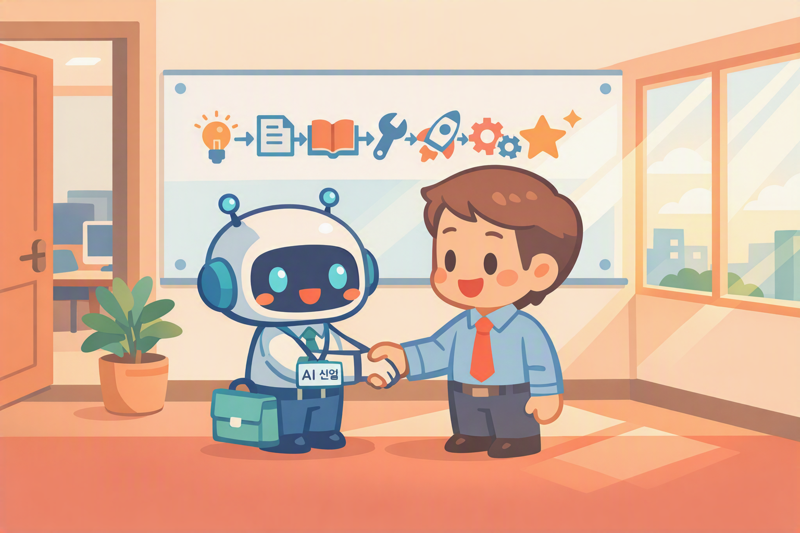

# Orientation — Preview the Agent You'll Build Today
{: .no_toc }

| Time | Duration | Participant Role |
|:-----|:-----|:-----------|
| 09:30 | 10 min | 👀 Watch |

## Table of Contents
{: .no_toc .text-delta }

1. TOC
{:toc}

---

## What You'll Learn in This Module

- See the **finished version** of the HR/Admin agent you'll build today
- **See for yourself** that it can be built without any code
- Understand the **overall flow** of today's course

{: .highlight }
> By the end of today, you'll have an **AI employee** on your PC. Without writing a single line of code.

---

## How Many Times a Day Do You Get These Questions?

- "How many vacation days do I have left?"
- "Who do I contact for expense claims?"
- "Where can I use my benefits points?"

Five times a day means 25 times a week, and 100 times a month.

The agent you'll build today will **answer all 100 of those for you.**

---

## 5 Things the Finished Agent Can Do

By the end of today's course, you'll have an agent that can do all five of the following.

### 1. Automatic FAQ Responses

For questions like "How many vacation days do I have left?", the agent **answers automatically based on the uploaded documents (textbooks)**. Sources are displayed alongside the answer.

### 2. Contact Person Lookup

"Who handles expense claims?" → The agent instantly finds the **name, phone number, and email** from the uploaded contact document.

### 3. Employee Benefits Guide

"Where can I use my benefits points?" → The agent **references multiple documents simultaneously** to answer.
Think of it as a new employee carrying several textbooks at once.

### 4. Forward Inquiries via Email

"I want to contact the person in charge directly." → The agent looks up the contact's email address, compiles the inquiry, and **automatically sends it via email (envelope)**.

### 5. Auto-Save Conversation Logs

Who asked what, and when — it's all **automatically logged in Excel**.
From an admin's perspective, you can see agent usage at a glance.

---

## Today's Journey at a Glance

| Step | What You'll Do | Module |
|:-----|:-----|:-----|
| ① Understand the Principles | How Copilot works and how to use it | M1 – M2 |
| ② Create an Agent | Build your first agent in 30 seconds | M3 |
| ③ Components + Behavior Manual + Textbook | Understand the framework + Write instructions + Connect knowledge | M4 – M7 |
| ④ Tool Concepts + Script Writing | Tool principles + Get smart with Topics and variables | M8 – M9 |
| ⑤ Publish + Share | Get your agent ready to use in Copilot | M10 |
| ⑥ Add Hands and Feet | Add actions with connectors + agent flows | M11 – M12 |
| ⑦ Advanced Tools | AI Prompts · Multi-Agent · MCP · Triggers | M13 – M16 |

---

## Key Takeaway

{: .important }
> **With just one behavior manual, your team gets an AI new employee today.**

---

Next module: [M1. How Copilot Works](m01-copilot-principles)
