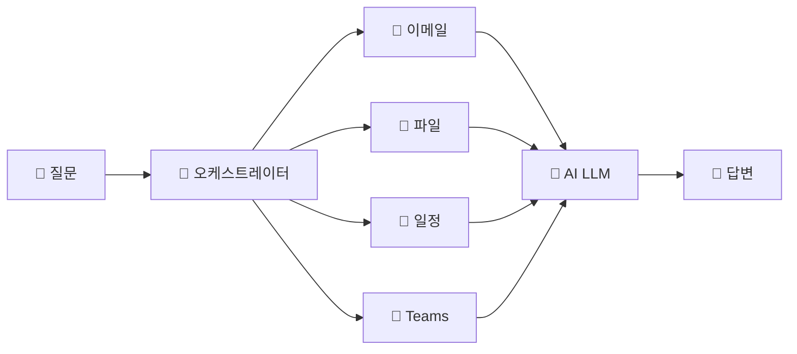

# Copilot 원리 + 보안·컴플라이언스
{: .no_toc }

## 목차
{: .no_toc .text-delta }

1. TOC
{:toc}

---

## 이 모듈에서 배우는 것

- Copilot의 **오케스트레이터** 구조 이해
- 컨텍스트(데이터)가 답변 품질을 좌우하는 원리
- M365 Copilot의 **보안 3중 보호막**

---

## Copilot은 어떻게 작동하나요?

Copilot에게 질문하면 AI에게 직접 말하는 것이 **아닙니다.**  
중간에 **교통경찰** 같은 존재가 있습니다. 이것을 '오케스트레이터'라고 합니다.

### 오케스트레이터의 작동 흐름

1. 여러분이 **질문**합니다
2. 오케스트레이터가 "이 질문에 답하려면 뭐가 필요하지?" **판단**합니다
3. 필요한 **데이터를 수집**합니다 — 이메일, 파일, 일정, Teams 대화 등
4. AI(LLM)에게 **질문 + 데이터를 함께** 넘깁니다
5. AI가 **답변을 생성**합니다

{: .highlight }
> **핵심:** AI가 혼자 답하는 게 아니라, 오케스트레이터가 재료를 모아서 넘깁니다.

---

## 재료가 다르면 답이 달라진다

같은 AI를 써도, 재료(데이터)가 다르면 답이 완전히 달라집니다.

| 상황 | 질문 | 결과 |
|:-----|:-----|:-----|
| **재료 없이** | "우리 팀 하반기 매출이 얼마야?" | ❌ "구체적인 데이터에 접근할 수 없어 답변드리기 어렵습니다" |
| **파일 첨부 후** | (같은 질문) | ✅ "하반기 매출은 12억 3천만원으로, 전년 대비 15% 증가했습니다" |

바뀐 것은 AI가 아닙니다. **재료**가 바뀐 겁니다.

{: .tip }
> 이것이 오후에 에이전트에게 '교과서(지식 소스)'를 주는 실습의 핵심 원리입니다.

---

## 보안 3중 보호막

"회사에서 써도 되는 거야?" — 가장 많이 받는 질문입니다.

결론부터 말하면: **네, 됩니다.** 이유는 3가지입니다.

### 보호막 ① — 데이터 보호

여러분이 입력한 내용, 회사 문서, 이메일 — 이 데이터는 **AI 학습에 사용되지 않습니다.**  
Microsoft 외부로 나가지 않습니다.

### 보호막 ② — 권한 기반 응답

여러분에게 접근 권한이 없는 파일은 **Copilot도 볼 수 없습니다.**  
오케스트레이터가 Microsoft Graph 권한을 체크하기 때문입니다.

### 보호막 ③ — 컴플라이언스 경계

회사에서 이미 쓰고 있는 보안 정책(Purview, DLP, 정보 보호)이 **Copilot에도 그대로 적용**됩니다.  
새로운 보안 시스템을 만들 필요가 없습니다.

| 보호막 | 핵심 | ChatGPT와 비교 |
|:------|:-----|:-------------|
| ① 데이터 보호 | 회사 데이터는 AI 학습에 사용 안 됨 | ChatGPT — 학습에 사용될 수 있음 |
| ② 권한 기반 | 내 권한 밖 데이터는 Copilot도 못 봄 | ChatGPT — 권한 개념 없음 |
| ③ 컴플라이언스 | 기존 M365 보안 정책 그대로 적용 | ChatGPT — 별도 보안 설정 필요 |

---

## 핵심 정리

1. Copilot은 AI가 혼자 일하는 게 아니라 **오케스트레이터가 재료를 모아서** 일합니다
2. **재료(데이터)가 좋아야 답이 좋습니다** — 이것이 '교과서(지식)'의 원리
3. **회사 데이터는 안전합니다** — 3가지 보호막이 지키고 있습니다

---

## FAQ

| 질문 | 답변 |
|:-----|:-----|
| Copilot과 ChatGPT의 가장 큰 차이는? | Copilot은 회사 데이터에 **안전하게** 접근합니다. ChatGPT는 회사 데이터에 접근할 수 없고, 입력 내용이 학습에 사용될 수 있습니다. |
| AI가 거짓말을 하면 어떻게 하나요? | 할루시네이션(환각)이 발생할 수 있습니다. 중요한 결정은 반드시 **출처를 확인**하세요. Copilot은 인용 출처를 함께 표시합니다. |
| 회사에서 쓰려면 관리자 승인이 필요한가요? | 네. Copilot 라이선스 할당과 보안 정책 설정은 IT 관리자가 진행합니다. |

---

## 참조 자료

| 자료 | 링크 |
|:-----|:-----|
| Microsoft Copilot 공식 문서 | [learn.microsoft.com/copilot](https://learn.microsoft.com/copilot/) |
| Microsoft 365 보안·컴플라이언스 | [learn.microsoft.com/security](https://learn.microsoft.com/microsoft-365/security/) |
| Copilot Studio 보안 가이드 | [learn.microsoft.com/copilot-studio/security](https://learn.microsoft.com/microsoft-copilot-studio/security-overview) |

---

다음 모듈: [M2. 몰입형 vs 인컨텍스트](m02-immersive-incontext)
