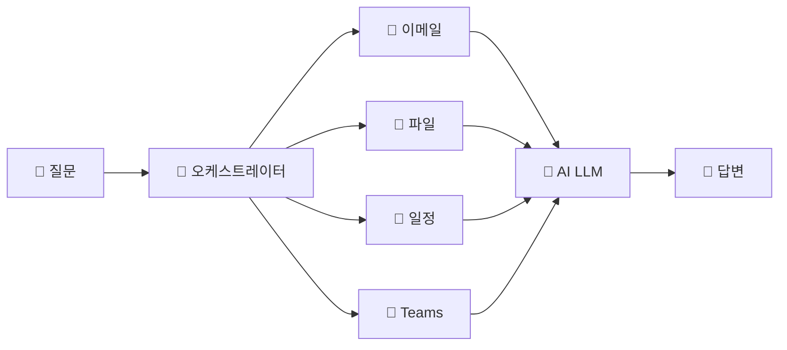

# 코파일럿과 에이전트의 동작원리
{: .no_toc }

| 시간 | 소요 | 수강생 역할 |
|:-----|:-----|:-----------|
| 09:40 | 10분 | 👀 보기 |

## 목차
{: .no_toc .text-delta }

1. TOC
{:toc}

---

## 이 모듈에서 배우는 것

- Copilot의 **오케스트레이터** 구조 이해
- 컨텍스트(데이터)가 답변 품질을 좌우하는 원리
- 오후 실습의 핵심인 **'교과서(지식)' 원리** 미리 이해

---

## Copilot은 어떻게 작동하나요?

Copilot에게 질문하면 AI에게 직접 말하는 것이 **아닙니다.**  
중간에 **교통경찰** 같은 존재가 있습니다. 이것을 '오케스트레이터'라고 합니다.

### 오케스트레이터의 작동 흐름

1. 여러분이 **질문**합니다
2. 오케스트레이터가 "이 질문에 답하려면 뭐가 필요하지?" **판단**합니다
3. 필요한 **데이터를 수집**합니다 — 이메일, 파일, 일정, Teams 대화 등
4. AI(LLM)에게 **질문 + 데이터를 함께** 넘깁니다
5. AI가 **답변을 생성**합니다

{: .highlight }
> **핵심:** AI가 혼자 답하는 게 아니라, 오케스트레이터가 재료를 모아서 넘깁니다.

---

## 재료가 다르면 답이 달라진다

같은 AI를 써도, 재료(데이터)가 다르면 답이 완전히 달라집니다.

| 상황 | 질문 | 결과 |
|:-----|:-----|:-----|
| **재료 없이** | "우리 팀 하반기 매출이 얼마야?" | ❌ "구체적인 데이터에 접근할 수 없어 답변드리기 어렵습니다" |
| **파일 첨부 후** | (같은 질문) | ✅ "하반기 매출은 12억 3천만원으로, 전년 대비 15% 증가했습니다" |

바뀐 것은 AI가 아닙니다. **재료**가 바뀐 겁니다.

{: .tip }
> 이것이 오후에 에이전트에게 '교과서(지식 소스)'를 주는 실습의 핵심 원리입니다.

---

## 핵심 정리

1. Copilot은 AI가 혼자 일하는 게 아니라 **오케스트레이터가 재료를 모아서** 일합니다
2. **재료(데이터)가 좋아야 답이 좋습니다** — 이것이 '교과서(지식)'의 원리
3. 오후에 에이전트에게 **교과서를 주는 이유**가 바로 이 원리입니다

---

## FAQ

| 질문 | 답변 |
|:-----|:-----|
| Copilot과 ChatGPT의 가장 큰 차이는? | Copilot은 회사 데이터(이메일, 파일, 일정 등)에 접근할 수 있습니다. ChatGPT는 접근할 수 없습니다. |
| AI가 거짓말을 하면 어떻게 하나요? | 할루시네이션(환각)이 발생할 수 있습니다. 중요한 결정은 반드시 **출처를 확인**하세요. Copilot은 인용 출처를 함께 표시합니다. |
| 재료를 많이 줄수록 좋은 건가요? | 관련 있는 재료를 주는 게 중요합니다. 관련 없는 데이터가 많으면 오히려 혼란을 줄 수 있습니다. |

---

## 참조 자료

| 자료 | 링크 |
|:-----|:-----|
| Microsoft Copilot 공식 문서 | [learn.microsoft.com/copilot](https://learn.microsoft.com/copilot/) |
| Copilot Studio 시작하기 | [learn.microsoft.com](https://learn.microsoft.com/microsoft-copilot-studio/fundamentals-get-started) |

---

다음 모듈: [M2. 몰입형 vs 인컨텍스트](m02-immersive-incontext)
