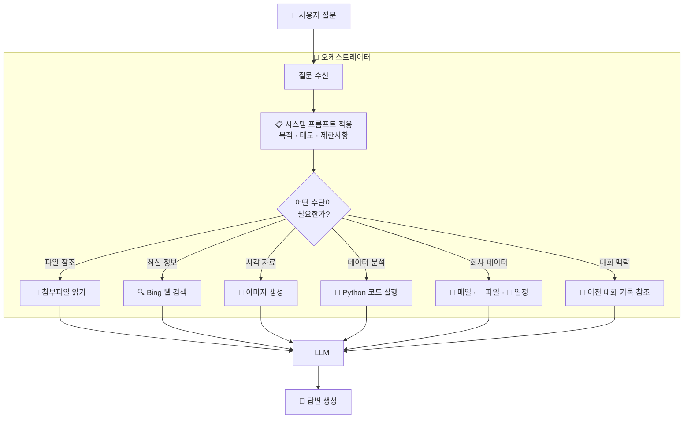
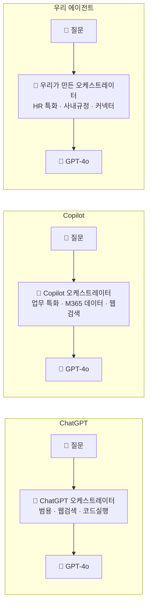

# 코파일럿과 에이전트의 동작원리 — 당신은 AI와 대화하고 있지 않다
{: .no_toc }

| 시간 | 소요 | 수강생 역할 |
|:-----|:-----|:-----------|
| 09:40 | 10분 | 👀 보기 |

## 목차
{: .no_toc .text-delta }

1. TOC
{:toc}

---

## 이 모듈에서 배우는 것

- 우리가 AI와 직접 대화한다는 것은 **착각**이라는 사실
- 인간과 LLM 사이에서 대화를 **중개하는 오케스트레이터**가 진짜 핵심이라는 점
- 오케스트레이터가 **시스템 프롬프트**와 **도구**를 통해 AI의 행동을 결정하는 원리
- Copilot의 오케스트레이터가 답변을 위해 **동원하는 수단들**

---

## 당신은 AI와 대화하고 있지 않다

ChatGPT에 질문을 입력하면, AI에게 직접 말하는 것 같습니다.  
하지만 **아닙니다.**

여러분과 LLM(대형 언어 모델) 사이에는 보이지 않는 **중개자**가 있습니다.  
이 중개자가 **오케스트레이터**입니다.

{: .warning }
> 우리가 사용하는 거의 모든 AI 챗봇 — ChatGPT, Copilot, Gemini, Claude — 에는 오케스트레이터가 있습니다. AI가 혼자 대답하는 서비스는 사실상 없습니다.

---

## 오케스트레이터가 하는 일

오케스트레이터는 단순한 중계기가 아닙니다.  
**판단하고, 수집하고, 가공하고, 행동하는 주체**입니다.

오케스트레이터가 하는 일을 세 가지로 정리하면:

### 1. 성격을 부여한다 — 시스템 프롬프트

오케스트레이터는 LLM에게 질문을 넘기기 **전에**, 시스템 프롬프트를 먼저 설정합니다.

> "너는 Microsoft 365 Copilot이다. 사용자의 업무를 돕는 것이 목적이다. 정치적 의견은 말하지 마라. 답변은 한국어로 하라."

이 시스템 프롬프트가 AI의 **목적, 태도, 제약**을 결정합니다.  
같은 GPT-4o 모델이라도, 시스템 프롬프트가 다르면 전혀 다른 AI처럼 동작합니다.

| 서비스 | 같은 LLM | 시스템 프롬프트 | 결과 |
|:-------|:---------|:------------|:-----|
| ChatGPT | GPT-4o | "범용 AI 어시스턴트" | 무엇이든 대답하는 만능 비서 |
| Copilot | GPT-4o | "M365 업무 도우미, 회사 데이터 참조" | 내 이메일·파일을 아는 업무 도우미 |
| **우리가 만들 에이전트** | GPT-4o | **"HR 전문 도우미, 사내 규정 참조"** | **HR 질문만 답하는 전문가** |

{: .highlight }
> 오늘 오후 실습에서 여러분이 작성할 **지침(Instructions)**이 바로 이 시스템 프롬프트입니다.

### 2. 수단을 동원한다 — 도구 호출

오케스트레이터는 질문에 답하기 위해 **할 수 있는 모든 수단을 동원**합니다.

| 상황 | 오케스트레이터가 하는 일 |
|:-----|:---------------------|
| 사용자가 파일을 첨부했다 | 📎 파일 내용을 읽어서 LLM에 전달 |
| "오늘 환율 알려줘" | 🔍 Bing 검색으로 최신 환율을 가져온 뒤 LLM에 전달 |
| "이 데이터로 그래프 그려줘" | 🐍 Python 코드를 작성·실행하여 차트 생성 |
| "이 내용을 그림으로 만들어줘" | 🎨 DALL-E로 이미지를 생성 |
| "지난주 팀 회의 내용 정리해줘" | 📧 Teams 대화 기록을 검색하여 LLM에 전달 |
| 이전 대화에서 선호도를 말했다 | 💬 대화 기록에서 사용자 선호를 추출하여 반영 |

이 중 어느 것도 LLM이 스스로 하는 일이 아닙니다.  
**모두 오케스트레이터가 판단하고 실행하는 일**입니다.

{: .tip }
> LLM은 텍스트를 생성하는 엔진일 뿐입니다. 인터넷을 검색하거나, 파일을 읽거나, 코드를 실행하는 것은 **오케스트레이터의 판단 아래 도구가 수행하는 것**입니다.

### 3. 맥락을 관리한다 — 대화 기록과 사용자 정보

오케스트레이터는 한 번의 질문만 보는 것이 아닙니다.

- **이전 대화 기록**을 기억하여 "아까 그 파일"이라고 하면 무슨 파일인지 파악
- 사용자가 선호하는 **언어, 호칭, 답변 스타일**을 대화에서 추출하여 반영
- 필요하면 **사용자에게 되물어서** 모호한 질문을 명확히 함

---

## 같은 LLM, 다른 오케스트레이터, 다른 결과

이 원리를 이해하면, ChatGPT와 Copilot이 왜 다른지 명확해집니다.

세 서비스 모두 **같은 GPT-4o**를 사용할 수 있습니다.  
하지만 결과가 다른 이유는 **오케스트레이터가 다르기 때문**입니다.

| 비교 | ChatGPT | Copilot | 우리가 만들 에이전트 |
|:-----|:--------|:--------|:-----------------|
| **시스템 프롬프트** | 범용 어시스턴트 | M365 업무 도우미 | HR 전문 도우미 |
| **접근 가능한 데이터** | 없음 (사용자가 직접 제공) | 이메일, 파일, 일정, Teams | 사내 규정 문서, Excel, 커넥터 |
| **사용 가능한 도구** | 웹검색, 코드실행, 이미지생성 | + M365 Graph API | + 토픽, 커넥터, 에이전트 흐름 |
| **결과** | 일반적인 답변 | 내 업무 맥락이 반영된 답변 | **우리 회사 HR 규정에 맞는 답변** |

---

## 오늘 우리가 하는 일의 본질

오늘 하루 동안 우리가 하는 것은 결국 이것입니다:

> **우리만의 오케스트레이터를 설계하는 것**

| 오케스트레이터 구성요소 | 오늘 실습에서 하는 일 | 모듈 |
|:---------------------|:-------------------|:-----|
| 시스템 프롬프트 (성격) | **지침** 작성 | M6 |
| 참조 데이터 (지식) | **지식 소스** 연결 | M7 |
| 도구 (행동 수단) | **토픽, 커넥터, 흐름** 연결 | M8~M16 |
| 판단 엔진 (두뇌) | **오케스트레이터 설정** | M5 |

---

## 핵심 정리

1. 우리는 AI와 직접 대화하지 않는다 — **오케스트레이터가 중개**한다
2. 오케스트레이터가 **시스템 프롬프트**로 AI의 성격과 제약을 결정한다
3. 오케스트레이터가 **모든 수단을 동원**하여 답변을 만든다 — 파일 읽기, 웹 검색, 코드 실행, 이미지 생성 모두 오케스트레이터의 판단
4. 같은 LLM이라도 **오케스트레이터가 다르면 전혀 다른 결과**가 나온다
5. 오늘 우리가 하는 일은 **우리만의 오케스트레이터를 설계하는 것**이다

---

## FAQ

| 질문 | 답변 |
|:-----|:-----|
| ChatGPT와 Copilot의 가장 큰 차이는? | LLM이 아니라 **오케스트레이터**가 다릅니다. Copilot은 M365 데이터에 접근하는 오케스트레이터를 가지고 있습니다. |
| AI가 거짓말(할루시네이션)을 하면? | LLM은 본질적으로 "그럴듯한 다음 단어"를 생성합니다. 이를 줄이는 것이 오케스트레이터의 역할이며, **지식 소스 연결**과 **지침 설정**이 핵심 수단입니다. |
| 왜 에이전트를 따로 만들어야 하나요? | Copilot은 범용 오케스트레이터입니다. 우리 회사 HR 규정을 모릅니다. **특화된 오케스트레이터**를 만들어야 정확한 답변이 나옵니다. |

---

## 참조 자료

| 자료 | 링크 |
|:-----|:-----|
| Microsoft Copilot 공식 문서 | [learn.microsoft.com/copilot](https://learn.microsoft.com/copilot/) |
| Copilot Studio 시작하기 | [learn.microsoft.com](https://learn.microsoft.com/microsoft-copilot-studio/fundamentals-get-started) |

---

다음 모듈: [M2. 몰입형 vs 인컨텍스트](m02-immersive-incontext)
