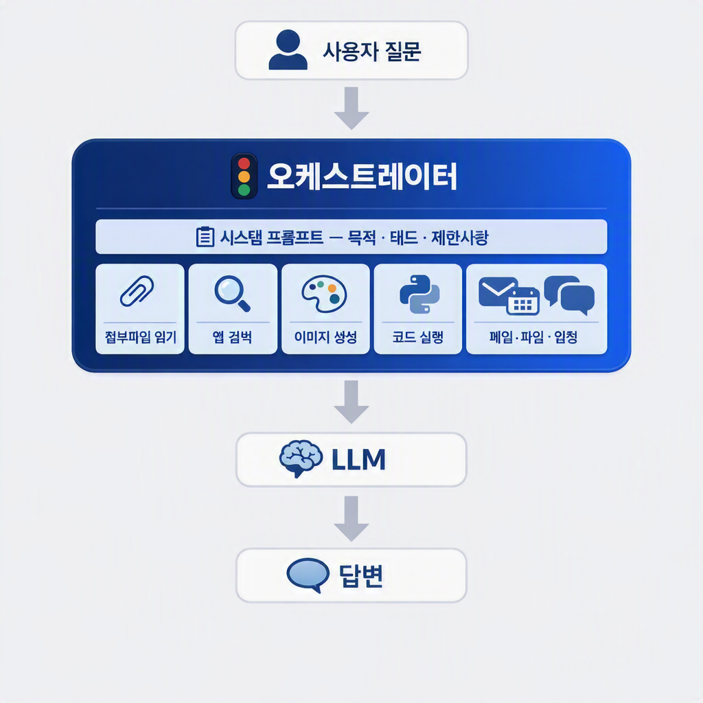
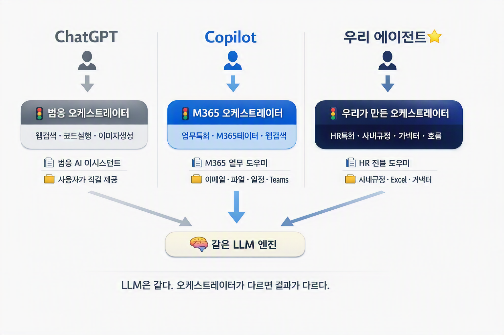

# How Copilot and Agents Work — You're Not Talking Directly to AI
{: .no_toc }

| Time | Duration | Participant Role |
|:-----|:-----|:-----------|
| 09:40 | 10 min | 👀 Watch |

## Table of Contents
{: .no_toc .text-delta }

1. TOC
{:toc}

---

## What You'll Learn in This Module

- The fact that talking directly to AI is actually a **misconception**
- That the **orchestrator — a mediator between you and the LLM** — is the real key player
- How the orchestrator determines AI behavior through **system prompts** and **tools**
- The **resources Copilot's orchestrator mobilizes** to generate answers

---

## You're Not Talking Directly to AI

When you type a question into ChatGPT, it feels like you're speaking directly to AI.  
But **you're not.**

Between you and the LLM (Large Language Model), there's an invisible **mediator**.  
That mediator is the **orchestrator**.

{: .warning }
> Nearly every AI chatbot we use — ChatGPT, Copilot, Gemini, Claude — has an orchestrator. There's virtually no service where AI answers entirely on its own.

---

## What the Orchestrator Does

The orchestrator is not a simple relay.  
It's the entity that **judges, gathers, processes, and takes action**.

Here's what the orchestrator does, in three parts:

### 1. It Assigns a Personality — The System Prompt

The orchestrator sets the system prompt **before** passing the question to the LLM.

> "You are Microsoft 365 Copilot. Your purpose is to assist users with their work. Do not express political opinions. Respond in the user's language."

This system prompt determines the AI's **purpose, attitude, and constraints**.  
Even with the same GPT-5 model, a different system prompt makes the AI behave like a completely different assistant.

| Service | Same LLM | System Prompt | Result |
|:-------|:---------|:------------|:-----|
| ChatGPT | GPT-5 | "General-purpose AI assistant" | An all-purpose assistant that answers anything |
| Copilot | GPT-5 | "M365 work assistant, references company data" | A work assistant that knows my emails and files |
| **Our Agent** | GPT-5 | **"HR specialist, references company policies"** | **An expert that only answers HR questions** |

{: .highlight }
> The **instructions** you'll write during this afternoon's lab are exactly this system prompt.

### 2. It Mobilizes Resources — Tool Calls

The orchestrator **uses every resource available** to answer a question.

| Situation | What the Orchestrator Does |
|:-----|:---------------------|
| User attached a file | 📎 Reads the file content and passes it to the LLM |
| "What's the exchange rate today?" | 🔍 Fetches the latest rate via Bing search, then passes it to the LLM |
| "Draw a chart from this data" | 🐍 Writes and executes Python code to generate the chart |
| "Turn this into an image" | 🎨 Generates an image with DALL-E |
| "Summarize last week's team meeting" | 📧 Searches Teams conversation history and passes it to the LLM |
| User mentioned preferences earlier | 💬 Extracts user preferences from conversation history and applies them |

None of these are things the LLM does on its own.  
**They are all judged and executed by the orchestrator.**

{: .tip }
> The LLM is just a text generation engine. Searching the web, reading files, or running code is **performed by tools under the orchestrator's direction**.

### 3. It Manages Context — Conversation History and User Information

The orchestrator doesn't just look at a single question.

- It **remembers previous conversation history**, so when you say "that file from earlier," it knows which file you mean
- It extracts the user's preferred **language, form of address, and response style** from the conversation and applies them
- When needed, it **asks clarifying questions** to resolve ambiguous queries

---

## Same LLM, Different Orchestrator, Different Results

Once you understand this principle, it becomes clear why ChatGPT and Copilot behave differently.

All three services can use the **same GPT-5**.  
But the results differ because **the orchestrators are different**.

| Comparison | ChatGPT | Copilot | Our Agent |
|:-----|:--------|:--------|:-----------------|
| **System Prompt** | General assistant | M365 work assistant | HR specialist |
| **Accessible Data** | None (user provides it) | Email, files, calendar, Teams | Company policy docs, Excel, connectors |
| **Available Tools** | Web search, code execution, image generation | + M365 Graph API | + Topics, connectors, agent flows |
| **Result** | Generic answers | Answers with my work context | **Answers aligned with our company's HR policies** |

---

## The Essence of What We're Doing Today

Everything we do today boils down to this:

> **Designing our own orchestrator**

| Orchestrator Component | What We'll Do in the Lab | Module |
|:---------------------|:-------------------|:-----|
| System Prompt (personality) | Write **instructions** | M6 |
| Reference Data (knowledge) | Connect **knowledge sources** | M7 |
| Tools (action capabilities) | Connect **Topics, connectors, flows** | M8–M16 |
| Decision Engine (brain) | Configure the **orchestrator settings** | M5 |

---

## Key Takeaways

1. We don't talk directly to AI — the **orchestrator mediates**
2. The orchestrator determines the AI's personality and constraints via the **system prompt**
3. The orchestrator **mobilizes every resource** to generate answers — file reading, web search, code execution, and image generation are all orchestrator decisions
4. Even with the same LLM, **a different orchestrator produces entirely different results**
5. What we're doing today is **designing our own orchestrator**

---

## FAQ

| Question | Answer |
|:-----|:-----|
| What's the biggest difference between ChatGPT and Copilot? | It's not the LLM — it's the **orchestrator**. Copilot has an orchestrator that accesses M365 data. |
| What if the AI hallucinates? | LLMs inherently generate "the most plausible next word." Reducing hallucinations is the orchestrator's job, and the key tools are **connecting knowledge sources** and **configuring instructions**. |
| Why do we need to build a separate agent? | Copilot is a general-purpose orchestrator. It doesn't know our company's HR policies. We need to build a **specialized orchestrator** to get accurate answers. |

---

## Reference Materials

| Resource | Link |
|:-----|:-----|
| Microsoft Copilot Official Docs | [learn.microsoft.com/copilot](https://learn.microsoft.com/copilot/) |
| Getting Started with Copilot Studio | [learn.microsoft.com](https://learn.microsoft.com/microsoft-copilot-studio/fundamentals-get-started) |

---

Next module: [M2. Agent Usage](m02-immersive-incontext)
