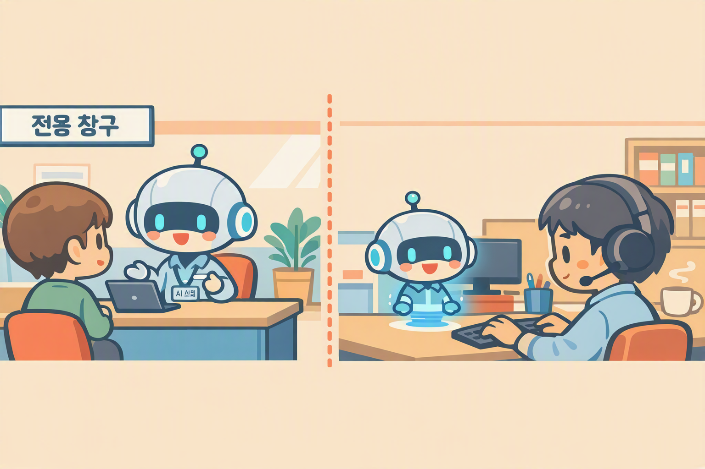

# 에이전트 활용 — 몰입형 vs 인컨텍스트
{: .no_toc }

| 시간 | 소요 | 수강생 역할 |
|:-----|:-----|:-----------|
| 09:50 | 15분 | 👀 보기 |



## 목차
{: .no_toc .text-delta }

1. TOC
{:toc}

---

## 이 모듈에서 배우는 것

- **몰입형**(전용 채널)과 **인컨텍스트**(@호출)의 차이
- 내 업무에 어떤 방식이 적합한지 판단
- 한 에이전트로 두 가지 방식 모두 사용 가능하다는 점

---

## 두 가지 사용 방식

에이전트를 만든 후 사용하는 방식은 크게 **두 가지**입니다.

| 구분 | 몰입형 | 인컨텍스트 |
|:-----|:------|:---------|
| **비유** | 전용 창구 | 옆자리 동료 |
| **사용 상황** | 에이전트에 집중해서 대화할 때 | 다른 업무 중 잠깐 물어볼 때 |
| **진입점** | Copilot에서 에이전트 이름 클릭 → 전용 화면 | Copilot 채팅에서 `@에이전트` 호출 |
| **장점** | 집중 대화, 전용 UI, 에이전트 전체 기능 사용 | 흐름 유지, 빠른 호출 |
| **적합 상황** | 신규 입사자 온보딩, 고객 상담 | 업무 중 빠른 조회 |

---

## 몰입형 — 전용 창구

Copilot에서 에이전트 이름을 클릭하면 **에이전트 전용 화면**으로 전환됩니다.  
에이전트와 1:1로 대화하는 전용 공간입니다.

**진입 방법:**
1. M365 Copilot (copilot.microsoft.com 또는 Teams Copilot) 접속
2. 에이전트 목록에서 **에이전트 이름 클릭**
3. 에이전트 전용 화면이 열림 → 바로 대화 시작

**이럴 때 적합합니다:**
- 여러 개의 질문을 연속으로 하고 싶을 때
- 에이전트와 깊이 있는 대화가 필요할 때
- 에이전트의 전체 기능(지식 검색, Flow 연동 등)을 활용할 때
- 신입사원 온보딩처럼 정보가 많은 상황

---

## 인컨텍스트 — @호출

Copilot 채팅에서 `@에이전트이름`으로 호출합니다.  
핵심은 **하나의 대화 안에서 여러 에이전트를 번갈아 부를 수 있다**는 것입니다.

### 기본 사용법

```
@HR도우미 복지포인트 사용처 알려줘
```

이렇게 한 줄로 질문과 응답이 끝납니다.

### 실전 워크플로 — 여러 에이전트 협업

인컨텍스트의 진짜 힘은 **하나의 대화 흐름 안에서 여러 에이전트를 조합**하는 것입니다.

아래는 고객사 미팅 준비를 하는 실전 예시입니다:

```mermaid
flowchart TD
    A[💬 Copilot에게 일반 질문<br>내일 A사 미팅 준비해야 해] --> B[@영업지원<br>A사 최근 영업 히스토리 알려줘]
    B --> C[💬 Copilot 일반 대화<br>영업지원 컨텍스트 해제]
    C --> D[@리서치<br>A사가 속한 반도체 산업 최신 트렌드 검색해줘]
    D --> E[💬 Copilot 일반 대화<br>리서치 컨텍스트 해제]
    E --> F[💬 Copilot에게 요청<br>지금까지 대화 내용 종합해서 미팅 브리핑 정리해줘]
    F --> G[@Word<br>이 내용을 미팅 브리핑 문서로 저장해줘]
```

| 단계 | 누구와 대화 | 하는 일 |
|:-----|:-----------|:--------|
| ① | **Copilot** (일반) | "내일 A사 미팅 준비해야 해" — 대화 시작 |
| ② | **@영업지원** 에이전트 | A사 최근 영업 히스토리·계약 정보 조회 |
| ③ | **Copilot** (일반) | 영업지원 컨텍스트 해제, 일반 대화로 복귀 |
| ④ | **@리서치** 도구 | A사가 속한 산업 분야의 최신 트렌드 검색 |
| ⑤ | **Copilot** (일반) | 리서치 컨텍스트 해제, 일반 대화로 복귀 |
| ⑥ | **Copilot** (일반) | "지금까지 대화 내용 종합해서 미팅 브리핑 정리해줘" |
| ⑦ | **@Word** 에이전트 | 정리된 내용을 Word 문서로 저장 |

{: .highlight }
> **Copilot이 지휘자, 에이전트들이 전문가 팀**입니다.  
> 하나의 대화 안에서 필요할 때마다 전문가를 불러 쓰고, Copilot이 전체를 종합합니다.

### 핵심 포인트

- **@호출** = 특정 에이전트의 전문 기능 사용
- **@해제 후 일반 대화** = Copilot이 전체 맥락을 종합
- **대화 흐름이 유지됨** — 영업지원이 준 정보 + 리서치 결과가 모두 같은 대화 안에 남아있음
- 마지막에 Copilot에게 **종합 정리를 시키면**, 여러 에이전트의 결과가 하나로 합쳐짐

---

## 한 번 만들면, 둘 다 됩니다

{: .highlight }
> 에이전트를 한 번 만들고 배포하면, 몰입형과 인컨텍스트 **모두 자동으로 지원**됩니다. 별도 설정이 필요 없습니다.

---

## 핵심 정리

1. **몰입형** = 에이전트 전용 화면에서 집중 대화
2. **인컨텍스트** = @호출로 여러 에이전트를 하나의 대화 안에서 조합
3. **Copilot = 지휘자**, 에이전트 = 전문가 팀 — @호출로 불러 쓰고, Copilot이 종합
4. **한 번 만들면 둘 다 사용 가능** — 별도 구현 불필요

---

## FAQ

| 질문 | 답변 |
|:-----|:-----|
| 두 방식 중 뭐가 더 좋나요? | 상황에 따라 다릅니다. 깊은 대화는 몰입형, 빠른 조회는 인컨텍스트가 편합니다. |
| 인컨텍스트에서도 파일 첨부가 되나요? | 네, @호출 시에도 파일 참조가 가능합니다. |
| 모바일에서도 사용할 수 있나요? | Teams 모바일 앱에서 두 방식 모두 사용 가능합니다. |

---

## 참조 자료

| 자료 | 링크 |
|:-----|:-----|
| 에이전트 배포 채널 | [learn.microsoft.com](https://learn.microsoft.com/microsoft-copilot-studio/publication-fundamentals-publish-channels) |
| M365 Copilot에서 에이전트 사용 | [learn.microsoft.com](https://learn.microsoft.com/microsoft-365-copilot/extensibility/) |
| Teams에 에이전트 배포 | [learn.microsoft.com](https://learn.microsoft.com/microsoft-copilot-studio/publication-add-bot-to-microsoft-teams) |

---

다음 모듈: [M3. 에이전트 빌더 실습](m03-agent-builder)
