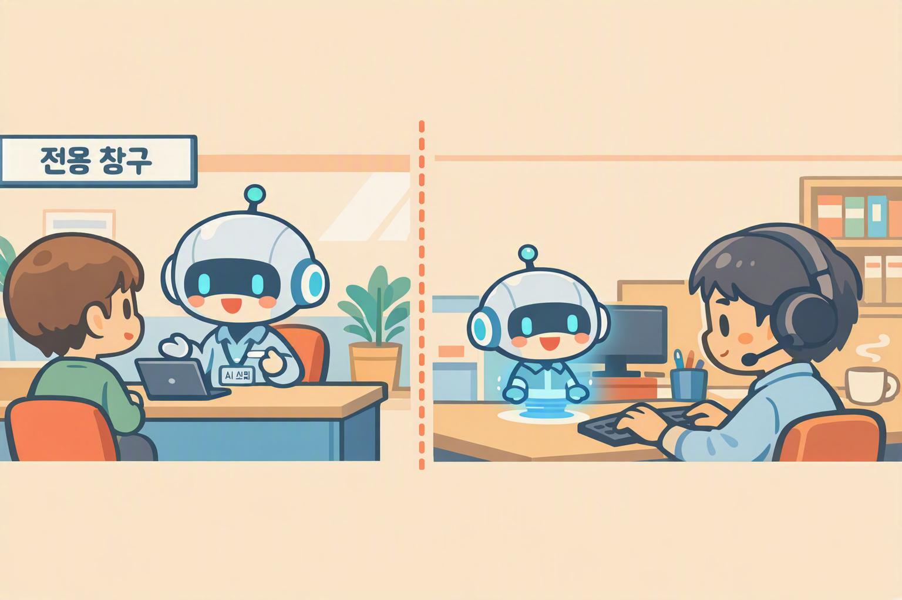
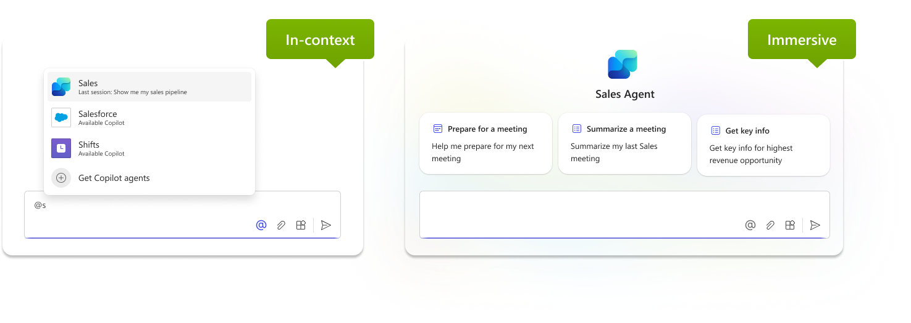
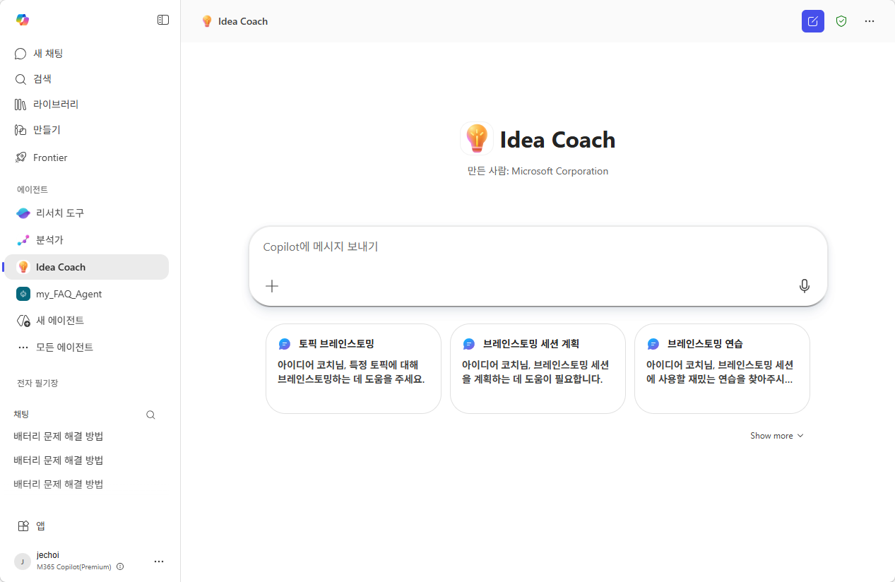
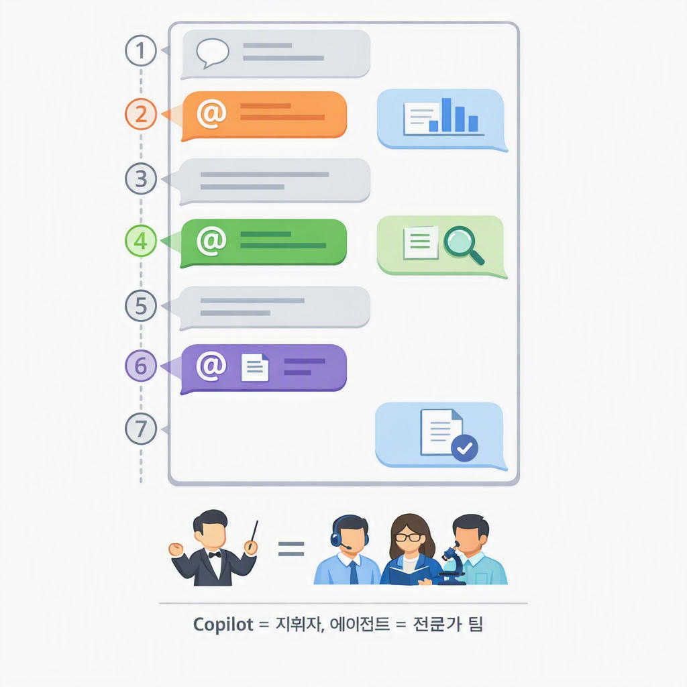

# Agent Usage — Immersive vs In-Context
{: .no_toc }

| Time | Duration | Participant Role |
|:-----|:-----|:-----------|
| 09:50 | 15 min | 👀 Watch |

## Table of Contents
{: .no_toc .text-delta }

1. TOC
{:toc}



---

## What You'll Learn in This Module

- The difference between **immersive** (dedicated channel) and **in-context** (@mention)
- How to determine which approach suits your workflow
- That a single agent supports both usage modes

---

## Two Ways to Use an Agent

After building an agent, there are two main ways to use it.

| Category | Immersive | In-Context |
|:-----|:------|:---------|
| **Analogy** | A dedicated service counter | The colleague sitting next to you |
| **When to use** | When you want to focus on a conversation with the agent | When you need a quick answer while doing other work |
| **Entry point** | Click the agent name in Copilot → opens a dedicated screen | Type `@AgentName` in Copilot chat |
| **Advantage** | Focused conversation, dedicated UI, full agent capabilities | Maintains workflow, quick access |
| **Best for** | New employee onboarding, customer support | Quick lookups during work |



---

## Immersive — The Dedicated Counter

When you click an agent name in Copilot, the screen switches to a **dedicated agent view**.  
It's a dedicated space for a 1:1 conversation with the agent.

**How to access:**
1. Open M365 Copilot (copilot.microsoft.com or Teams Copilot)
2. **Click the agent name** in the agent list
3. The dedicated agent screen opens → start chatting right away

**Best for these scenarios:**
- When you have multiple questions in a row
- When you need an in-depth conversation with the agent
- When you want to use the agent's full capabilities (knowledge search, Flow integration, etc.)
- Information-heavy situations like new employee onboarding



---

## In-Context — @Mention

In Copilot chat, you call the agent with `@AgentName`.  
The key point is that **you can call multiple agents back and forth within a single conversation**.

### Basic Usage

```
@HRHelper Where can I use my benefits points?
```

A one-line question and response — that's it.

### Real-World Workflow — Multi-Agent Collaboration

The real power of in-context is **combining multiple agents within a single conversation flow**.

Here's a real-world example of preparing for a client meeting:



| Step | Who You Talk To | What Happens |
|:-----|:-----------|:--------|
| ① | **Copilot** (general) | "I need to prepare for tomorrow's meeting with Company A" — start the conversation |
| ② | **@SalesSupport** agent | Look up Company A's recent sales history and contract info |
| ③ | **Copilot** (general) | SalesSupport context released, back to general chat |
| ④ | **@Research** tool | Search for the latest trends in Company A's industry |
| ⑤ | **Copilot** (general) | Research context released, back to general chat |
| ⑥ | **Copilot** (general) | "Compile everything from this conversation into a meeting briefing" |
| ⑦ | **@Word** agent | Save the compiled content as a Word document |

{: .highlight }
> **Copilot is the conductor, and agents are the team of specialists.**  
> Within a single conversation, you call on specialists as needed, and Copilot synthesizes everything.

### Key Points

- **@mention** = use a specific agent's specialized capabilities
- **General chat after releasing @** = Copilot synthesizes the full context
- **Conversation flow is preserved** — information from SalesSupport + research results all remain in the same conversation
- When you ask Copilot to **summarize at the end**, results from multiple agents are combined into one

---

## Build Once, Use Both Ways

{: .highlight }
> Once you build and deploy an agent, it **automatically supports both immersive and in-context** modes. No additional configuration needed.

---

## Key Takeaways

1. **Immersive** = focused conversation on the agent's dedicated screen
2. **In-context** = combine multiple agents in a single conversation via @mention
3. **Copilot = conductor**, agents = team of specialists — call them with @mention, and Copilot synthesizes the results
4. **Build once, use both ways** — no separate implementation needed

---

## FAQ

| Question | Answer |
|:-----|:-----|
| Which approach is better? | It depends on the situation. Deep conversations work best in immersive mode; quick lookups are easier in-context. |
| Can I attach files in in-context mode? | Yes, file references are supported even when using @mention. |
| Can I use this on mobile? | Yes, both modes are available in the Teams mobile app. |

---

## Reference Materials

| Resource | Link |
|:-----|:-----|
| Agent Deployment Channels | [learn.microsoft.com](https://learn.microsoft.com/microsoft-copilot-studio/publication-fundamentals-publish-channels) |
| Using Agents in M365 Copilot | [learn.microsoft.com](https://learn.microsoft.com/microsoft-365-copilot/extensibility/) |
| Deploy Agent to Teams | [learn.microsoft.com](https://learn.microsoft.com/microsoft-copilot-studio/publication-add-bot-to-microsoft-teams) |

---

Next module: [M3. Build Your First Agent](m03-agent-builder)
