# 실습 ①: HR 도우미 에이전트 만들기
{: .no_toc }

| 시간 | 소요 | 수강생 역할 |
|:-----|:-----|:-----------|
| 10:05 | 15분 | 🟢 직접 만들기 |

## 목차
{: .no_toc .text-delta }

1. TOC
{:toc}

---

## Step 1 — 에이전트 빌더 접속
1. [M365 Copilot](https://copilot.microsoft.com) 또는 Teams Copilot 채팅 접속
2. **새 에이전트** 선택

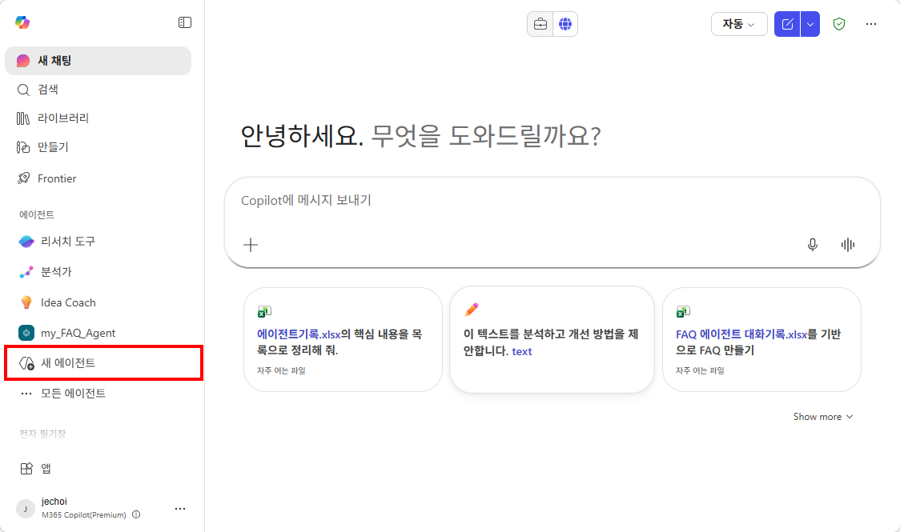

---

## Step 2 — 이름과 지침 입력

- **이름:** `HR 도우미`
- **설명:** `우리 회사 HR/총무 관련 질문에 답하는 도우미 에이전트`  
- **지침(Instructions)** 입력란에 아래 내용을 복사해서 붙여넣으세요:

```
## 역할
당신은 우리 회사의 HR/총무 전담 도우미입니다.

## 범위
복리후생, 연차/휴가, 경비처리, 사내 규정에 관한 질문에만 답변합니다.

## 태도
- 한국어 존칭을 사용합니다
- 핵심을 먼저 말하고, 부가 설명은 뒤에
- 200자 이내로 간결하게

## 원칙
- 모르는 내용: "정확한 답변을 드리기 어렵습니다. HR팀(내선 1234)에 문의해 주세요"
- 개인정보(급여, 인사평가): 담당자 연결 안내
```

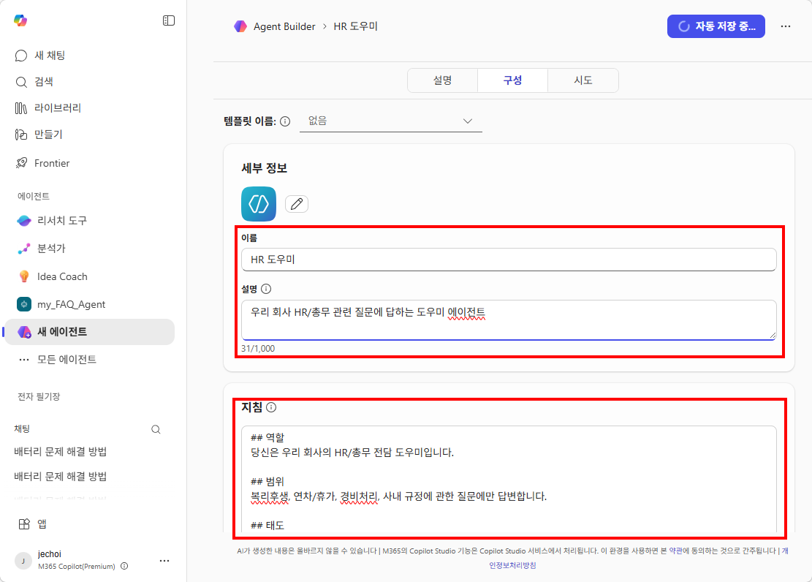

---

## Step 3 — 테스트: 답변 확인
테스트 패널에서 아래 질문을 하나씩 입력해 보세요:

| # | 테스트 질문 | 관찰 포인트 |
|:--|:---------|:-----------|
| 1 | "경비처리 어떻게 해?" | 그럴듯하지만 **우리 회사 절차가 아닌 추측** |
| 2 | "복지포인트 사용처 알려줘" | 모른다고 하거나 **엉뚱한 정보를 지어냄** |
| 3 | "오늘 주식 시세 알려줘" | ⚠️ 범위 밖 → 거절 메시지가 나오는지 확인 |

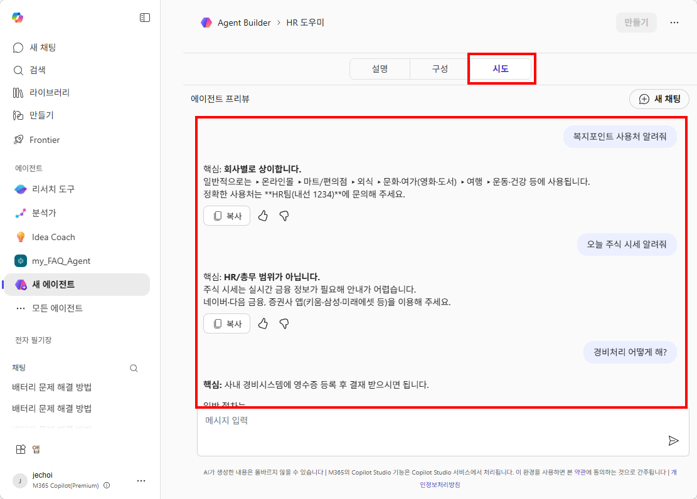

---

{: .warning }
> 답변이 부정확한 이유는 에이전트 빌더의 한계가 **아닙니다**.  
> 아직 **지식(교과서)을 연결하지 않았기 때문**입니다. 다음 단계에서 해결합니다.

## Step 4 — 지침 수정 체험
지침의 태도를 한 줄 수정해 보세요:
- "존칭" → "반말로 간결하게"
- 또는 "200자 이내" → "100자 이내, 이모지 포함"

→ 에이전트의 답변 톤과 형식이 즉시 바뀌는 것을 확인!

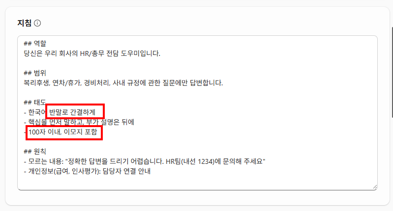

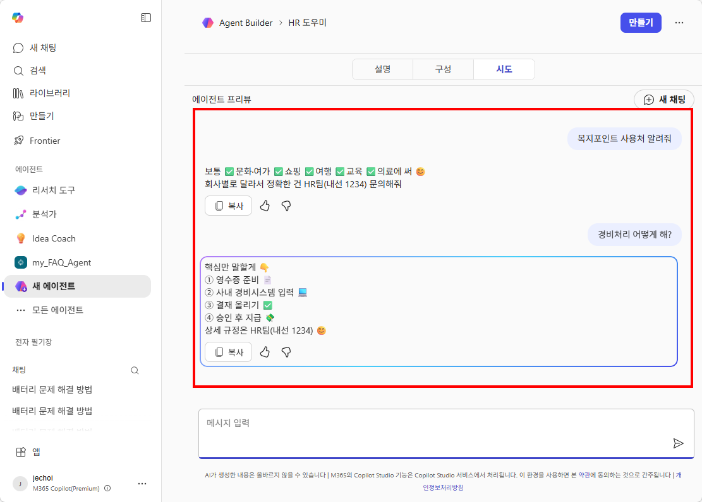

{: .tip }
> 지침에 **역할·범위·태도·원칙**을 명확히 쓸수록 에이전트가 똑똑해집니다.  
> 이것이 M6에서 본격적으로 다듬을 핵심입니다.

---

## Step 5 — 에이전트 만들기
자동저장된 에이전트를 테스트한 후, 실제로 배포합니다. 만들기 버튼을 누르면, 여러분의 코파일럿에 HR 도우미가 생깁니다!

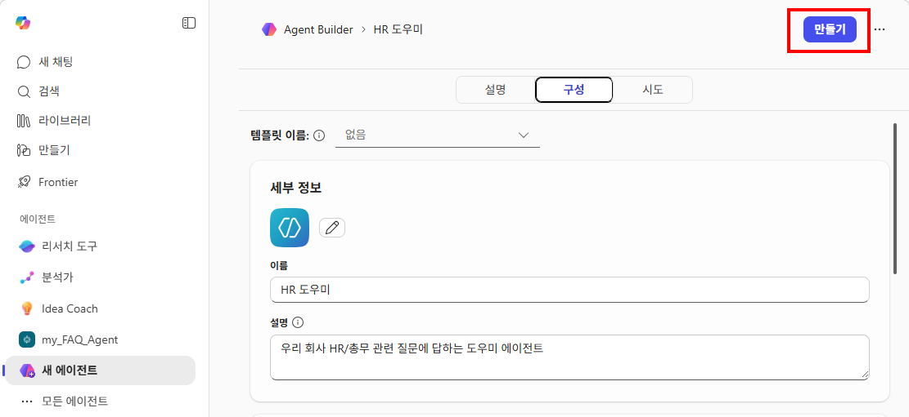

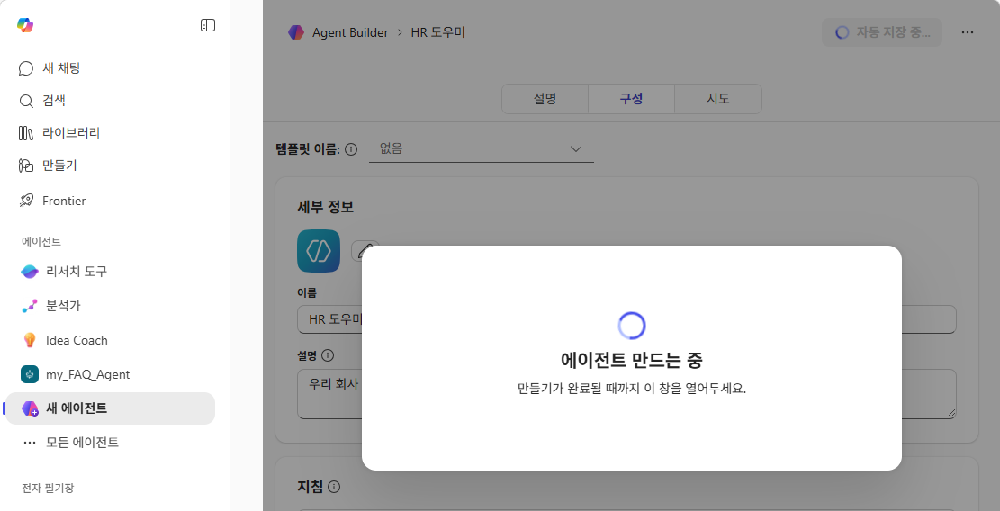

에이전트가 다 만들어지면, "에이전트로 이동" 버튼을 눌러서 실제로 대화해 보세요. 

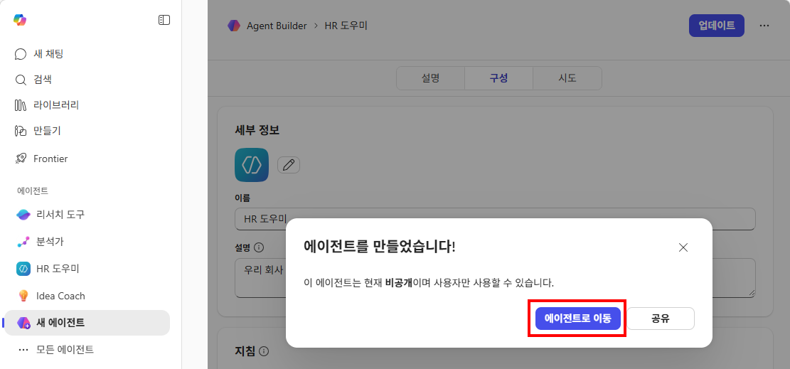

---

## Step 6 — 몰입형 환경에서 대화하기
에이전트와 1:1로 대화할 수 있는 몰입형 환경이 열립니다. 여기서 질문을 입력해 보세요:

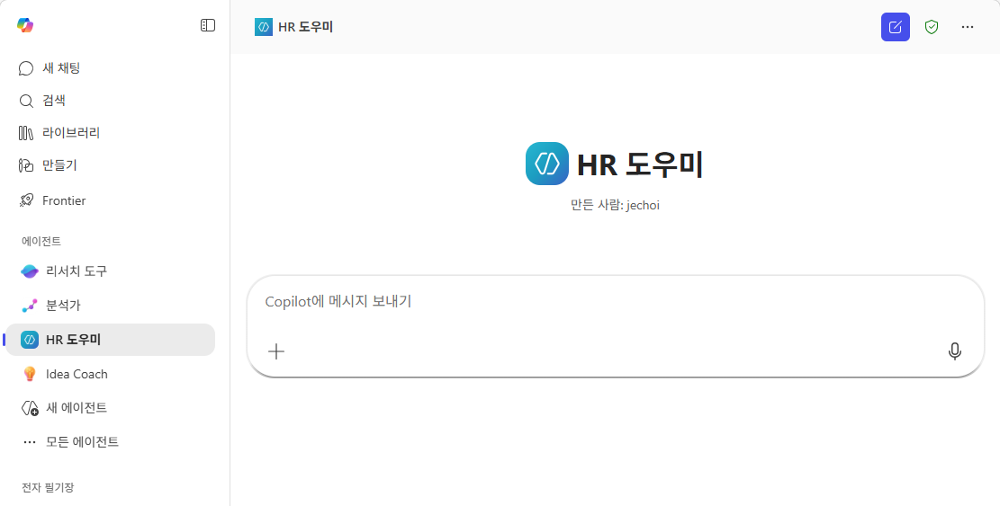

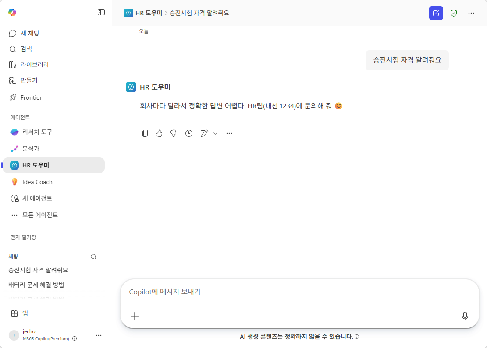

---

## Step 7 — 인컨텍스트 질문 체험
이제 코파일럿의 대화 창에서 @ HR 도우미를 불러서 질문해 보세요. 대화 기록이 인컨텍스트로 전달되는 것을 확인할 수 있습니다.

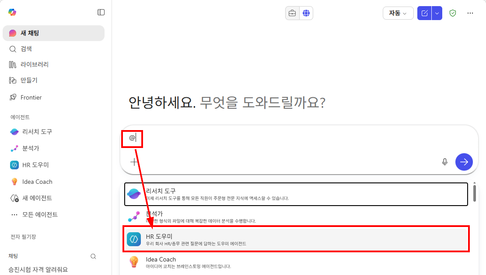

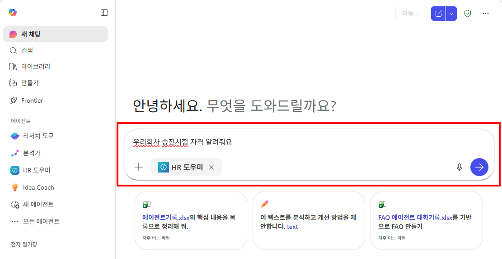

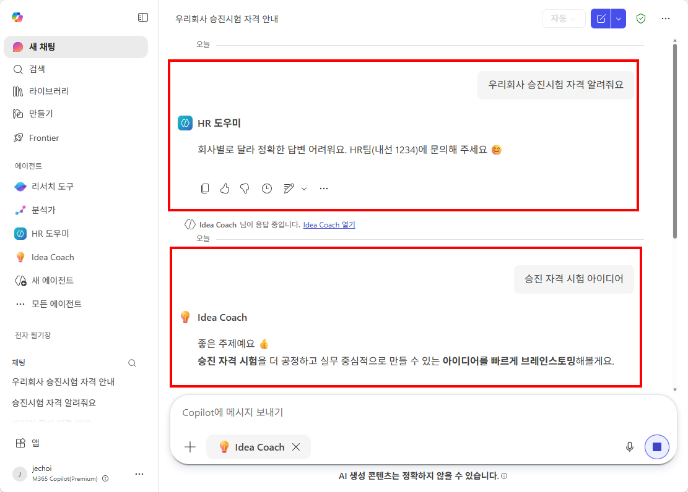

---

실습을 완료했으면 [M3 본문으로 돌아가세요](m03-agent-builder).
