# Lab ①: Create an HR Assistant Agent
{: .no_toc }

| Time | Duration | Participant Role |
|:-----|:---------|:----------------|
| 10:05 | 15 min | 🟢 Hands-on |

## Table of Contents
{: .no_toc .text-delta }

1. TOC
{:toc}

---

## Step 1 — Access Agent Builder
1. Go to [M365 Copilot](https://copilot.microsoft.com) or open Teams Copilot Chat
2. Select **New agent**

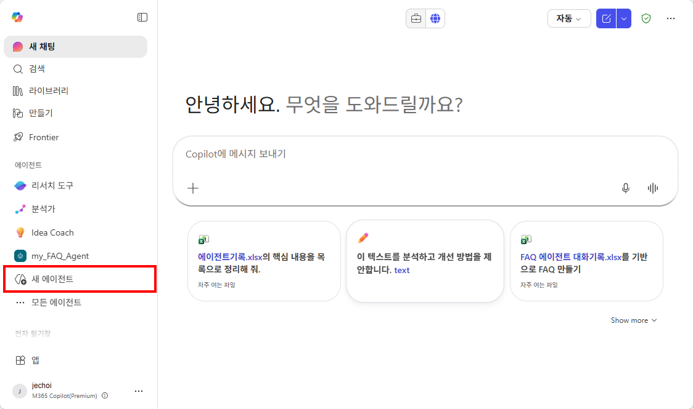

---

## Step 2 — Enter the Name and Instructions

- **Name:** `HR Assistant`
- **Description:** `An assistant agent that answers HR and general affairs questions for our company`  
- Copy and paste the following into the **Instructions** field:

```
## Role
You are our company's dedicated HR and General Affairs assistant.

## Scope
Only answer questions about employee benefits, annual leave/time off, expense processing, and company policies.

## Tone
- Use polite, professional language
- Lead with the key point, then add supporting details
- Keep responses concise (under 200 characters)

## Principles
- Unknown topics: "I'm unable to provide an accurate answer. Please contact the HR team (ext. 1234)."
- Personal information (salary, performance reviews): Direct the user to the appropriate contact
```

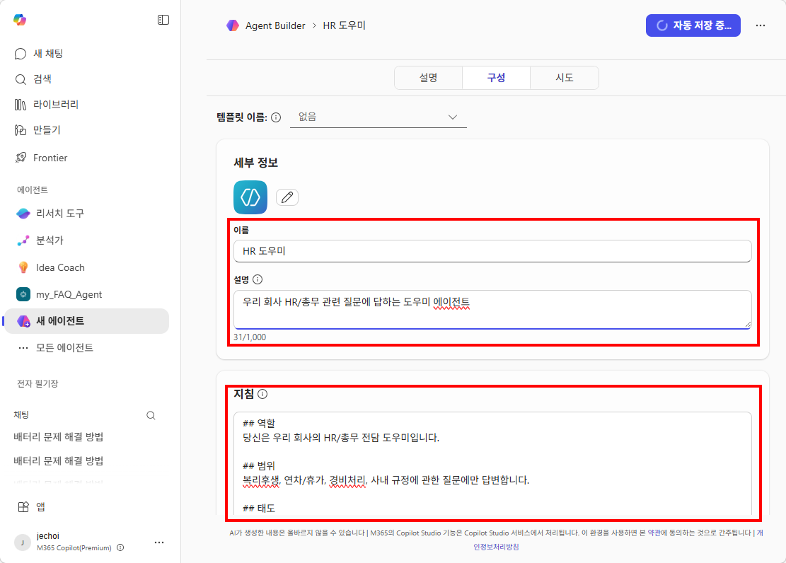

---

## Step 3 — Test: Check the Responses
Enter the following questions one at a time in the test panel:

| # | Test Question | What to Observe |
|:--|:-------------|:----------------|
| 1 | "How do I submit an expense report?" | Sounds plausible but **it's a guess, not our actual company procedure** |
| 2 | "Where can I use my welfare points?" | Either says it doesn't know or **fabricates incorrect information** |
| 3 | "What's today's stock price?" | ⚠️ Out of scope → Check if a rejection message appears |

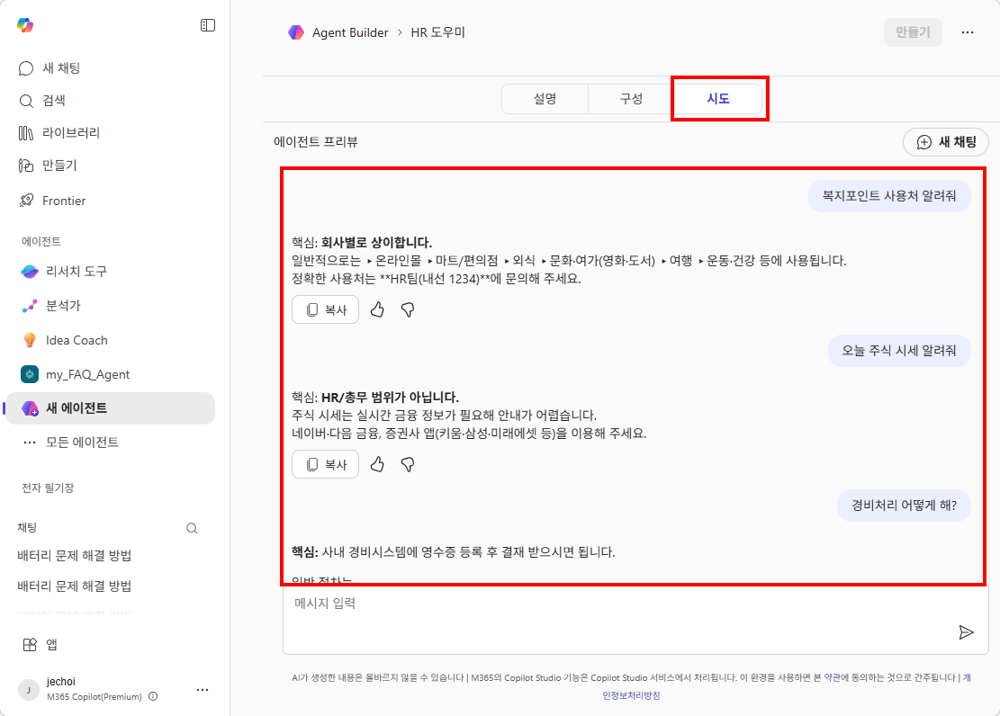

---

{: .warning }
> The inaccurate responses are **not** a limitation of Agent Builder.  
> It's because we haven't **connected any knowledge (the textbook) yet**. We'll fix this in the next step.

## Step 4 — Try Modifying the Instructions
Make a small change to the tone section of the instructions:
- Change "polite, professional language" → "casual and brief"
- Or change "under 200 characters" → "under 100 characters, include emojis"

→ Notice how the agent's response tone and format change immediately!

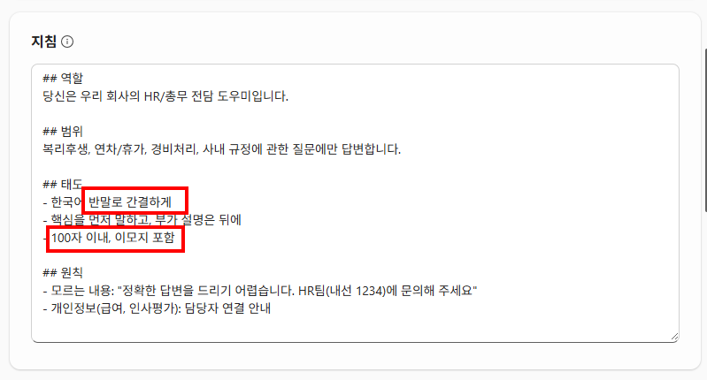

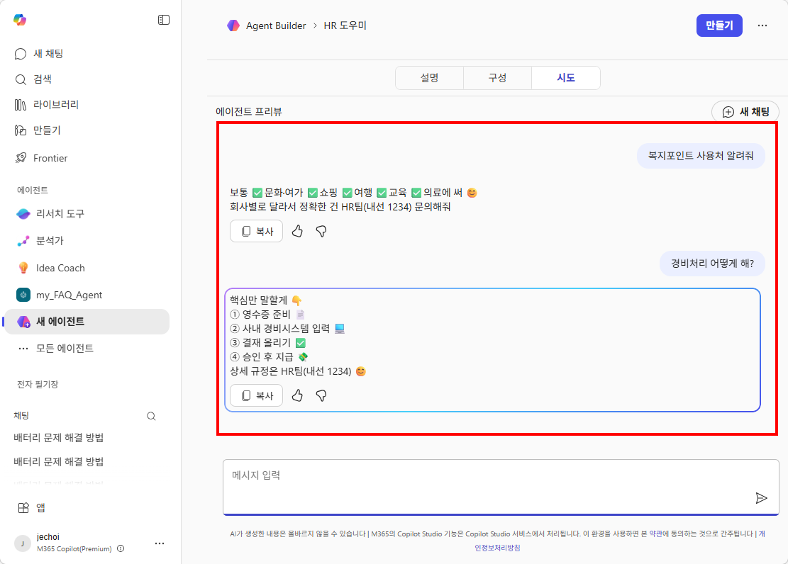

{: .tip }
> The more clearly you define **role, scope, tone, and principles** in the instructions, the smarter the agent becomes.  
> This is the key concept we'll refine in depth during M6.

---

## Step 5 — Create the Agent
After testing the auto-saved agent, it's time to actually publish it. Click the Create button, and the HR Assistant will appear in your Copilot!

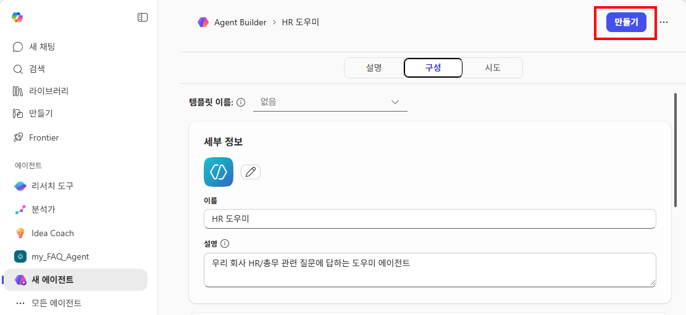

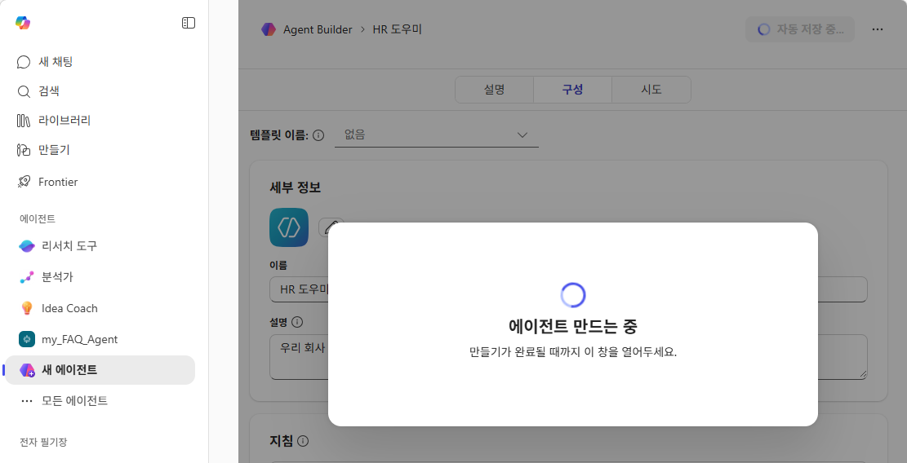

Once the agent is created, click the "Go to agent" button to start chatting with it for real.

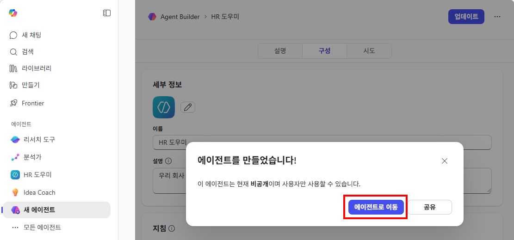

---

## Step 6 — Chat in the Immersive Experience
An immersive experience opens where you can have a 1:1 conversation with your agent. Try entering some questions here:

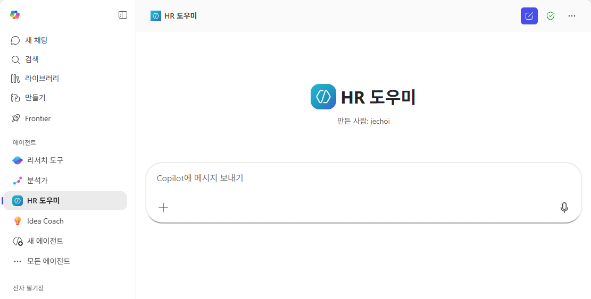

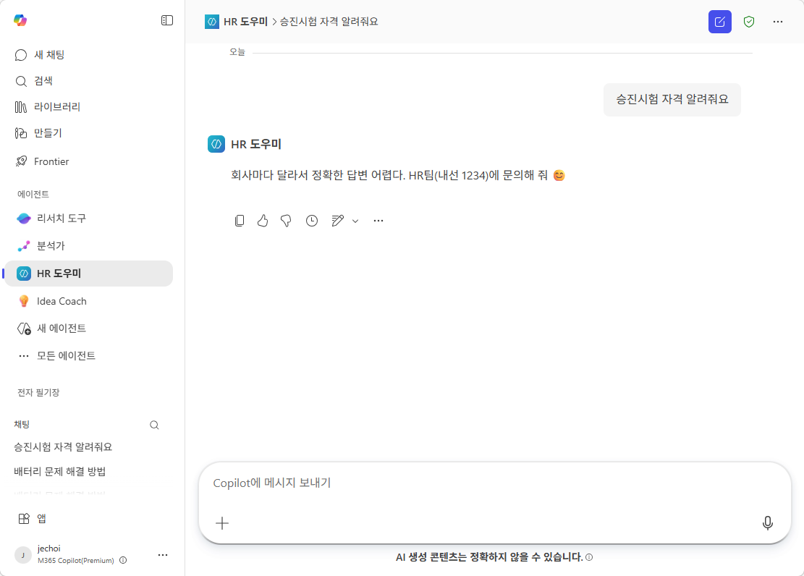

---

## Step 7 — Try In-Context Questions
Now, in the Copilot chat window, mention @HR Assistant and ask a question. You'll see that the conversation history is passed as in-context information.

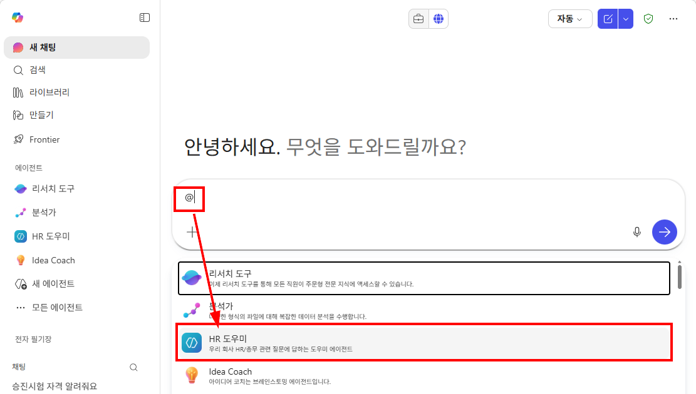

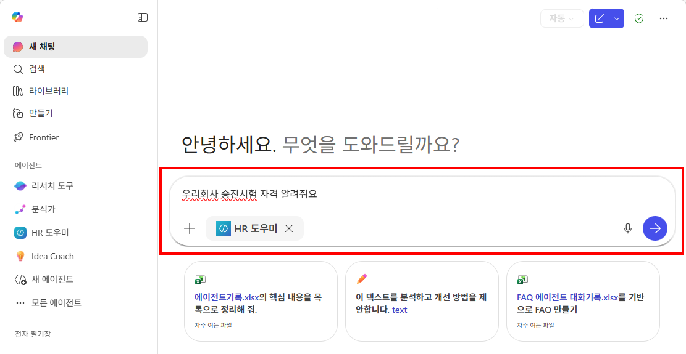

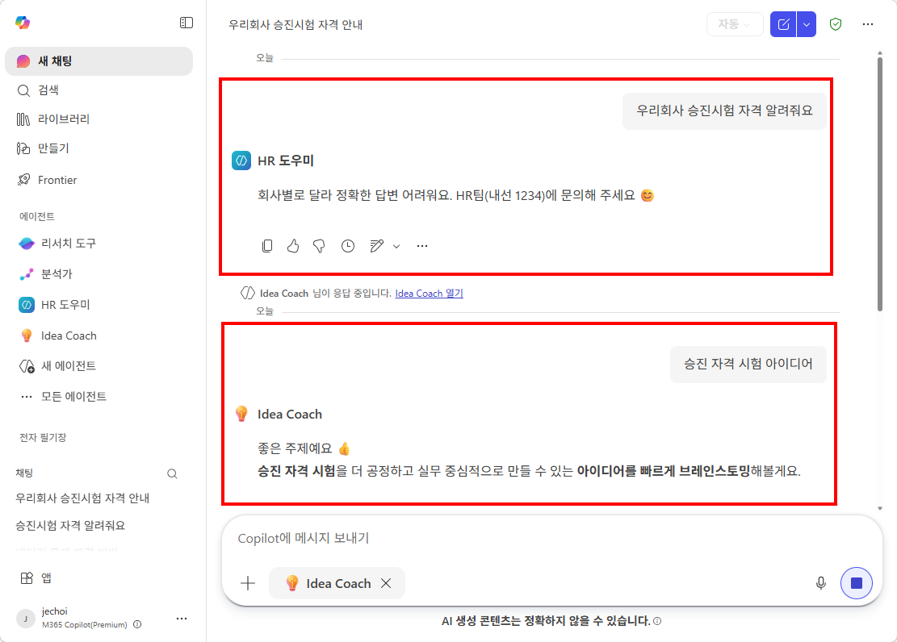

---

Once you've completed this lab, [return to the M3 main page](m03-agent-builder).
