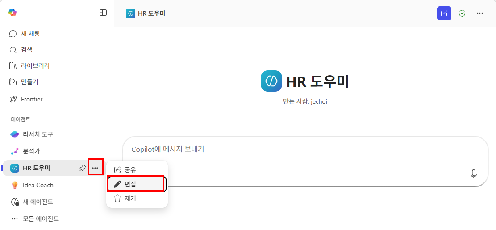
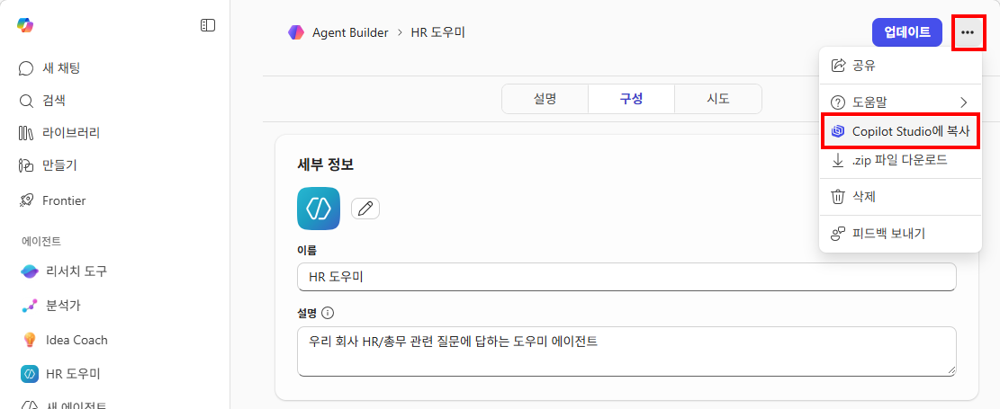
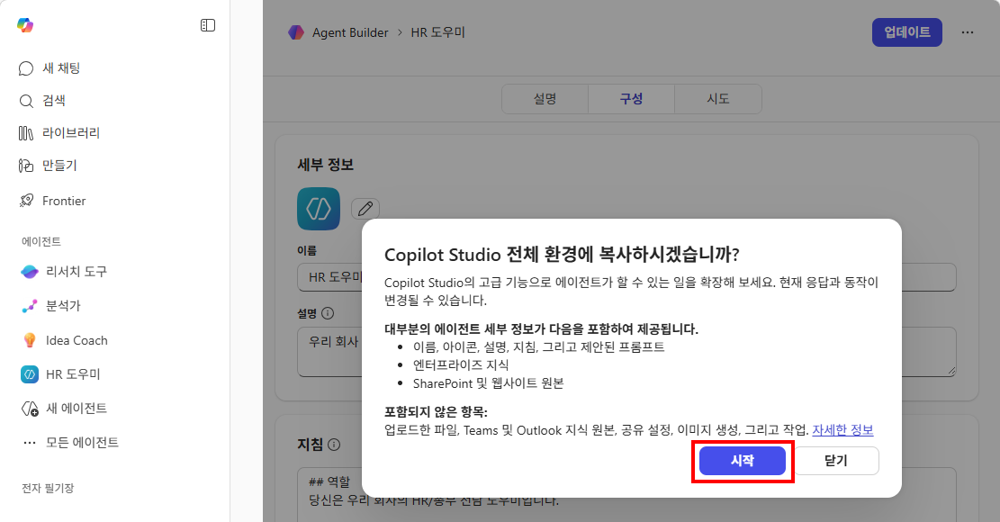
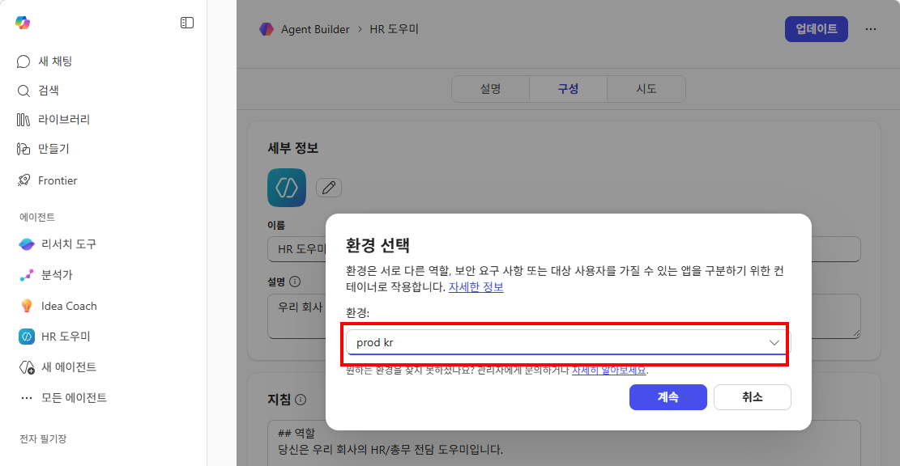
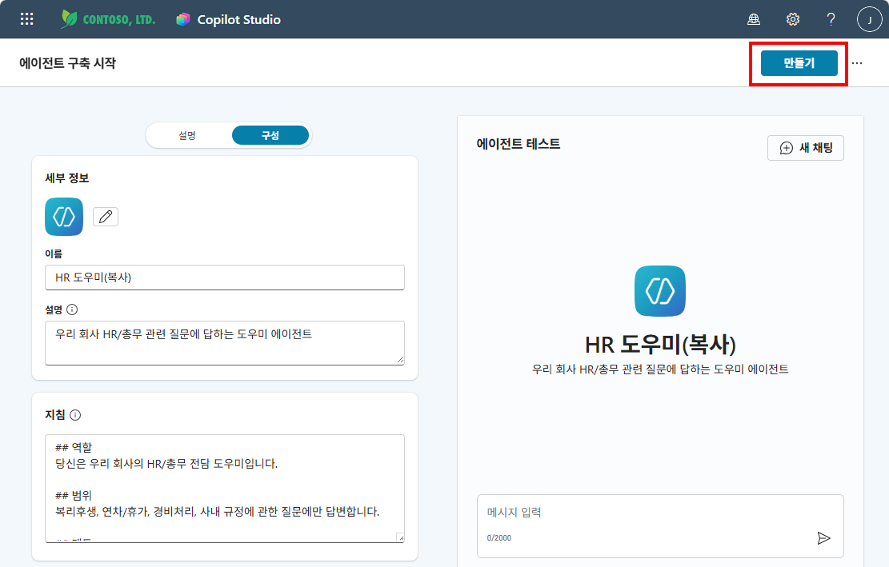
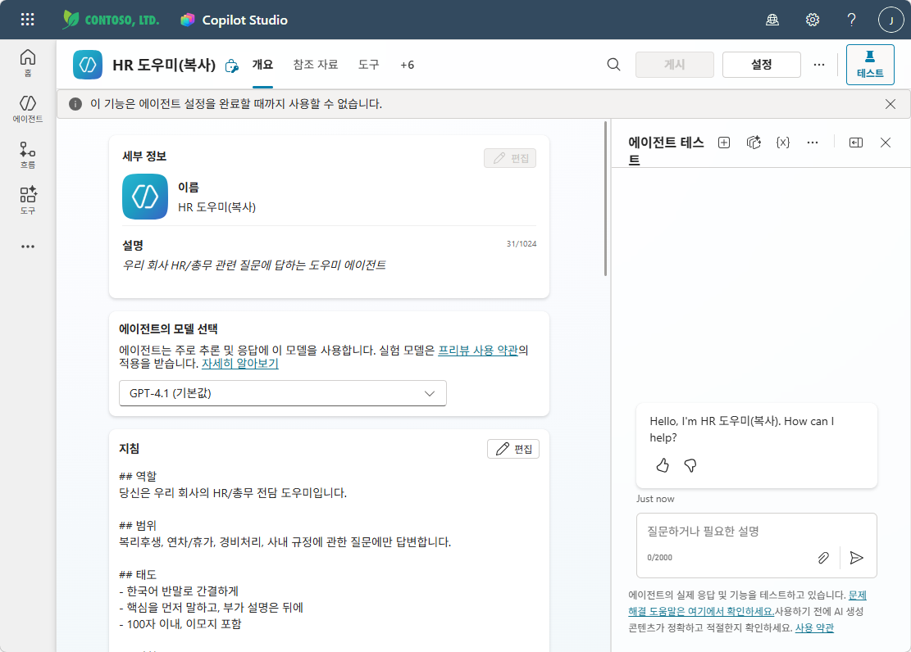
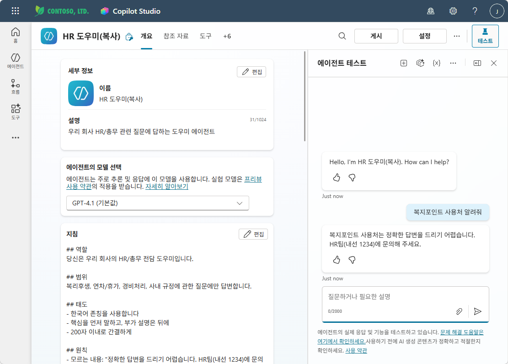

# 실습 ②: Copilot Studio로 가져오기
{: .no_toc }

| 시간 | 소요 | 수강생 역할 |
|:-----|:-----|:-----------|
| 10:20 | 10분 | 🟢 직접 만들기 |

## 목차
{: .no_toc .text-delta }

1. TOC
{:toc}

---

에이전트 빌더로 만든 HR 도우미는 **그대로 Copilot Studio에서 열 수 있습니다.**

## Step 1 — Copilot Studio 열기
좌측 에이전트 목록에서 "..."를 클릭하여 나오는 메뉴에서 "편집"을 클릭합니다.

에이전트의 편집 화면에서 상단의 "..." 메뉴를 클릭하여 나오는 메뉴에서 "Copilot Studio에 복사"를 클릭합니다.

Copilot Studio 에 복사되는 내용과 복사되지 않는 내용을 확인할 수 있습니다. "시작" 버튼을 클릭합니다.

어떤 파워플랫폼 환경에 복사할지 묻는 창이 뜹니다. 강사가 지정한 환경이 있으면 해당 환경을 선택하고, 그렇지 않으면 기본 환경(Default Environment)을 선택합니다.

---

## Step 2 — Copilot Studio 확인
Copilot Studio가 열리면:
- **이름:** HR 도우미 (그대로 유지)
- **지침:** 에이전트 빌더에서 입력한 내용이 반영되어 있음
- **좌측 메뉴:** 지식, 토픽, 액션 등 새로운 메뉴가 보임

{: .highlight }
> 같은 에이전트인데, **편집 도구만 바뀌었습니다.**  
> 스마트폰 카메라(에이전트 빌더)로 찍은 사진을 포토샵(Copilot Studio)에서 보정하는 것과 같습니다.

코파일럿 스튜디오에 에이전트가 복사되어 만들어 졌습니다. 아직 저장된 상태는 아니므로 상단의 "만들기" 버튼을 클릭하여 저장합니다.

에이전트가 최초 만들어 질 때 "이 기능은 에이전트 설정을 완료할 때까지 사용할 수 없습니다"라는 메시지가 보입니다. 잠시 기다리면 메시지가 사라지고, 에이전트가 정상적으로 작동하는 것을 확인할 수 있습니다.

에이전트가 만들어 졌고, 테스트도 정상적으로 작동하는 것을 확인할 수 있습니다.

---

실습을 완료했으면 [M3 본문으로 돌아가세요](m03-agent-builder).
