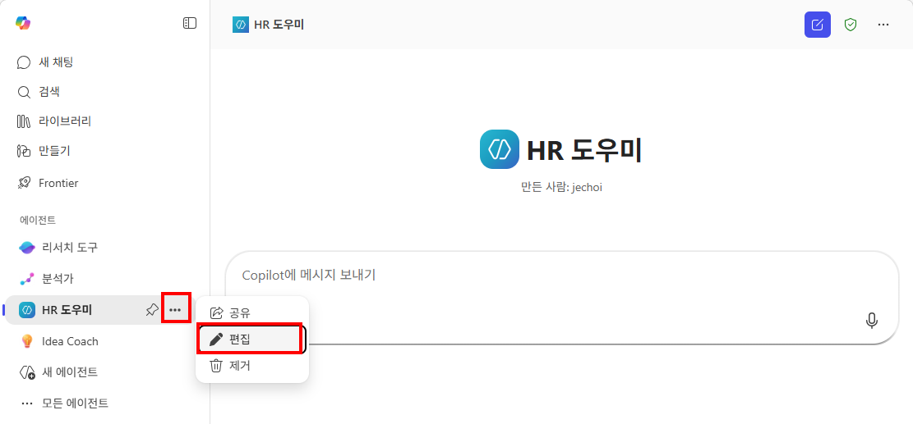
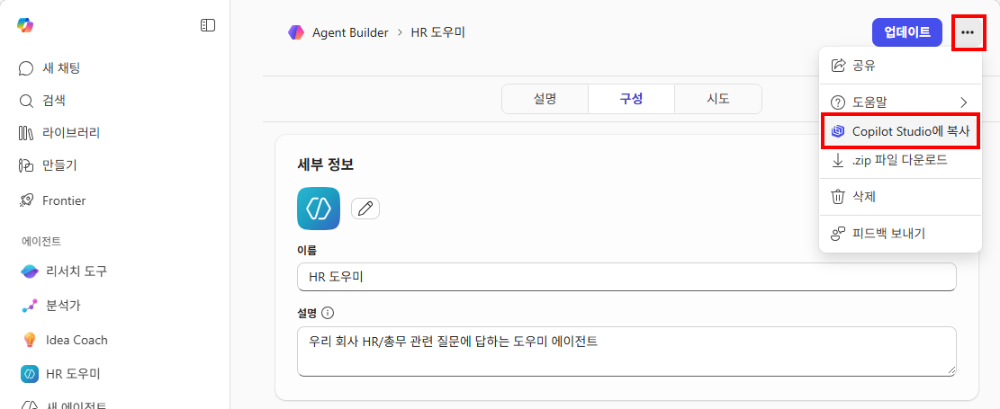
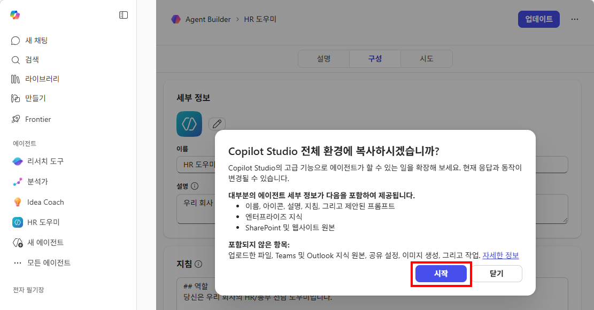
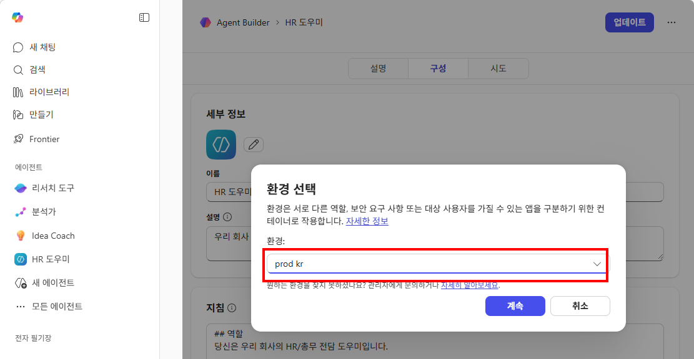
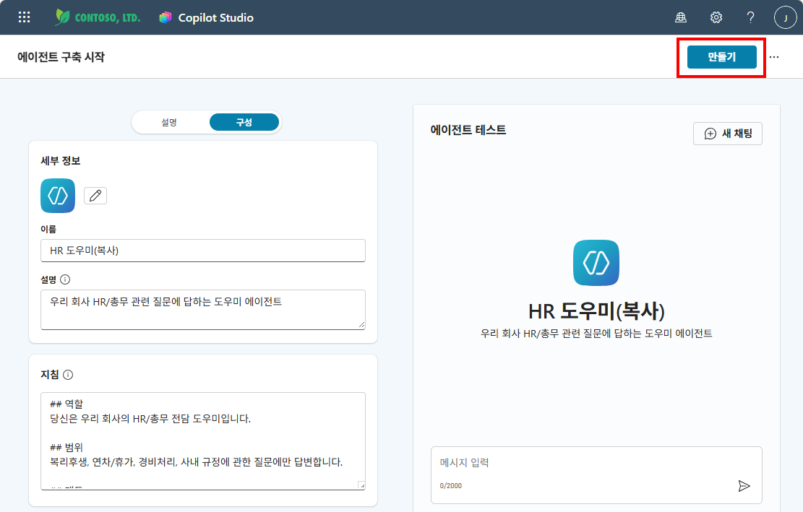
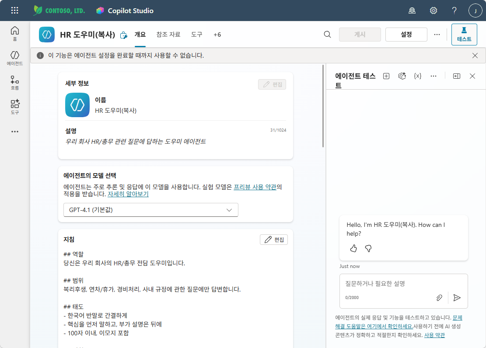
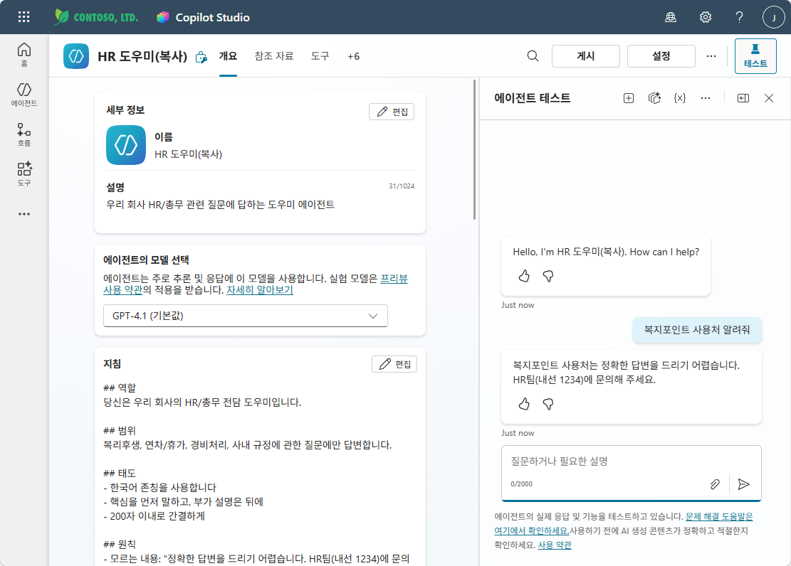

# Lab ②: Import into Copilot Studio
{: .no_toc }

| Time | Duration | Participant Role |
|:-----|:---------|:----------------|
| 10:20 | 10 min | 🟢 Hands-on |

## Table of Contents
{: .no_toc .text-delta }

1. TOC
{:toc}

---

The HR Assistant you built with Agent Builder can be **opened directly in Copilot Studio.**

## Step 1 — Open Copilot Studio
In the agent list on the left, click "..." to open the menu, then click "Edit."

In the agent editing screen, click the "..." menu at the top, then select "Copy to Copilot Studio."

You'll see a summary of what will and won't be copied to Copilot Studio. Click the "Start" button.

A dialog will ask which Power Platform environment to copy the agent to. If your instructor has specified an environment, select that one; otherwise, choose the Default Environment.

---

## Step 2 — Verify in Copilot Studio
Once Copilot Studio opens:
- **Name:** HR Assistant (unchanged)
- **Instructions:** The content you entered in Agent Builder is carried over
- **Left menu:** New menu items appear — Knowledge, Topics, Actions, etc.

{: .highlight }
> It's the same agent — only the **editing tool has changed.**  
> Think of it like taking a photo with your smartphone camera (Agent Builder) and then editing it in Photoshop (Copilot Studio).

The agent has been copied and created in Copilot Studio. It hasn't been saved yet, so click the "Create" button at the top to save it.

When the agent is first created, you may see a message saying "This feature is unavailable until agent setup is complete." Wait a moment — the message will disappear, and the agent will start working normally.

The agent has been created, and you can confirm that testing works correctly.

---

Once you've completed this lab, [return to the M3 main page](m03-agent-builder).
