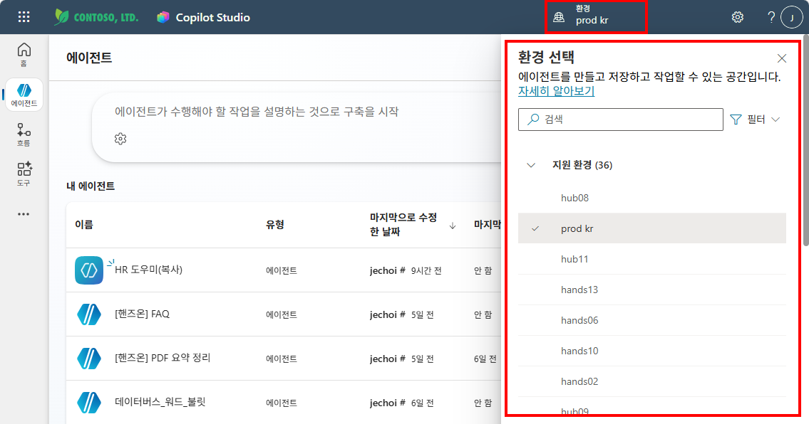
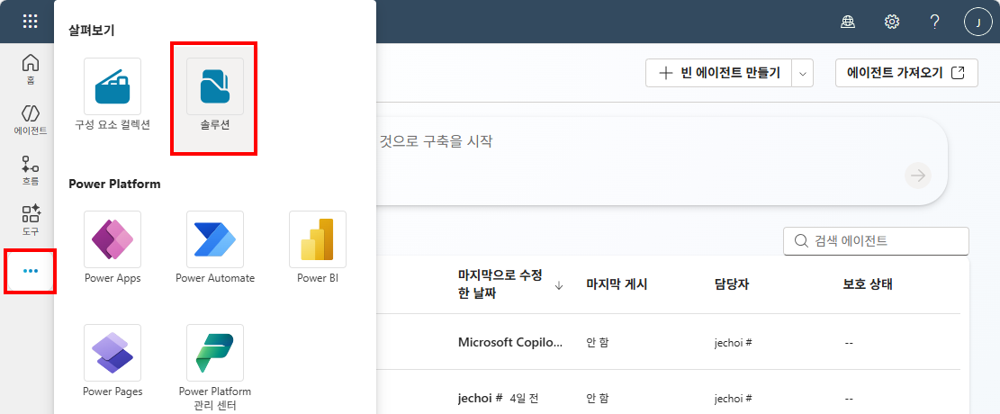
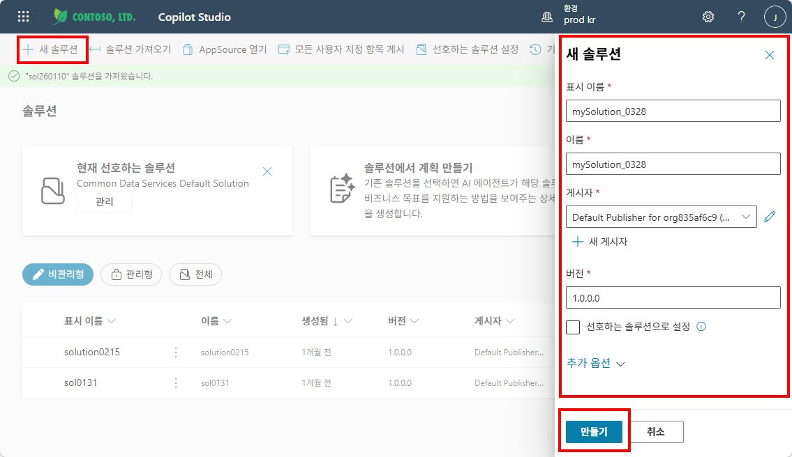
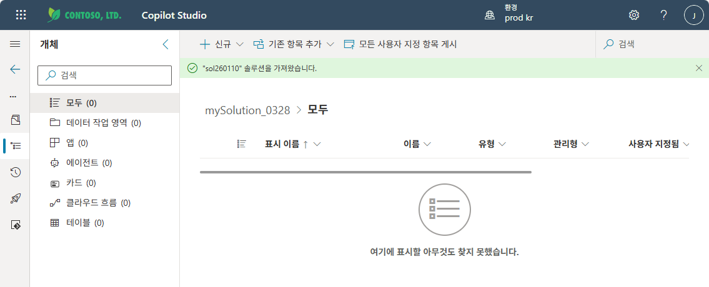
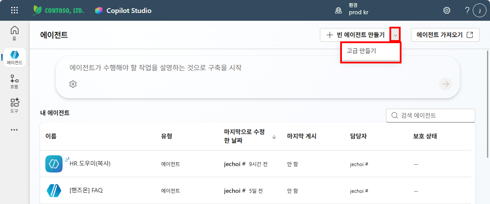
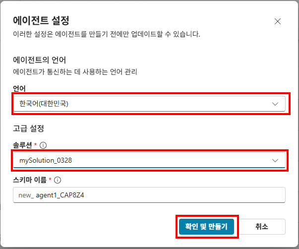
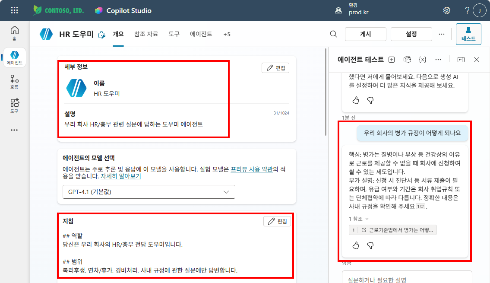

# 실습 ③: Copilot Studio에서 새 에이전트 만들기
{: .no_toc }

| 시간 | 소요 | 수강생 역할 |
|:-----|:-----|:-----------|
| 10:30 | 10분 | 🟢 직접 만들기 |

## 목차
{: .no_toc .text-delta }

1. TOC
{:toc}

---

{: .warning }
> 실습 ②에서 에이전트 빌더 → Copilot Studio로 가져오면 빠르고 편리하지만, **에이전트 언어가 영어로 고정**되고 변경할 수 없습니다.  
> 이 실습에서는 Copilot Studio에서 **처음부터** 에이전트를 만들어 **한국어 에이전트**를 생성합니다.

---

## Step 1 — Copilot Studio 접속 및 환경 확인

1. [Copilot Studio](https://copilotstudio.microsoft.com) 접속
2. 왼쪽 상단의 **환경(Environment)** 이 올바른지 확인
   - 강사가 지정한 환경이 있으면 해당 환경으로 전환

---

## Step 2 — 솔루션 만들기

에이전트를 독립된 솔루션에 넣으면 나중에 내보내기(Export)나 이동이 편리합니다.

1. 왼쪽 메뉴에서 **솔루션** 선택
2. **+ 새 솔루션** 클릭
3. 이름: `HR 도우미 솔루션` (또는 원하는 이름)
4. 게시자: 기본 게시자 선택
5. **만들기** 클릭

{: .tip }
> 솔루션은 에이전트·흐름·커넥터 등을 묶는 **컨테이너**입니다. 실무에서도 솔루션 단위로 관리하면 환경 간 이동이 깔끔합니다.

아래 스크린샷을 참고하여 각 단계를 진행하세요.

**① 살펴보기 메뉴 → 솔루션 선택**

**② + 새 솔루션 → 이름 입력 후 "만들기" 클릭**

**③ 솔루션 생성 완료 (빈 솔루션 화면)**

---

## Step 3 — 고급 만들기로 에이전트 생성

1. 왼쪽 메뉴에서 **에이전트** 선택
2. 에이전트 목록 상단의 **+ 새 에이전트** 클릭
3. ⚠️ "빈 에이전트 만들기" 대신 → **"고급 만들기"** 버튼 클릭
4. 설정 입력:

| 항목 | 값 |
|:-----|:---|
| **이름** | HR 도우미 |
| **설명** | 우리 회사 HR/총무 관련 질문에 답하는 도우미 에이전트 |
| **언어** | **한국어** 선택 |
| **솔루션** | 방금 만든 `HR 도우미 솔루션` 선택 |

5. **만들기** 클릭

**① 에이전트 목록 → "고급 만들기" 버튼 클릭**

**② 에이전트 설정 — 한국어 선택, 솔루션 지정, "확인 및 만들기" 클릭**

{: .important }
> **"고급 만들기"** 를 사용해야 언어와 솔루션을 직접 지정할 수 있습니다.  
> "빈 에이전트 만들기"로 만들면 언어가 영어로 고정되고 솔루션도 기본값이 사용됩니다.

---

## Step 4 — 에이전트 확인

새 에이전트가 열리면 아래를 확인합니다:

- **기본 언어**: 한국어로 설정되어 있는지 확인
- **솔루션**: 왼쪽 메뉴 → 솔루션에서 `HR 도우미 솔루션` 안에 에이전트가 들어있는지 확인

---

## 실습 ② 에이전트와의 차이

| 항목 | 실습 ② (에이전트 빌더 → 가져오기) | 실습 ③ (Copilot Studio 고급 만들기) |
|:-----|:---:|:---:|
| 생성 속도 | 빠름 (30초) | 약간 느림 (2~3분) |
| 에이전트 언어 | 영어 (변경 불가) | **한국어 직접 선택** |
| 솔루션 지정 | 기본 솔루션 | **원하는 솔루션 선택** |
| 내보내기/이동 | 불편 | **솔루션 단위로 깔끔** |

{: .highlight }
> **이후 실습에서는 이 실습 ③에서 만든 에이전트를 계속 사용합니다.**  
> M6 지침 → M7 지식 → M9 토픽 → M12 흐름까지 이 에이전트에 기능을 추가해 나갑니다.

---

실습을 완료했으면 [M3 본문으로 돌아가세요](m03-agent-builder).
