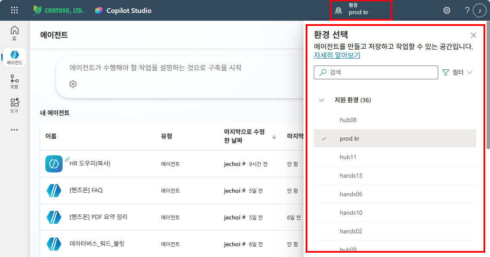
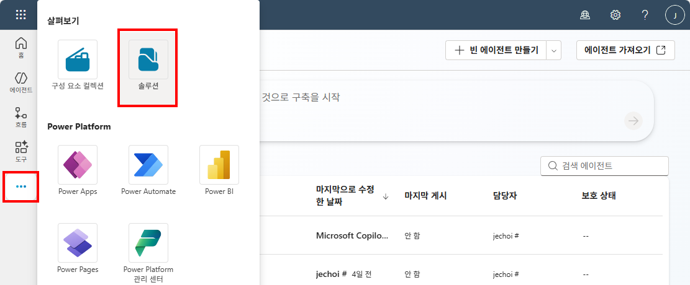
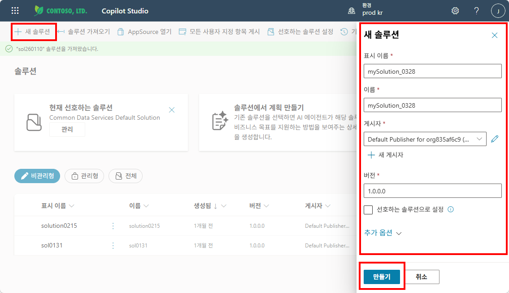
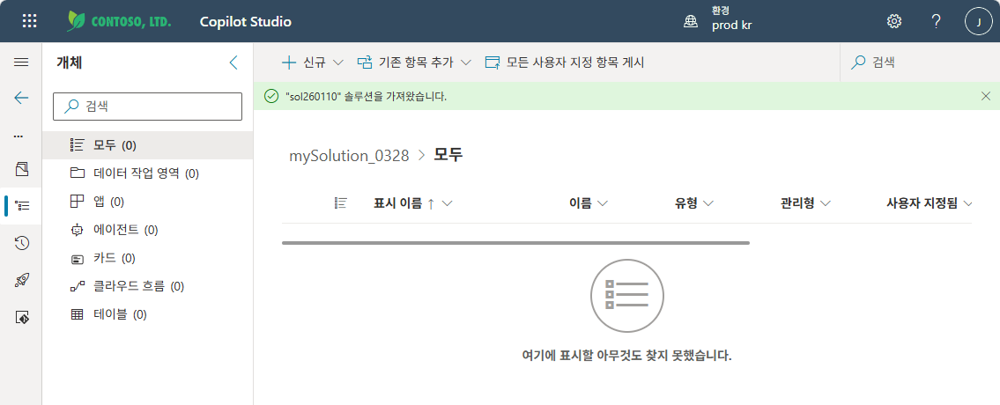
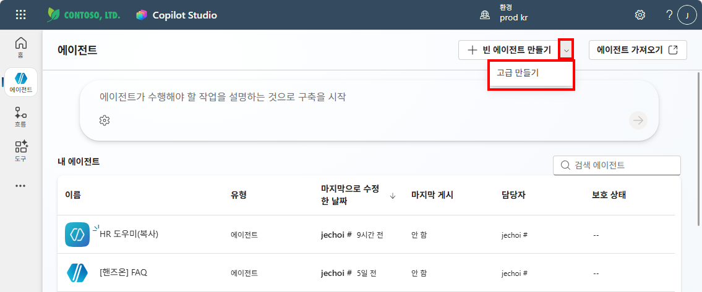
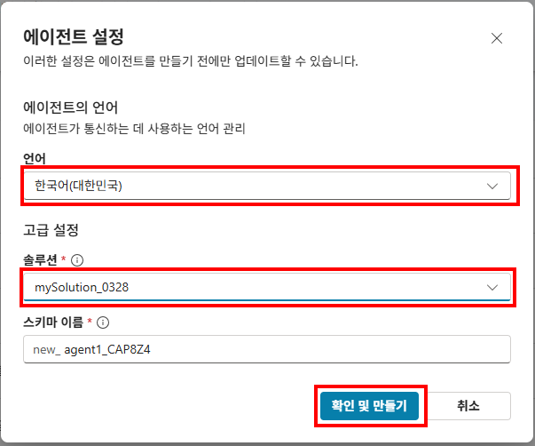
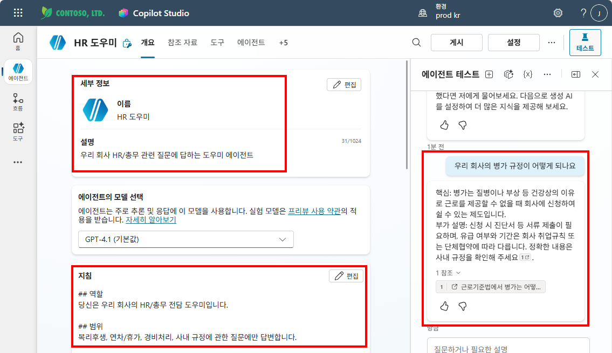

# Lab ③: Create a New Agent in Copilot Studio
{: .no_toc }

| Time | Duration | Participant Role |
|:-----|:---------|:----------------|
| 10:30 | 10 min | 🟢 Hands-on |

## Table of Contents
{: .no_toc .text-delta }

1. TOC
{:toc}

---

{: .warning }
> Importing from Agent Builder → Copilot Studio (Lab ②) is quick and convenient, but the **agent language gets locked to English** and cannot be changed.  
> In this lab, we create an agent **from scratch** in Copilot Studio to set up a **Korean-language agent**.

---

## Step 1 — Access Copilot Studio and Verify the Environment

1. Go to [Copilot Studio](https://copilotstudio.microsoft.com)
2. Verify that the **Environment** in the top-left corner is correct
   - If your instructor has specified an environment, switch to that one

---

## Step 2 — Create a Solution

Placing your agent in a dedicated solution makes it easier to export or move later.

1. Select **Solutions** from the left menu
2. Click **+ New solution**
3. Name: `HR Assistant Solution` (or any name you prefer)
4. Publisher: Select the default publisher
5. Click **Create**

{: .tip }
> A solution is a **container** that bundles agents, flows, connectors, and more. Managing things at the solution level in production makes moving between environments much cleaner.

---

## Step 3 — Create an Agent with Advanced Create

1. Select **Agents** from the left menu
2. Click **+ New agent** at the top of the agent list
3. ⚠️ Instead of "Create a blank agent" → click the **"Advanced Create"** button
4. Enter the settings:

| Field | Value |
|:------|:------|
| **Name** | HR Assistant |
| **Description** | An assistant agent that answers HR and general affairs questions for our company |
| **Language** | Select **Korean** |
| **Solution** | Select the `HR Assistant Solution` you just created |

5. Click **Create**

{: .important }
> You must use **"Advanced Create"** to specify the language and solution directly.  
> If you use "Create a blank agent," the language will be locked to English and the default solution will be used.

---

## Step 4 — Verify the Agent

Once the new agent opens, check the following:

- **Primary language**: Confirm it is set to Korean
- **Solution**: Go to Solutions in the left menu and verify the agent is inside the `HR Assistant Solution`

---

## Differences from the Lab ② Agent

| Item | Lab ② (Agent Builder → Import) | Lab ③ (Copilot Studio Advanced Create) |
|:-----|:---:|:---:|
| Creation speed | Fast (30 seconds) | Slightly slower (2–3 minutes) |
| Agent language | English (cannot be changed) | **Korean — directly selectable** |
| Solution assignment | Default solution | **Choose your own solution** |
| Export/migration | Inconvenient | **Clean, solution-based** |

{: .highlight }
> **All subsequent labs will continue using the agent created in this Lab ③.**  
> From M6 Instructions → M7 Knowledge → M9 Topics → M12 Flows, we'll keep adding capabilities to this agent.

---

Once you've completed this lab, [return to the M3 main page](m03-agent-builder).
