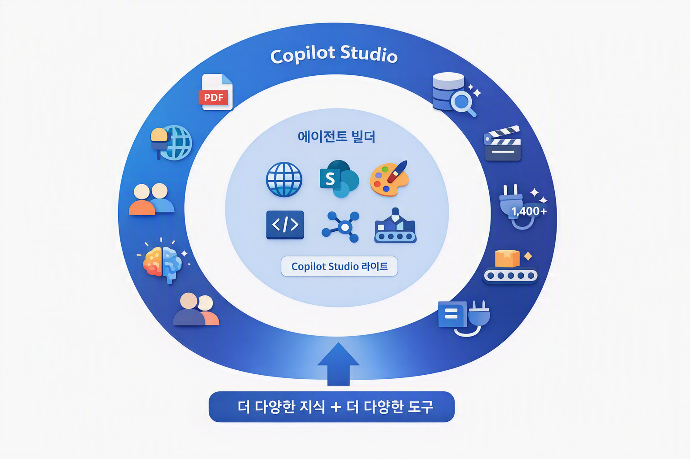

# 첫번째 에이전트 만들기 — 에이전트 빌더로 충분할까?
{: .no_toc }

| 시간 | 소요 | 수강생 역할 |
|:-----|:-----|:-----------|
| 10:05 | 30분 | 🟢 직접 만들기 |

## 목차
{: .no_toc .text-delta }

1. TOC
{:toc}


---

## 이 모듈에서 배우는 것

- M365 Copilot **에이전트 빌더**로 HR 도우미 에이전트를 직접 만들기
- 에이전트 빌더가 **이미 갖추고 있는 기능** — 지식 연결, 이미지 생성, 코드 인터프리터
- 에이전트 빌더만으로도 **충분히 쓸 만한 에이전트**를 만들 수 있다는 사실
- 그럼에도 **Copilot Studio를 선택하는 두 가지 이유**

---

## 에이전트 빌더란?

M365 Copilot 안에 내장된 **간편 에이전트 생성 도구**입니다.  
자연어로 설명하면 30초 만에 에이전트가 만들어집니다.

에이전트 빌더의 정식 명칭은 **Copilot Studio 라이트**입니다.  
라이트 버전이라고 해서 무시할 수준이 아닙니다 — 충분히 강력합니다.

---

## 실습 ①: HR 도우미 에이전트 만들기

### Step 1 — 에이전트 빌더 접속
1. [M365 Copilot](https://copilot.microsoft.com) 또는 Teams Copilot 채팅 접속
2. **에이전트 빌더** 선택

### Step 2 — 이름과 지침 입력

- **이름:** `HR 도우미`
- **지침(Instructions)** 입력란에 아래 내용을 복사해서 붙여넣으세요:

```
## 역할
당신은 우리 회사의 HR/총무 전담 도우미입니다.

## 범위
복리후생, 연차/휴가, 경비처리, 사내 규정에 관한 질문에만 답변합니다.

## 태도
- 한국어 존칭을 사용합니다
- 핵심을 먼저 말하고, 부가 설명은 뒤에
- 200자 이내로 간결하게

## 원칙
- 모르는 내용: "정확한 답변을 드리기 어렵습니다. HR팀(내선 1234)에 문의해 주세요"
- 개인정보(급여, 인사평가): 담당자 연결 안내
```

### Step 3 — 테스트: 답변 확인
테스트 패널에서 아래 질문을 하나씩 입력해 보세요:

| # | 테스트 질문 | 관찰 포인트 |
|:--|:---------|:-----------|
| 1 | "연차 며칠이야?" | 답변은 하지만 **우리 회사 규정이 아닌 일반론** |
| 2 | "경비처리 어떻게 해?" | 그럴듯하지만 **우리 회사 절차가 아닌 추측** |
| 3 | "복지포인트 사용처 알려줘" | 모른다고 하거나 **엉뚱한 정보를 지어냄** |
| 4 | "오늘 주식 시세 알려줘" | ⚠️ 범위 밖 → 거절 메시지가 나오는지 확인 |

{: .warning }
> 답변이 부정확한 이유는 에이전트 빌더의 한계가 **아닙니다**.  
> 아직 **지식(교과서)을 연결하지 않았기 때문**입니다. 다음 단계에서 해결합니다.

### Step 4 — 지침 수정 체험
지침의 태도를 한 줄 수정해 보세요:
- "존칭" → "반말로 간결하게"
- 또는 "200자 이내" → "100자 이내, 이모지 포함"

→ 에이전트의 답변 톤과 형식이 즉시 바뀌는 것을 확인!

{: .tip }
> 지침에 **역할·범위·태도·원칙**을 명확히 쓸수록 에이전트가 똑똑해집니다.  
> 이것이 M6에서 본격적으로 다듬을 핵심입니다.

---

## 에이전트 빌더, 생각보다 강력하다

"에이전트 빌더는 간단한 것만 할 수 있다"고 생각할 수 있지만, **사실이 아닙니다.**

### 에이전트 빌더가 이미 제공하는 기능

| 기능 | 설명 |
|:-----|:-----|
| **지식 연결** | 웹사이트 URL, SharePoint 사이트를 지식 소스로 연결 가능 |
| **이미지 생성** | DALL-E 기반 이미지 생성 도구 내장 |
| **코드 인터프리터** | Python 코드 실행 — 데이터 분석, 차트 생성 가능 |
| **이미지 분석** | Graph connector를 통한 이미지 분석 도구 지원 |
| **MS Graph 연결** | Graph connector를 통해 M365 데이터 접근 |

{: .highlight }
> 에이전트 빌더(Copilot Studio 라이트)만으로도 **충분히 쓸 만한 에이전트**를 만들 수 있습니다.  
> 지식을 연결하고, 이미지를 생성하고, 데이터를 분석하는 에이전트가 **코드 한 줄 없이** 가능합니다.

---

## 그럼 왜 Copilot Studio가 필요한가?

에이전트 빌더로 충분한 경우가 많습니다.  
하지만 **두 가지 경우**에는 Copilot Studio(풀 버전)가 필요합니다.

### 이유 1: 더 다양한 지식 소스

| 지식 소스 | 에이전트 빌더 | Copilot Studio |
|:---------|:----------:|:------------:|
| 웹사이트 URL | ✅ | ✅ |
| SharePoint | ✅ | ✅ |
| 파일 직접 업로드 (Word, PDF 등) | ❌ | ✅ |
| Dataverse 테이블 | ❌ | ✅ |
| AI Search 인덱스 | ❌ | ✅ |
| Azure OpenAI 커스텀 지식 | ❌ | ✅ |

### 이유 2: 더 다양한 도구

| 도구 유형 | 에이전트 빌더 | Copilot Studio |
|:---------|:----------:|:------------:|
| 이미지 생성 (DALL-E) | ✅ | ✅ |
| 코드 인터프리터 | ✅ | ✅ |
| **토픽(대본형 대화 흐름)** | ❌ | ✅ |
| **커넥터 (1,400+ 외부 서비스)** | ❌ | ✅ |
| **에이전트 흐름 (Power Automate)** | ❌ | ✅ |
| **AI 프롬프트 (흐름 내 AI)** | ❌ | ✅ |
| **멀티에이전트 (에이전트 간 연결)** | ❌ | ✅ |
| **MCP (외부 프로토콜 연결)** | ❌ | ✅ |
| **트리거 (이벤트 기반 자동 실행)** | ❌ | ✅ |
| **배포 채널 (Teams, 웹, 앱 등)** | 제한적 | ✅ |



{: .highlight }
> **에이전트 빌더 = 충분히 강력한 기본기.**  
> **Copilot Studio = 더 넓은 지식과 더 많은 도구.**  
> 어디까지 필요한지에 따라 선택하면 됩니다.

---

## 언제 어떤 것을 선택하는가?

| 요건 | 에이전트 빌더로 충분 | Copilot Studio 필요 |
|:-----|:-----------------:|:-----------------:|
| 웹사이트/SharePoint 기반 FAQ 봇 | ✅ | |
| 이미지 생성이 가능한 마케팅 도우미 | ✅ | |
| 데이터 분석(코드 인터프리터) 활용 | ✅ | |
| **사내 PDF/Word 문서를 직접 참조** | | ✅ |
| **AI Search 인덱스 연결** | | ✅ |
| **레거시 시스템 API 연동** | | ✅ |
| **대화 흐름 제어 (토픽)** | | ✅ |
| **메일 발송, Excel 기록 등 자동화** | | ✅ |
| **여러 에이전트 협업 (멀티에이전트)** | | ✅ |

{: .tip }
> 오늘 과정에서는 Copilot Studio의 풀 기능을 배우지만, 실무에서 에이전트 빌더만으로 해결되는 경우도 많습니다. **"가장 단순한 도구로 충분히 되는지"를 먼저 판단**하는 것이 좋습니다.

---

## 실습 ②: Copilot Studio로 가져오기

에이전트 빌더로 만든 HR 도우미는 **그대로 Copilot Studio에서 열 수 있습니다.**

### Step 1 — Copilot Studio 열기
에이전트 빌더 화면에서 **"Copilot Studio에서 편집"** (또는 ⚙️ 설정 → "Copilot Studio에서 열기")을 클릭합니다.

### Step 2 — Copilot Studio 확인
Copilot Studio가 열리면:
- **이름:** HR 도우미 (그대로 유지)
- **지침:** 에이전트 빌더에서 입력한 내용이 반영되어 있음
- **좌측 메뉴:** 지식, 토픽, 액션 등 새로운 메뉴가 보임

{: .highlight }
> 같은 에이전트인데, **편집 도구만 바뀌었습니다.**  
> 스마트폰 카메라(에이전트 빌더)로 찍은 사진을 포토샵(Copilot Studio)에서 보정하는 것과 같습니다.

{: .important }
> 이 HR 도우미 에이전트를 **오늘 하루 동안 점점 완성**해 갑니다.  
> M6에서 지침을 다듬고, M7에서 지식을 연결하고, M9에서 Topic을 추가하고, M12에서 흐름을 붙입니다.

---

{: .tip }
> 시간이 남거나 다양한 에이전트를 체험해 보고 싶다면, [M3a. 샘플 에이전트 체험](m03a-sample-agents) 부록에서 **6가지 샘플 지침**을 복사·붙여넣기해 보세요.

---

## 핵심 정리

1. 에이전트 빌더로 **HR 도우미**를 30초 만에 생성
2. 에이전트 빌더도 **지식 연결, 이미지 생성, 코드 인터프리터**를 제공한다 — 간단한 에이전트는 이것만으로 충분
3. Copilot Studio가 필요한 이유는 **두 가지** — 더 다양한 지식 소스, 더 다양한 도구
4. **Copilot Studio로 가져와서** 오늘 하루 동안 지침·지식·Topic·Flow를 붙여 완성한다

---

## FAQ

| 질문 | 답변 |
|:-----|:-----|
| 에이전트 빌더에서 만든 걸 그대로 Copilot Studio에서 열 수 있나요? | 네, 같은 에이전트입니다. 편집 도구만 바뀌는 것입니다. |
| 에이전트 빌더만으로 충분한 경우도 있나요? | **네.** 웹/SharePoint 지식 + 이미지 생성 + 코드 인터프리터면 충분한 경우가 많습니다. |
| 그럼 왜 Copilot Studio를 배우나요? | 사내 문서 직접 참조, 레거시 시스템 연동, 대화 흐름 제어 등 **범위를 넘는 요건**이 있을 때 필요하기 때문입니다. |
| M3에서 만든 HR 도우미를 계속 쓰나요? | 네, 오늘 하루 동안 이 에이전트에 지침·지식·Topic·Flow를 추가하며 완성합니다. |
| 영어로 지침을 써야 더 잘 되나요? | 한국어로 작성해도 잘 작동합니다. 한국어 지침 권장. |

---

## 참조 자료

| 자료 | 링크 |
|:-----|:-----|
| M365 Copilot 에이전트 빌더 | [learn.microsoft.com](https://learn.microsoft.com/microsoft-365-copilot/extensibility/copilot-studio-agent-builder) |
| Copilot Studio 시작하기 | [learn.microsoft.com](https://learn.microsoft.com/microsoft-copilot-studio/fundamentals-get-started) |

---

다음 모듈: [M4. 에이전트의 구성요소](m04-four-components)
