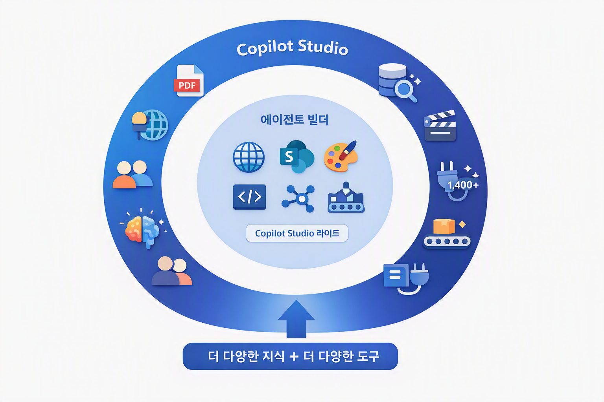

# Building Your First Agent — Is Agent Builder Enough?
{: .no_toc }

| Time | Duration | Participant Role |
|:-----|:---------|:----------------|
| 10:05 | 30 min | 🟢 Hands-on |

## Table of Contents
{: .no_toc .text-delta }

1. TOC
{:toc}

---

## What You'll Learn in This Module

- Build an HR Assistant agent hands-on using the M365 Copilot **Agent Builder**
- Discover the capabilities **Agent Builder already has** — knowledge connections, image generation, code interpreter
- See that Agent Builder alone can produce **a perfectly usable agent**
- Understand the **two reasons you'd choose Copilot Studio** instead

---

## What Is Agent Builder?

Agent Builder is a **simple agent creation tool** built right into M365 Copilot.  
Describe what you want in natural language and your agent is ready in 30 seconds.

Agent Builder's official name is **Copilot Studio Lite**.  
Don't underestimate the "Lite" label — it's surprisingly powerful.

---

## Lab ①: Create an HR Assistant Agent

{: .important }
> 📌 This lab is on a separate page.  
> Complete [Lab ①: Create an HR Assistant Agent](m03-1-create-agent) and then come back here.

---

## Agent Builder Is More Powerful Than You Think

You might assume Agent Builder can only handle simple tasks — **that's not true.**

### Capabilities Agent Builder Already Provides

| Capability | Description |
|:-----------|:------------|
| **Knowledge connections** | Connect website URLs and SharePoint sites as knowledge sources |
| **Image generation** | Built-in DALL-E-based image generation tool |
| **Code interpreter** | Run Python code — data analysis and chart creation |
| **Image analysis** | Image analysis tool support via Graph connectors |
| **MS Graph connection** | Access M365 data through Graph connectors |

{: .highlight }
> Agent Builder (Copilot Studio Lite) alone can produce **a perfectly usable agent**.  
> An agent that connects to knowledge, generates images, and analyzes data — **all without a single line of code**.

---

## So Why Do You Need Copilot Studio?

Agent Builder is sufficient in many cases.  
However, there are **two scenarios** where you need Copilot Studio (the full version).

### Reason 1: More Knowledge Sources

| Knowledge Source | Agent Builder | Copilot Studio |
|:-----------------|:------------:|:--------------:|
| Website URLs | ✅ | ✅ |
| SharePoint | ✅ | ✅ |
| Direct file uploads (Word, PDF, etc.) | ❌ | ✅ |
| Dataverse tables | ❌ | ✅ |
| AI Search indexes | ❌ | ✅ |
| Azure OpenAI custom knowledge | ❌ | ✅ |

### Reason 2: More Tools

| Tool Type | Agent Builder | Copilot Studio |
|:----------|:------------:|:--------------:|
| Image generation (DALL-E) | ✅ | ✅ |
| Code interpreter | ✅ | ✅ |
| **Topics (scripted conversation flows)** | ❌ | ✅ |
| **Connectors (1,400+ external services)** | ❌ | ✅ |
| **Agent flows (Power Automate)** | ❌ | ✅ |
| **AI prompts (AI within flows)** | ❌ | ✅ |
| **Multi-agent (agent-to-agent connections)** | ❌ | ✅ |
| **MCP (external protocol connections)** | ❌ | ✅ |
| **Triggers (event-based automation)** | ❌ | ✅ |
| **Deployment channels (Teams, web, apps, etc.)** | Limited | ✅ |

{: .highlight }
> **Agent Builder = a powerful foundation.**  
> **Copilot Studio = broader knowledge and more tools.**  
> Choose based on how far your requirements go.

---

## When Should You Choose Which?

| Requirement | Agent Builder Is Enough | Copilot Studio Needed |
|:------------|:----------------------:|:---------------------:|
| FAQ bot based on website/SharePoint | ✅ | |
| Marketing assistant with image generation | ✅ | |
| Data analysis using code interpreter | ✅ | |
| **Reference internal PDF/Word documents directly** | | ✅ |
| **Connect to AI Search indexes** | | ✅ |
| **Integrate with legacy system APIs** | | ✅ |
| **Control conversation flows (Topics)** | | ✅ |
| **Automate email sending, Excel logging, etc.** | | ✅ |
| **Multi-agent collaboration** | | ✅ |

{: .tip }
> Today's course covers the full capabilities of Copilot Studio, but in practice, Agent Builder alone handles many real-world scenarios. **Always start by asking "Can the simplest tool do the job?"**

---

## Lab ②: Import into Copilot Studio

{: .important }
> 📌 This lab is on a separate page.  
> Complete [Lab ②: Import into Copilot Studio](m03-2-open-in-studio) and then come back here.

---

## Lab ③: Create a New Agent in Copilot Studio

The agent imported in Lab ② has its **language locked to English** and cannot be changed.  
By creating from scratch in Copilot Studio, you can set up a **Korean-language agent in its own solution**.

{: .important }
> 📌 This lab is on a separate page.  
> Complete [Lab ③: Create a New Agent in Copilot Studio](m03-3-studio-new-agent) and then come back here.

---

{: .tip }
> If you have extra time or want to explore different types of agents, check out the [M3a. Sample Agents](m03a-sample-agents) appendix and try **6 sample instructions** by copy-and-paste.

---

## Key Takeaways

1. Created an **HR Assistant** in 30 seconds with Agent Builder
2. Agent Builder already offers **knowledge connections, image generation, and code interpreter** — simple agents need nothing more
3. The **two reasons** you need Copilot Studio — more knowledge sources and more tools
4. Agents imported from Agent Builder are **locked to English** → Use Copilot Studio **Advanced Create** to build a Korean-language agent
5. **All subsequent labs continue with the agent from Lab ③** — we'll keep adding instructions, knowledge, Topics, and Flows to complete it

---

## FAQ

| Question | Answer |
|:---------|:-------|
| Can I open an Agent Builder agent directly in Copilot Studio? | Yes — it's the same agent. Only the editing tool changes. |
| Are there cases where Agent Builder alone is sufficient? | **Yes.** Web/SharePoint knowledge + image generation + code interpreter covers many scenarios. |
| Then why learn Copilot Studio? | Because you'll need it when requirements go beyond Agent Builder — direct internal document references, legacy system integrations, conversation flow control, etc. |
| Will we keep using the HR Assistant from M3? | Yes — the agent created in **Lab ③** will be used throughout the rest of the day. |
| Do instructions work better in English? | Instructions work well in Korean too. Writing them in Korean is recommended. |
| Why don't we use the agent imported from Agent Builder? | Its language is locked to English and can't be changed. We create a new Korean-language agent in Lab ③. |
| Do I have to create a solution? | It's not required, but creating agents inside a solution makes exporting and moving them much easier. |

---

## References

| Resource | Link |
|:---------|:-----|
| M365 Copilot Agent Builder | [learn.microsoft.com](https://learn.microsoft.com/microsoft-365-copilot/extensibility/copilot-studio-agent-builder) |
| Getting Started with Copilot Studio | [learn.microsoft.com](https://learn.microsoft.com/microsoft-copilot-studio/fundamentals-get-started) |

---

Next module: [M4. The Components of an Agent](m04-four-components)
