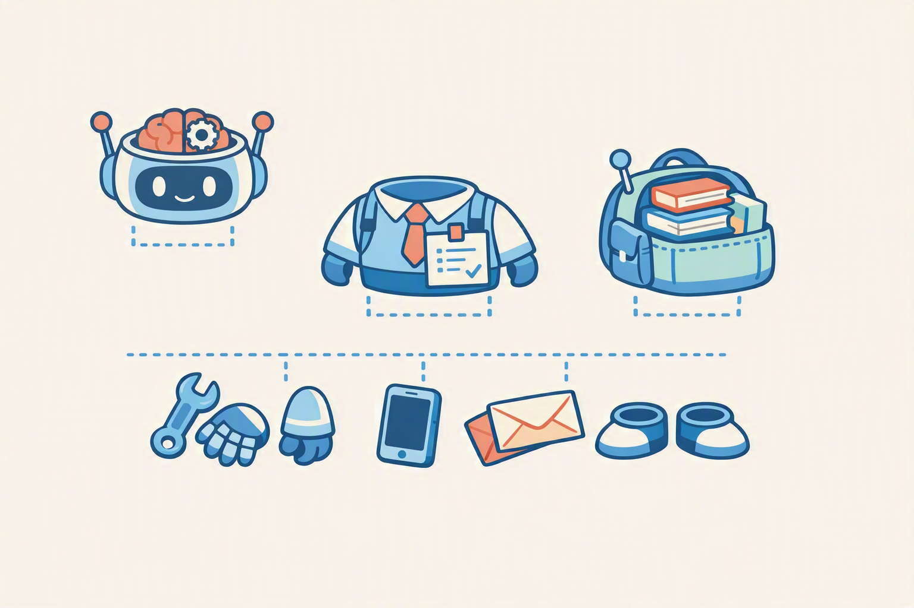

# 에이전트의 4가지 구성요소 + Copilot Studio 둘러보기
{: .no_toc }

| 시간 | 소요 | 수강생 역할 |
|:-----|:-----|:-----------|
| 10:35 | 20분 |  보기 |

## 목차
{: .no_toc .text-delta }

1. TOC
{:toc}

---

## 이 모듈에서 배우는 것

- **생성형 오케스트레이션**(자동변속)의 개념
- 에이전트의 **4가지 구성요소**(오케스트레이터지침지식도구)
- Copilot Studio 화면에서 각 구성요소가 **어디에 있는지** 확인

{: .highlight }
> M3에서 에이전트 빌더로 만든 HR 도우미를 Copilot Studio에서 열었습니다.  
> 이 모듈에서는 Copilot Studio의 구조를 파악하고, M5부터 진행할 실습의 지도를 머릿속에 그립니다.

---

## 생성형 오케스트레이션 = 자동변속

Copilot Studio에는 두 가지 방식이 있습니다.

| 방식 | 비유 | 설명 |
|:-----|:-----|:-----|
| **생성형** (자동변속) | 오토매틱 | AI가 상황을 판단하고 알아서 처리 |
| 클래식 (수동변속) | 수동 변속기 | 모든 흐름을 일일이 설계 |

{: .highlight }
> 이 과정에서는 **생성형(자동변속)**을 사용합니다. 더 직관적이고, 텍스트만으로 에이전트를 만들 수 있습니다.

---

## 에이전트의 4가지 구성요소

에이전트는 4가지 구성요소로 이루어져 있습니다.

| 구성요소 | 역할 | 비유 | 배울 모듈 |
|:---------|:-----|:-----|:---------|
| **오케스트레이터** | 어떤 AI가 두뇌인가 + 에이전트 전체 설정 | 자동차 엔진 | M5 |
| **지침** | 역할태도범위원칙 |  채용공고 | M6 |
| **지식** | 답변의 근거 자료 |  교과서 | M7 |
| **도구** | 실제로 할 수 있는 행동 |  손발 | M8~M16 |

{: .note }
> **남은 건 다 도구입니다.** 토픽, 커넥터, 에이전트 흐름, AI 프롬프트, 멀티에이전트, MCP, 트리거  이 과정의 절반이 도구 실습입니다.

---

## Copilot Studio 화면 둘러보기

M3에서 에이전트 빌더로 만든 HR 도우미를 Copilot Studio에서 열어봅니다.

### 왼쪽 메뉴 구조

| 메뉴 | 역할 | 해당 구성요소 |
|:-----|:-----|:------------|
| **개요** | 에이전트 기본 정보채널 |  |
| **지침** | 지침(채용공고) 입력 | 지침 (M6) |
| **지식** | 참조 문서 연결 | 지식 (M7) |
| **토픽** | 대본(Topic) 관리 | 도구 (M9) |
| **작업** | 커넥터흐름 연결 | 도구 (M11M12) |
| **설정** | AI 모델 선택동작 조정 | 오케스트레이터 (M5) |

### 화면을 열면 가장 먼저 볼 것

1. **설정  생성형 AI**  생성형 오케스트레이션이 켜져 있는지 확인
2. **설정  AI 모델**  어떤 모델이 선택돼 있는지 확인
3. **지침** 탭  에이전트 빌더가 자동으로 작성한 지침 내용 확인
4. **지식** 탭  연결된 지식 소스가 있는지 확인
5. **토픽** 탭  기본 시스템 토픽 목록 확인

{: .tip }
> 지금 당장 모든 것을 이해할 필요는 없습니다. "이 버튼이 어디에 있었지" 정도만 기억해 두세요. M5부터 하나씩 직접 건드릴 예정입니다.

---

## 핵심 정리

1. **생성형 오케스트레이션** = AI가 알아서 판단하는 자동변속
2. 에이전트 = **오케스트레이터 + 지침 + 지식 + 도구**
3. 도구가 가장 넓다  토픽커넥터흐름MCP트리거 모두 도구

---

다음 모듈: [M5. 오케스트레이터](m05-orchestrator)
