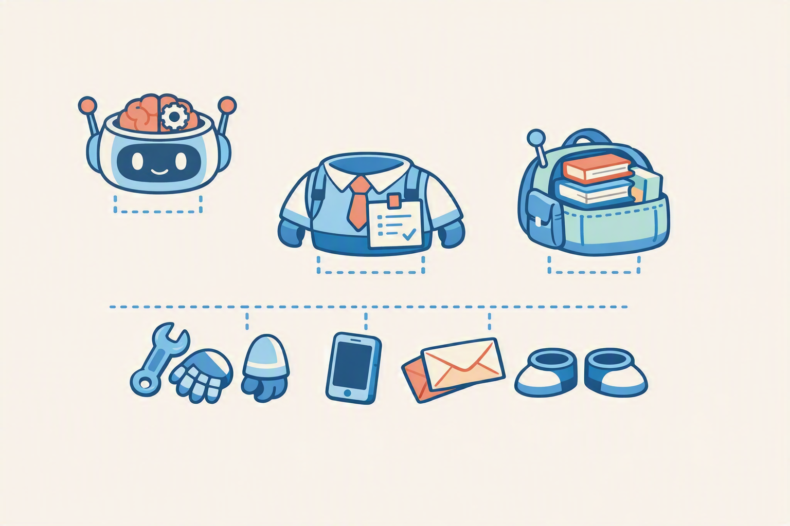
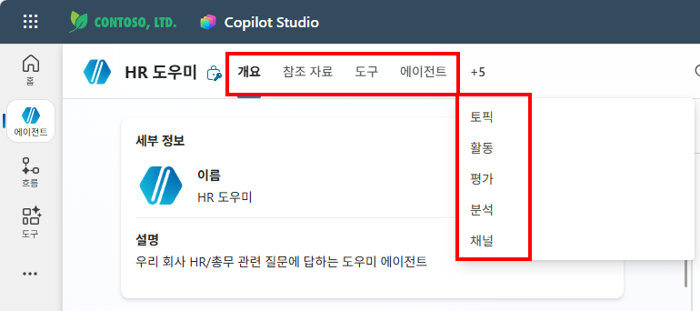

# The 4 Components of an Agent + Copilot Studio Tour
{: .no_toc }

| Time | Duration | Participant Role |
|:-----|:---------|:-----------------|
| 10:35 | 20 min | 👀 Watch |

## Table of Contents
{: .no_toc .text-delta }

1. TOC
{:toc}

---

## What You'll Learn in This Module

- The concept of **Generative Orchestration** (automatic transmission)
- The **4 components** of an agent (Orchestrator / Instructions / Knowledge / Tools)
- **Where each component is located** in the Copilot Studio interface

{: .highlight }
> In M3, we opened the HR Assistant created with Agent Builder in Copilot Studio.  
> In this module, we'll understand the structure of Copilot Studio and build a mental map for the hands-on labs starting from M5.

---

## Generative Orchestration = Automatic Transmission

Copilot Studio offers two modes:

| Mode | Analogy | Description |
|:-----|:--------|:------------|
| **Generative** (automatic) | Automatic transmission | AI assesses the situation and handles it on its own |
| Classic (manual) | Manual transmission | You design every flow step by step |

{: .highlight }
> In this course, we use **Generative (automatic transmission)**. It's more intuitive and lets you build agents using just text.

---

## The 4 Components of an Agent

An agent is made up of four components:

| Component | Role | Analogy | Module |
|:----------|:-----|:--------|:-------|
| **Orchestrator** | Which AI serves as the brain + overall agent settings | Car engine | M5 |
| **Instructions** | Role · Tone · Scope · Principles | 📋 Behavior manual | M6 |
| **Knowledge** | Reference material for answers | 📖 Textbook | M7 |
| **Tools** | Actions the agent can actually perform | 🤲 Hands and feet | M8–M16 |

{: .note }
> **Everything else is a Tool.** Topics, Connectors, Agent Flows, AI Prompts, Multi-Agent, MCP, Triggers — half of this course is hands-on tool labs.

---

## Copilot Studio Interface Tour

Let's open the HR Assistant we created with Agent Builder in M3 in Copilot Studio.

### Menu Structure

| Menu | Purpose | Component |
|:-----|:--------|:----------|
| **Overview** | Agent basic info & channels | — |
| **Instructions** | Enter instructions (behavior manual) | Instructions (M6) |
| **Knowledge** | Connect reference documents | Knowledge (M7) |
| **Topics** | Manage scripts (Topics) | Tools (M9) |
| **Actions** | Connect Connectors & Flows | Tools (M11–M12) |
| **Settings** | Select AI model & adjust behavior | Orchestrator (M5) |

### What to Check First When You Open the Screen

1. **Settings → Generative AI** — Verify that Generative Orchestration is turned on
2. **Settings → AI Model** — Check which model is selected
3. **Instructions** tab — Review the instructions auto-generated by Agent Builder
4. **Knowledge** tab — Check if any knowledge sources are connected
5. **Topics** tab — Review the default system Topic list

{: .tip }
> You don't need to understand everything right now. Just remember "where that button was." Starting from M5, we'll work with each one hands-on.

---

## Key Takeaways

1. **Generative Orchestration** = automatic transmission where AI decides on its own
2. Agent = **Orchestrator + Instructions + Knowledge + Tools**
3. Tools is the broadest category — Topics, Connectors, Flows, MCP, Triggers are all Tools

---

Next module: [M5. Component 1 — Orchestrator & AI](m05-orchestrator)
