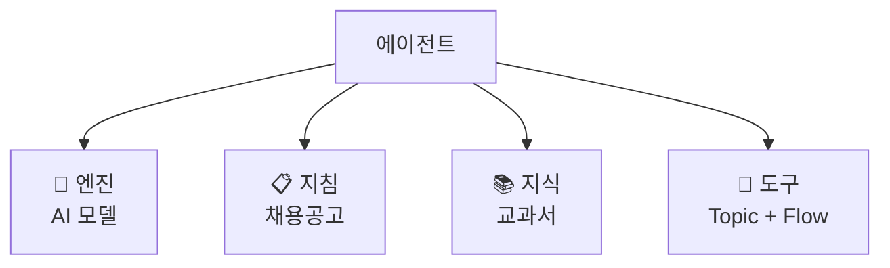

# 에이전트의 4가지 구성요소 + 나만의 설계서 작성
{: .no_toc }

| 시간 | 소요 | 수강생 역할 |
|:-----|:-----|:-----------|
| 11:15 | 30분 | 🟢 설계서 작성 |

## 목차
{: .no_toc .text-delta }

1. TOC
{:toc}

---

## 이 모듈에서 배우는 것

- **생성형 오케스트레이션**(자동변속)의 개념
- 에이전트의 **4가지 구성요소**(엔진·지침·지식·도구)
- 나만의 **에이전트 설계서** 작성

{: .highlight }
> M3에서 에이전트 빌더로 만든 HR 도우미를 Copilot Studio에서 열었습니다.  
> 이 모듈에서는 Copilot Studio의 구조를 이해하고, HR 도우미를 **어떻게 완성할지 설계서**를 작성합니다.

---

## 생성형 오케스트레이션 = 자동변속

Copilot Studio에는 두 가지 방식이 있습니다.

| 방식 | 비유 | 설명 |
|:-----|:-----|:-----|
| **생성형** (자동변속) | 오토매틱 | AI가 상황을 판단하고 알아서 처리 |
| 클래식 (수동변속) | 수동 변속기 | 모든 흐름을 일일이 설계 |

{: .highlight }
> 이 과정에서는 **생성형(자동변속)**을 사용합니다. 더 직관적이고, 텍스트만으로 에이전트를 만들 수 있습니다.

---

## 에이전트의 4가지 구성요소

에이전트는 4가지 구성요소로 이루어져 있습니다.

| 구성요소 | 역할 | 비유 | 배울 모듈 |
|:---------|:-----|:-----|:---------|
| **엔진** | 어떤 AI가 두뇌인가 | 자동차 엔진 | M5 도입부 |
| **지침** | 역할·태도·범위·원칙 | 📋 채용공고 | M5 |
| **지식** | 답변의 근거 자료 | 📚 교과서 | M6 |
| **도구** | 실제로 할 수 있는 행동 | 🤲 손발 | M7~M11 |



---

## 실습: 나만의 에이전트 설계서 작성

지금부터 **오늘 하루의 나침반**이 될 설계서를 만듭니다.

### 3가지 샘플 중 선택

| 샘플 | 대상 업무 | 핵심 기능 |
|:-----|:---------|:---------|
| **A. HR/총무 도우미** | 복리후생·사내 규정 | 자동 답변 + 담당자 연결 |
| **B. 구매/총무 도우미** | 구매 신청·승인 | 프로세스 안내 |
| **C. 기획/전략 보고서** | 주간 실적 보고 | 보고서 자동 생성 |

{: .tip }
> 위 샘플이 아니라 **자신의 실제 업무**를 주제로 설계서를 만들어도 좋습니다!

### Copilot을 활용한 설계서 작성

Copilot에게 아래 프롬프트를 입력하세요:

<details markdown="1">
<summary><strong>프롬프트 (클릭해서 펼치기)</strong></summary>

```
나는 [역할]을 담당하고 있어. [업무내용]을 자동으로 처리하는 
AI 에이전트를 만들고 싶어. 다음 형식으로 설계서를 작성해줘:

- 에이전트 이름
- 한 줄 목적
- 지침 핵심 (3줄 이내)
- 필요 지식 소스
- 필요 도구/Flow
- 사용 채널
- 관련 모듈
```

</details>

### 설계서 예시

<details markdown="1">
<summary><strong>예시 (클릭해서 펼치기)</strong></summary>

```
에이전트 이름: HR 도우미
한 줄 목적: 직원들의 HR/총무 질문에 즉시 답변
지침 핵심: 친절한 HR 전담 도우미, 복리후생·연차·경비 전문
필요 지식: FAQ.docx, 복리후생_안내.docx, 담당자정보.docx
필요 도구: 담당자 문의 전달 Flow
사용 채널: Teams + @호출
```

</details>

{: .important }
> 이 설계서는 오늘의 **나침반**입니다. 모듈이 끝날 때마다 꺼내서 "지금 여기를 하고 있구나" 확인하세요. 마지막 모듈(M14)에서 완성합니다.

---

## 핵심 정리

1. **생성형 오케스트레이션** = AI가 알아서 판단하는 자동변속
2. 에이전트 = **엔진 + 지침 + 지식 + 도구**
3. 설계서는 오늘의 나침반 — M14에서 완성

---

## FAQ

| 질문 | 답변 |
|:-----|:-----|
| 설계서에 모르는 단어가 있어요 | 괜찮습니다. 오후가 끝나면 다 알게 됩니다. 빈칸은 나중에 채우면 됩니다. |
| 실제 업무가 아닌 주제도 괜찮나요? | 네! 연습이 목적입니다. 다만 실제 업무를 주제로 하면 내일 바로 적용할 수 있습니다. |
| Copilot이 설계서를 대신 만들어줘도 되나요? | 물론입니다. '설계서를 만드는 것'이 아니라 '에이전트의 구조를 이해하는 것'이 목적입니다. |

---

## 참조 자료

| 자료 | 링크 |
|:-----|:-----|
| Copilot Studio 오케스트레이션 | [learn.microsoft.com](https://learn.microsoft.com/microsoft-copilot-studio/advanced-generative-actions) |
| 에이전트 설계 가이드 | [learn.microsoft.com](https://learn.microsoft.com/microsoft-copilot-studio/guidance/building-agents-overview) |

---

다음 모듈: [M5. 지침 작성](m05-instructions)
