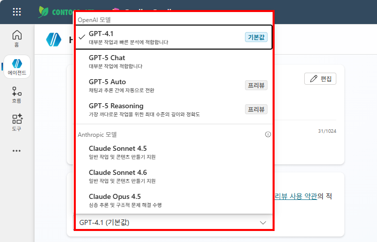

# 실습 ①: 모델을 바꾸고 결과 비교하기
{: .no_toc }

| 시간 | 소요 | 수강생 역할 |
|:-----|:-----|:-----------|
| 11:10 | 10분 | 🟢 직접 실습 |

---

### 실습 순서

1. Copilot Studio → HR 도우미 에이전트 열기
2. 현재 선택된 AI 모델 확인
3. 모델 변경 후 **반영되기 까지 기다리기** 
4. 오른쪽 테스트 창에서 새로운 세션 시작
5. 오른쪽 테스트 창에서 같은 질문 입력
6. 답변 길이·표현 방식이 어떻게 달라지는지 비교



### 비교할 질문 예시

```
연차는 몇 일이야?
경비 처리하려면 어떻게 해?
```

{: .tip }
> 답변의 정확도보다 **표현 방식과 길이**의 차이를 집중해서 봅니다. 지식(교과서)이 아직 없기 때문에 정확한 답변보다는 모델별 특성 차이를 보는 것이 목적입니다.

---

실습을 완료했으면 [M5 본문으로 돌아가세요](m05-orchestrator).
