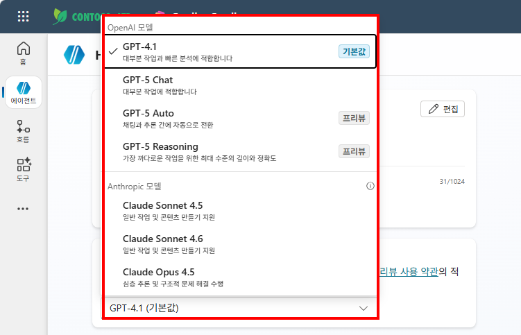

# Lab ①: Change the Model and Compare Results
{: .no_toc }

| Time | Duration | Participant Role |
|:-----|:---------|:-----------------|
| 11:10 | 10 min | 🟢 Hands-on lab |

---

### Lab Steps

1. Copilot Studio → Open the HR Assistant agent
2. Check the currently selected AI model
3. Change the model and **wait for it to take effect**
4. Start a new session in the test pane on the right
5. Enter the same question in the test pane on the right
6. Compare how the response length and phrasing differ



### Sample Questions for Comparison

```
How many days of annual leave do I get?
How do I submit an expense claim?
```

{: .tip }
> Focus on the **differences in phrasing and length** rather than accuracy. Since we haven't added any knowledge (textbook) yet, the goal is to observe how different models behave — not to get accurate answers.

---

Once you've completed the lab, [return to the M5 main page](m05-orchestrator).
