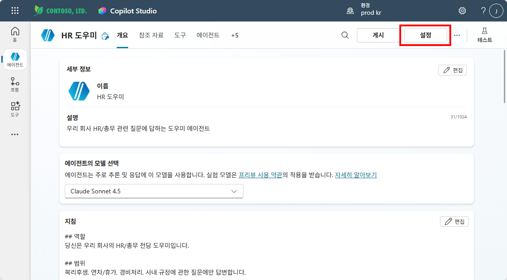
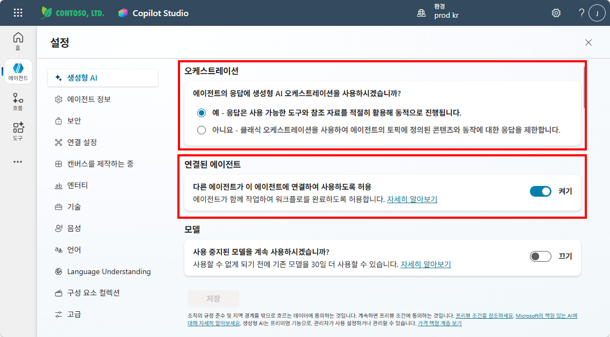
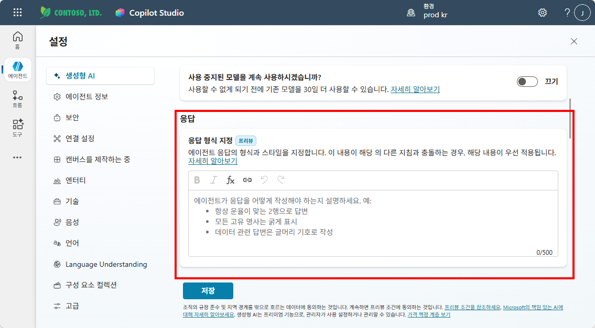
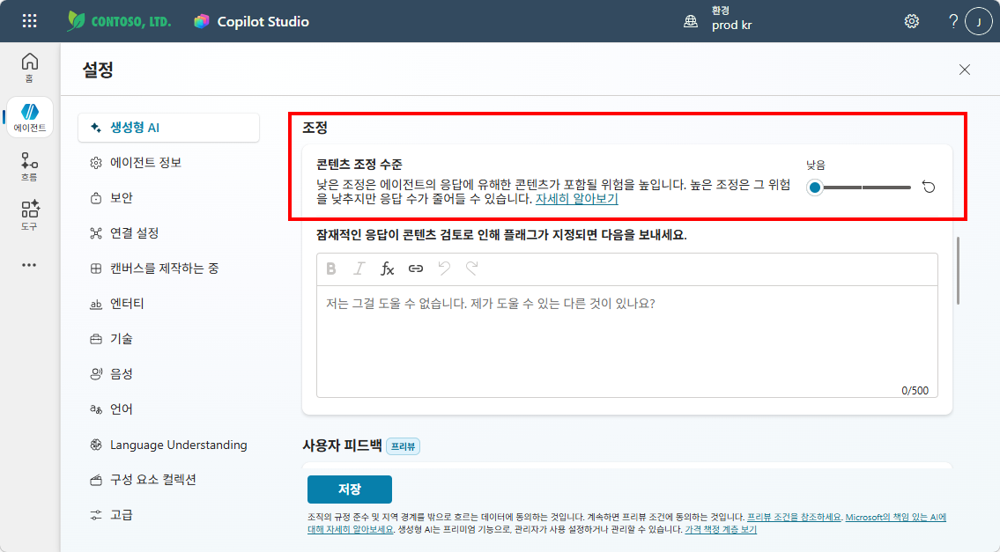
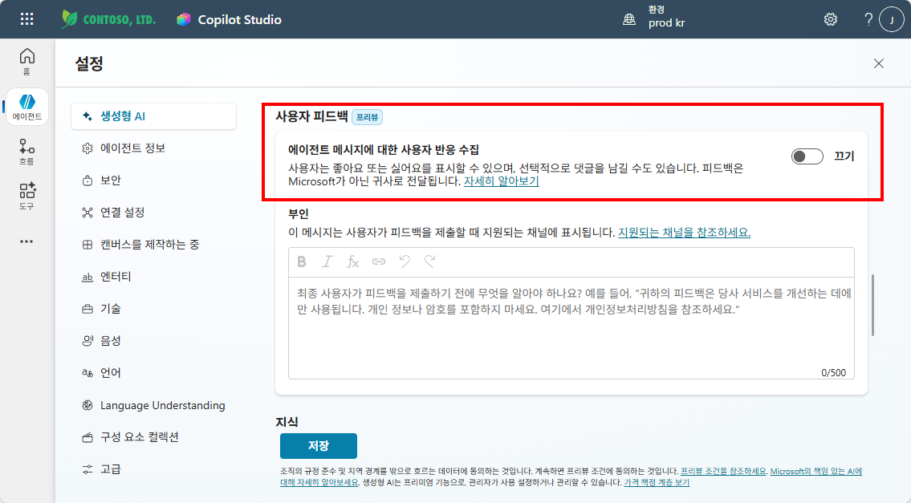
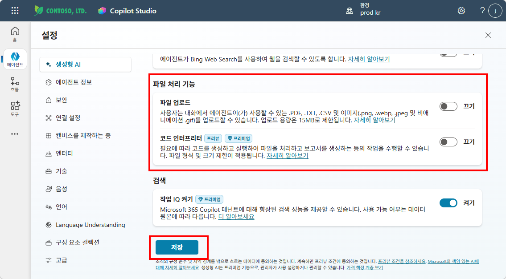
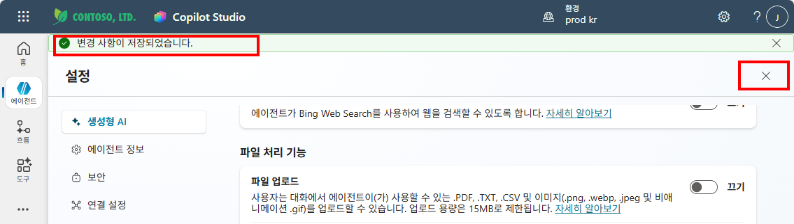

# 실습 ②: 에이전트 설정 변경
{: .no_toc }

| 시간 | 소요 | 수강생 역할 |
|:-----|:-----|:-----------|
| 11:20 | 10분 | 🟢 직접 실습 |

---

이 실습에서는 이후 모듈의 실습이 원활하게 동작하도록 **에이전트의 생성형 AI 설정을 미리 구성**합니다.

## Step 1 — 설정 화면 열기

1. Copilot Studio → HR 도우미 에이전트 열기
2. 에이전트 화면 **상단 우측의 ⚙️ 설정** 버튼 클릭
3. 왼쪽 메뉴에서 **생성형 AI** 선택

---

## Step 2 — 각 항목 설정

아래 표의 순서대로 설정을 확인하고 변경하세요:

| # | 설정 항목 | 설정값 | 설명 |
|:--|:---------|:-----:|:-----|
| 1 | **오케스트레이션** | **예** (확인) | 에이전트가 지식·토픽·흐름 중 최적의 도구를 자동 선택합니다. 꺼져 있으면 도구를 전혀 활용하지 못합니다. |
| 2 | **연결된 에이전트** | **켜기** (확인) | M14 멀티에이전트 실습에서 다른 에이전트와 협업하려면 켜져 있어야 합니다. |
| 3 | **응답** | **그대로 유지** | 응답 길이·형식은 지침(M6)에서 텍스트로 제어하는 것이 더 효과적입니다. |
| 4 | **조정** | **낮음** | 콘텐츠 필터링 수준입니다. "높음"이면 정상 답변도 차단될 수 있어, 실습 중에는 "낮음"이 적합합니다. |
| 5 | **사용자 피드백** | **끄기** | 답변마다 👍👎 버튼이 표시되는 기능입니다. 실습에서는 불필요하므로 끕니다. |
| 6 | **파일 업로드** | **끄기** | 사용자가 대화 중 파일을 첨부하는 기능입니다. M7에서 지식 소스로 파일을 연결하는 것과는 별개이며, 실습에서는 끕니다. |
| 7 | **코드 인터프리터** | **끄기** | Python 코드 실행 기능입니다. HR 도우미에는 불필요하므로 끕니다. |
| 8 | **작업 IQ 켜기** | **켜기** | 에이전트가 Power Automate 흐름을 도구로 자동 인식하는 기능입니다. M12 에이전트 흐름 실습에 필요합니다. |

{: .note }
> 각 설정의 의미를 지금 완벽하게 이해할 필요는 없습니다. 이후 모듈에서 해당 기능을 직접 사용하면서 자연스럽게 체감하게 됩니다.

아래 스크린샷을 참고하여 각 항목을 확인하고 변경하세요.

**① 오케스트레이션(예) · 연결된 에이전트(켜기)**

**② 응답 형식 지정 (그대로 유지)**

**③ 조정(낮음) · 사용자 피드백**

**④ 사용자 피드백(끄기)**

**⑤ 파일 업로드(끄기) · 코드 인터프리터(끄기) · 작업 IQ(켜기) → 저장**

---

## Step 3 — 저장 및 닫기

1. 설정 화면 하단의 **"저장"** 버튼 클릭
2. 저장이 완료되면 우측 상단의 **"✕"** 를 클릭하여 설정을 닫고 에이전트로 돌아갑니다

---

## 설정 요약

| 설정 | 값 | 관련 모듈 |
|:-----|:--:|:---------|
| 오케스트레이션 | 예 | 전체 (도구 자동 선택) |
| 연결된 에이전트 | 켜기 | M14 멀티에이전트 |
| 조정 | 낮음 | 전체 (필터 완화) |
| 작업 IQ | 켜기 | M12 에이전트 흐름 |
| 사용자 피드백 | 끄기 | — |
| 파일 업로드 | 끄기 | — |
| 코드 인터프리터 | 끄기 | — |

{: .important }
> 이 설정은 **이후 모든 실습의 기반**이 됩니다. 실습 중 에이전트가 기대와 다르게 동작하면, 이 설정을 먼저 확인하세요.

---

실습을 완료했으면 [M5 본문으로 돌아가세요](m05-orchestrator).
