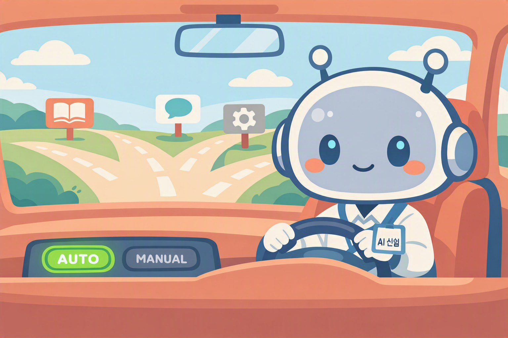

# Component 1: Orchestrator — Model Selection + Settings Lab
{: .no_toc }

| Time | Duration | Participant Role |
|:-----|:---------|:-----------------|
| 11:10 | 20 min | 🟢 Hands-on lab |

## Table of Contents
{: .no_toc .text-delta }

1. TOC
{:toc}

---

## What You'll Learn in This Module

- The **role of the Orchestrator** within an agent
- How changing the AI model affects the results
- How to adjust agent settings (response length, language, safety)

{: .highlight }
> The Orchestrator is the brain of the agent. Depending on which engine you choose, the depth, speed, and cost of responses will vary.

---

## What Is the Orchestrator?

The Orchestrator is the AI model that receives the user's message, **decides which tool (Knowledge / Topic / Flow) to use**, and **generates the final response**.

| Role | Description |
|:-----|:------------|
| Intent recognition | Determines what the user is asking for |
| Tool selection | Decides between knowledge search vs. Topic execution vs. Flow invocation |
| Response generation | Composes the final answer based on gathered information |

---

## Selecting a Model in Copilot Studio

You can change the model under **Settings → Generative AI → AI Model**.

{: .note }
> The actual list of available models may vary depending on your **tenant, timing, license, and preview opt-in status**. The tables below are representative examples.

### OpenAI Models

| Model | Characteristics | Notes |
|:------|:----------------|:------|
| **GPT-4.1** | Suitable for most tasks and quick analysis | ✅ Default |
| GPT-5 Chat | Suitable for most tasks | |
| GPT-5 Auto | Automatically switches between chat and reasoning | Preview |
| GPT-5 Reasoning | Maximum depth and accuracy for the most demanding tasks | Preview |

### Anthropic Models

| Model | Characteristics |
|:------|:----------------|
| **Claude Sonnet 4.5** | Supports general tasks and content creation |
| Claude Sonnet 4.6 | Supports general tasks and content creation |
| Claude Opus 4.6 | Deep reasoning and structured problem solving |

{: .tip }
> In this module, we start with the **default (GPT-4.1)**. In Lab ①, try changing the model to experience the differences firsthand.  
---

## Lab ①: Change the Model and Compare Results

{: .important }
> 📌 This lab is on a separate page.  
> Complete [Lab ①: Model Change + Comparison](m05-1-model-compare) and then come back.

---

## Lab ②: Change Agent Settings

{: .important }
> 📌 This lab is on a separate page.  
> Complete [Lab ②: Change Agent Settings](m05-2-agent-settings) and then come back.

---

## Key Takeaways

1. Orchestrator = the agent's brain → Intent recognition → Tool selection → Response generation
2. Changing the model affects response depth, speed, and cost
3. You can adjust response length and safety levels in Settings

---

Next module: [M6. Component 2 — Instructions](m06-instructions)
