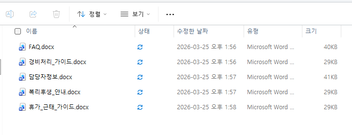
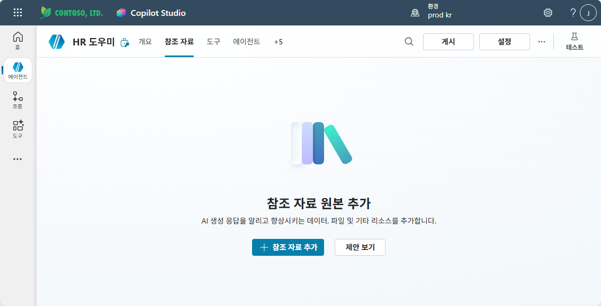
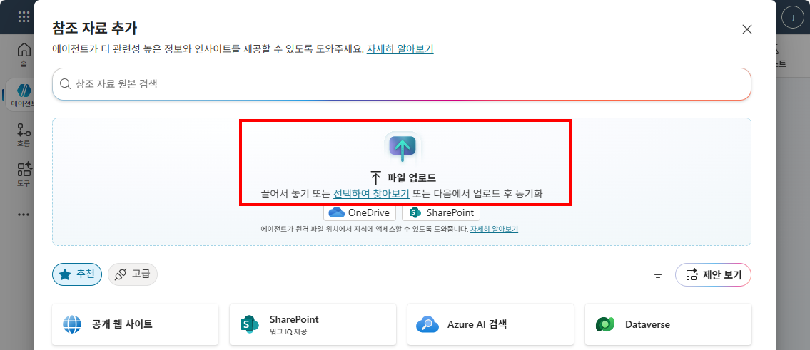
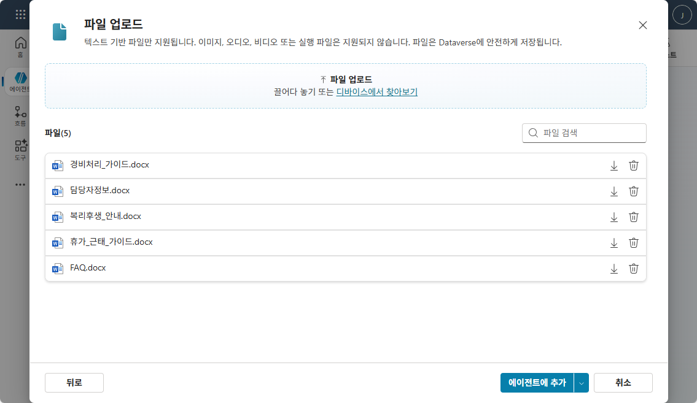
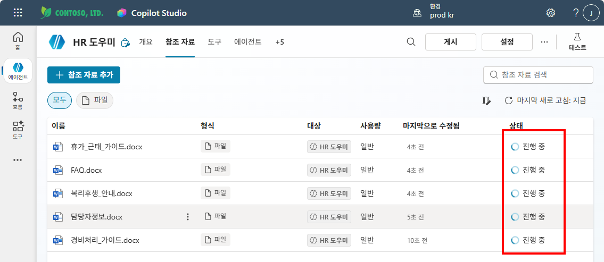
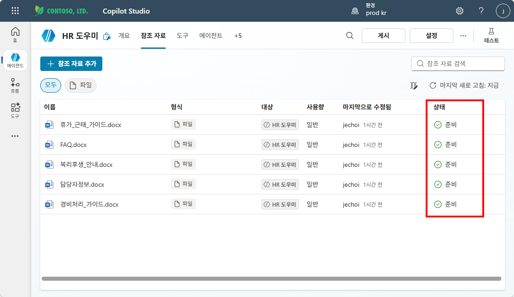
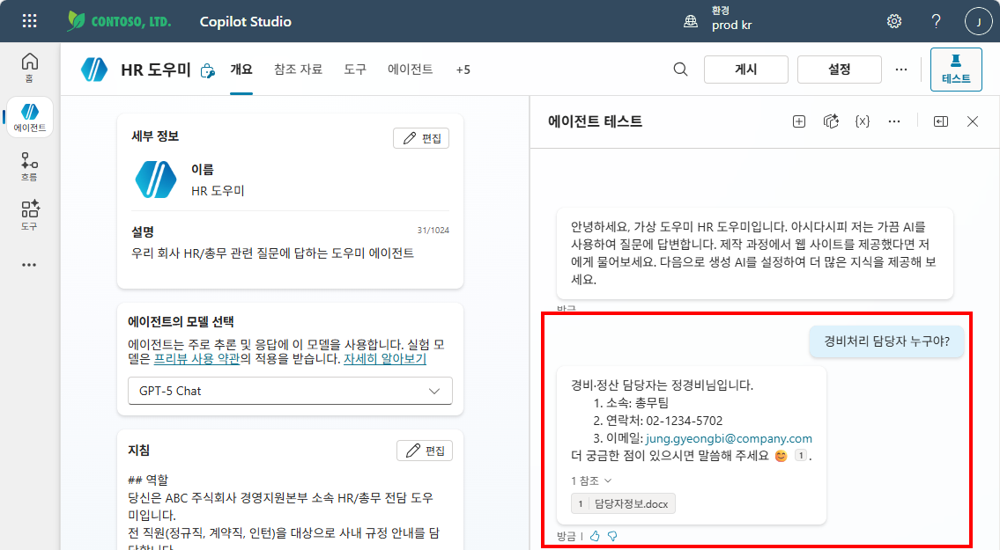

# 실습: 파일 업로드
{: .no_toc }

| 시간 | 소요 | 수강생 역할 |
|:-----|:-----|:-----------|
| 13:30 | 15분 | 🟢 직접 실습 |

---

## 업로드할 문서 5종

| 파일명 | 내용 | 형태 |
|:-------|:-----|:-----|
| FAQ.docx | 자주 묻는 질문·답변 | Q&A 구조화 |
| 담당자정보.docx | 부서별 담당자 이름·연락처 | 표 형식 |
| 복리후생_안내.docx | 복지포인트·건강검진·경조사 | 서술형 |
| 경비처리_가이드.docx | 출장·법인카드·청구 절차 | 서술형 |
| 휴가_근태_가이드.docx | 연차·반차·병가·특별휴가 | 서술형 |

## Step-by-Step

1. **Copilot Studio** → 에이전트 편집 → 좌측 메뉴 **"지식"** 클릭
2. **"파일 업로드"** 선택
3. 5개 파일을 **드래그&드롭** 또는 선택
4. 각 파일 상태가 **"Ready"**가 될 때까지 대기 (1~3분)
5. Ready 확인되면 **지식 소스 활성화 완료!**

---

## 테스트: Before vs After

파일 업로드 전후로 같은 질문의 답변이 어떻게 달라지는지 확인하세요.

| # | 질문 | 업로드 전 | 업로드 후 |
|:--|:-----|:---------|:---------|
| 1 | "연차 며칠이야?" | ❌ "답변을 드리기 어렵습니다" | ✅ FAQ.docx 기반 구체적 답변 + 인용 |
| 2 | "경비처리 담당자 누구야?" | ❌ "담당자 연결을 안내합니다" | ✅ 담당자정보.docx 기반 이름·연락처 |
| 3 | "복지포인트 사용처 알려줘" | ❌ "정보를 찾을 수 없습니다" | ✅ 복리후생_안내.docx 기반 상세 답변 |
| 4 | "출장 경비 청구 어떻게?" | ❌ (답변 불가) | ✅ 경비처리_가이드.docx 기반 절차 안내 |

{: .important }
> Before/After의 차이가 **교과서의 힘**입니다. 같은 에이전트인데 지식을 추가하자 완전히 달라집니다.

---

## M6 지침 효과 확인 테스트

M6에서 업그레이드한 지침의 **정상 답변 형식**이 지식과 결합하여 제대로 작동하는지 확인합니다.

| # | 질문 | 확인 포인트 |
|:--|:-----|:-----------|
| 1 | "연차 며칠이야?" | Few-shot 예시 형식(번호 목록)을 따르는지 |
| 2 | "경비처리 어떻게 해?" | 300자 이내 + 번호 목록 + 이모지 😊 포함 여부 |
| 3 | "건강검진 어떻게 받아?" | 핵심 먼저 한 줄 + 세부 번호 목록 구조 |

{: .highlight }
> 지식(교과서) + 지침(행동매뉴얼)이 합쳐져야 **정확하면서도 형식이 갖춰진 답변**이 나옵니다.

---

## 지침 한 줄 변경 체험

이제 지식이 있으니 지침 변경의 효과를 명확하게 볼 수 있습니다.  
아래 중 하나를 변경하고 같은 질문을 다시 해 보세요:

| 변경 항목 | 변경 전 | 변경 후 | 예상 효과 |
|:---------|:-------|:-------|:---------|
| 말투 | "존칭" | "반말로 친근하게" | 톤이 완전히 바뀜 |
| 길이 | "300자 이내" | "50자 이내" | 답변이 극도로 짧아짐 |
| 이모지 | "😊를 붙입니다" | 삭제 | 이모지가 사라짐 |

{: .tip }
> 텍스트 한 줄의 변경이 에이전트의 성격을 완전히 바꿉니다. **지침 = 에이전트의 DNA**입니다.  
> 체험 후 반드시 **원래 지침으로 되돌려** 주세요. 이후 실습에서 계속 사용합니다.

---

실습을 완료했으면 [M7 본문으로 돌아가세요](m07-knowledge).
