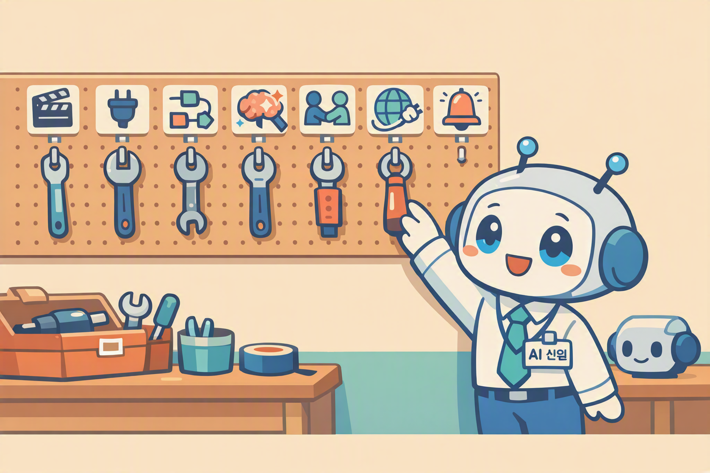
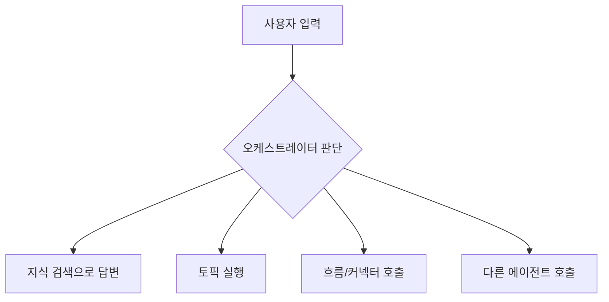

# 4요소 도구들  도구가 채택되는 원리
{: .no_toc }

| 시간 | 소요 | 수강생 역할 |
|:-----|:-----|:-----------|
| 14:00 | 10분 |  보기 |

## 목차
{: .no_toc .text-delta }

1. TOC
{:toc}

---

## 이 모듈에서 배우는 것

- 에이전트에서 **도구(Tool)**란 무엇인지
- 오케스트레이터가 도구를 **채택하는 기준**
- 이 과정에서 다룰 도구의 종류와 순서

{: .highlight }
> 지침과 지식을 갖춘 HR 도우미가 이제 **행동**을 할 차례입니다. 도구가 연결되는 순간, 에이전트는 말만 하는 챗봇에서 실제로 일하는 AI 직원이 됩니다.

---

## 남은 건 다 도구다

오케스트레이터지침지식을 제외한 **모든 것은 도구**입니다.

| 도구 종류 | 설명 | 배울 모듈 |
|:---------|:-----|:---------|
| **토픽** | 특정 상황에서 실행되는 대본 | M9 |
| **커넥터** | Microsoft 365 앱과 직접 연결 | M11 |
| **에이전트 흐름** | Power Automate로 복잡한 자동화 | M12 |
| **AI 프롬프트** | Flow 안에서 AI 로직 실행 | M13 |
| **멀티에이전트** | 다른 에이전트를 도구로 호출 | M14 |
| **MCP** | 외부 서비스를 도구로 연결 | M15 |
| **트리거** | 특정 이벤트가 에이전트를 깨움 | M16 |

---

## 도구가 채택되는 원리

오케스트레이터는 사용자의 말을 보고 **어떤 도구를 쓸지 스스로 결정**합니다.

### 도구가 채택되려면?

두 가지가 중요합니다:

1. **Description(설명)**  도구에 달린 설명이 명확해야 AI가 언제 쓸지 판단 가능
2. **지침을 통한 도구 지정**  지침에 "이런 상황에서는 이 도구를 써라"고 명시 가능

{: .tip }
> Description이 불명확하면 오케스트레이터가 도구를 무시합니다. 도구를 만들 때 **"이 도구는 언제 쓰는 것인지"**를 Description에 명확히 적어두세요.

---

## 핵심 정리

1. 도구 = 에이전트가 실제로 **행동**하게 해주는 것
2. 오케스트레이터는 Description을 보고 도구를 스스로 선택
3. M9~M16에서 도구를 하나씩 직접 만든다

---

다음 모듈: [M9. 토픽과 변수](m09-topic-variables)
