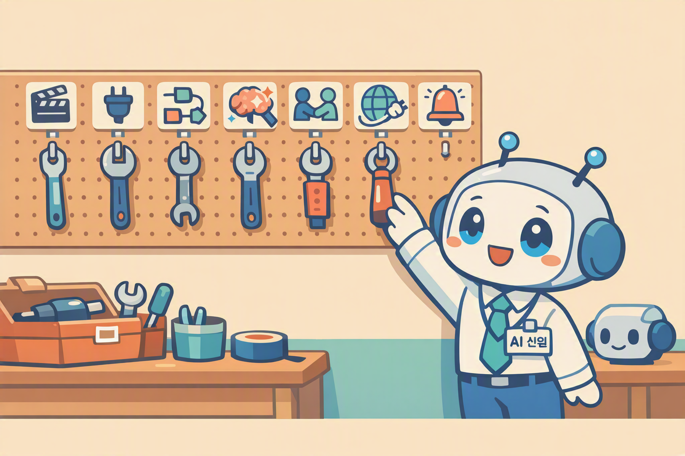
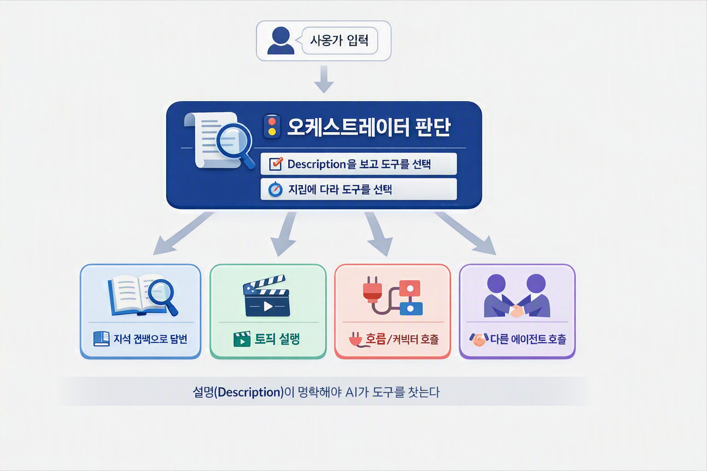

# Element 4 — Tools: How the Orchestrator Selects Tools
{: .no_toc }

| Time | Duration | Participant Role |
|:-----|:---------|:-----------------|
| 14:00 | 10 min | 👀 Watch |

## Table of Contents
{: .no_toc .text-delta }

1. TOC
{:toc}

---

## What You'll Learn in This Module

- What a **Tool** is in the context of an agent
- The **criteria** the orchestrator uses to select tools
- The types of tools covered in this course and their order

{: .highlight }
> Our HR assistant now has Instructions and Knowledge. It's time for it to take **action**. The moment tools are connected, the agent transforms from a chatbot that only talks into an AI employee that actually gets work done.

---

## Everything Else Is a Tool

Apart from the Orchestrator, Instructions, and Knowledge, **everything else is a tool**.

| Tool Type | Description | Module |
|:----------|:------------|:-------|
| **Topic** | A script that runs in a specific situation | M9 |
| **Connector** | Direct connection to Microsoft 365 apps | M11 |
| **Agent Flow** | Complex automation via Power Automate | M12 |
| **AI Prompt** | AI logic executed inside a Flow | M13 |
| **Multi-Agent** | Calling another agent as a tool | M14 |
| **MCP** | Connecting external services as tools | M15 |
| **Trigger** | A specific event that wakes the agent | M16 |

---

## How the Orchestrator Selects Tools

The orchestrator looks at the user's message and **decides on its own which tool to use**.

### What Does It Take for a Tool to Be Selected?

Two things matter:

1. **Description** — The tool's description must be clear so the AI can judge when to use it
2. **Specifying tools via Instructions** — You can explicitly state in your Instructions: "Use this tool in this situation"

{: .tip }
> If the Description is vague, the orchestrator will ignore the tool. When creating a tool, clearly write **"when should this tool be used"** in the Description.

---

## Key Takeaways

1. Tools = What lets an agent actually **take action**
2. The orchestrator reads the Description and selects tools on its own
3. In M9–M16, we'll build tools one by one

---

Next module: [M9. Tools — Topics and Variables](m09-topic-variables)
