# 실습 ①: HRdoc Topic 만들기
{: .no_toc }

| 시간 | 소요 | 수강생 역할 |
|:-----|:-----|:-----------|
| 14:10 | 10분 | 🟢 직접 실습 |

---

| 항목 | 내용 |
|:-----|:-----|
| **Topic 이름** | HRdoc Topic |
| **역할** | 사내 규정·복리후생·경비·휴가 문서에서 답변 찾기 → 결과를 글로벌 변수에 저장 |
| **글로벌 변수** | `Global.HRdoc_result` |

{: .highlight }
> 이 Topic은 결과를 **메시지로 직접 보내지 않습니다.** 글로벌 변수에 저장해 두면, **오케스트레이터가 지침에 따라 해당 내용을 활용하여 답변**합니다.  
> 이렇게 하면 답변의 내용과 스타일을 오케스트레이션 모델에게 맡길 수 있고, 복합적인 질문에도 유연하게 대응하는 AI 챗봇다운 대화가 가능해집니다.

## Step-by-Step

1. Copilot Studio → 에이전트 → 좌측 **"토픽"** 클릭
2. **"+ 토픽 추가"** → **"새로 시작"**
3. Topic 이름 입력: `HRdoc Topic`
4. 편집 화면이 열리면 아래 순서로 노드를 구성합니다:

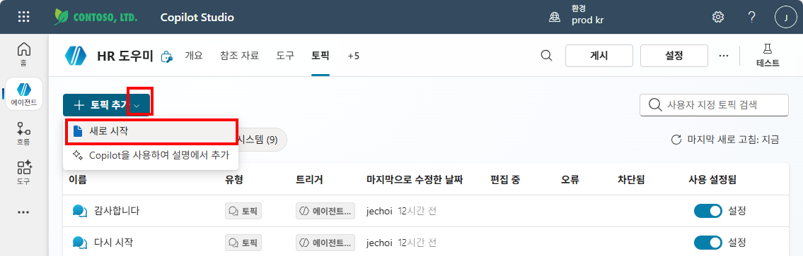

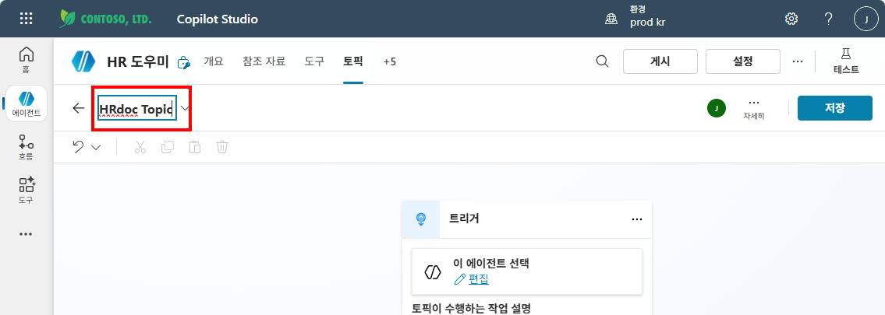

---

### 노드 1 — 트리거 (자동 생성됨)
- "Topic이 트리거될 때" 노드가 자동으로 만들어져 있습니다.
- **Description** 입력: `이 토픽은 사내 규정, 복리후생, 연차, 휴가, 경비처리 등 HR/총무 관련 질문에 답변을 제공합니다.`

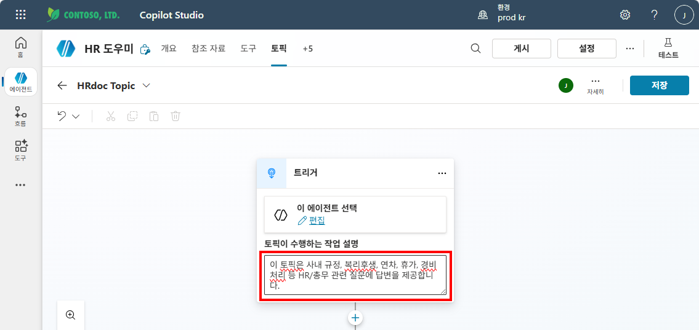

---

### 노드 2 — 지식 검색 (생성형 답변)
- 트리거 아래 **"+"** 클릭 → **"지식 검색"** 노드 추가

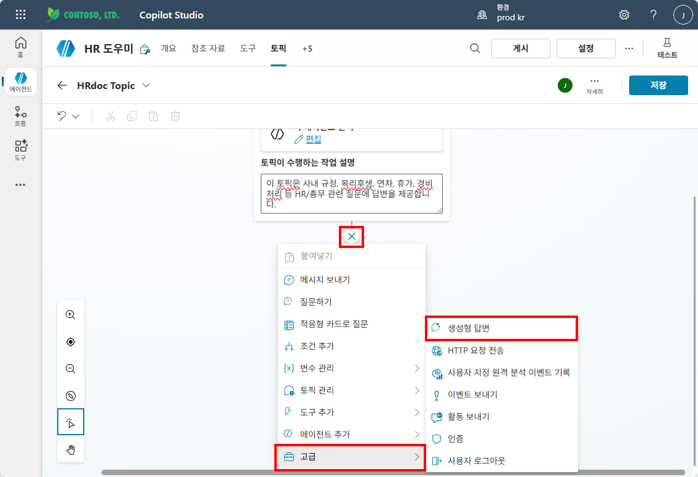

- 입력: `Activity.Text` (사용자 질문)

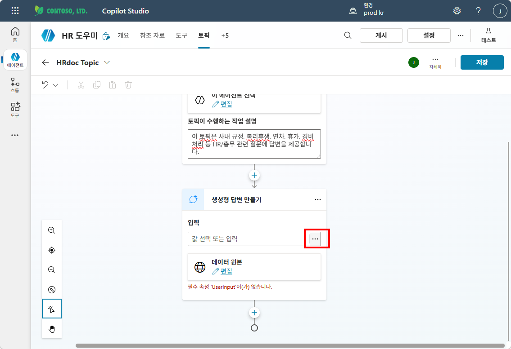

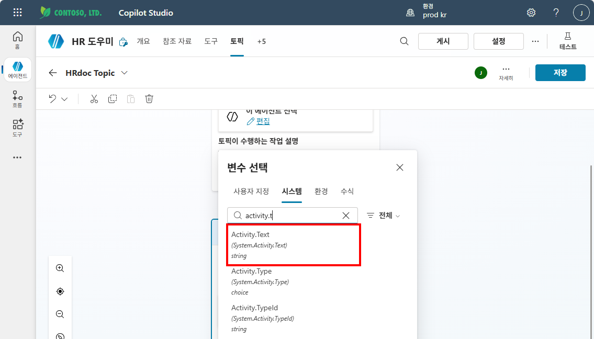

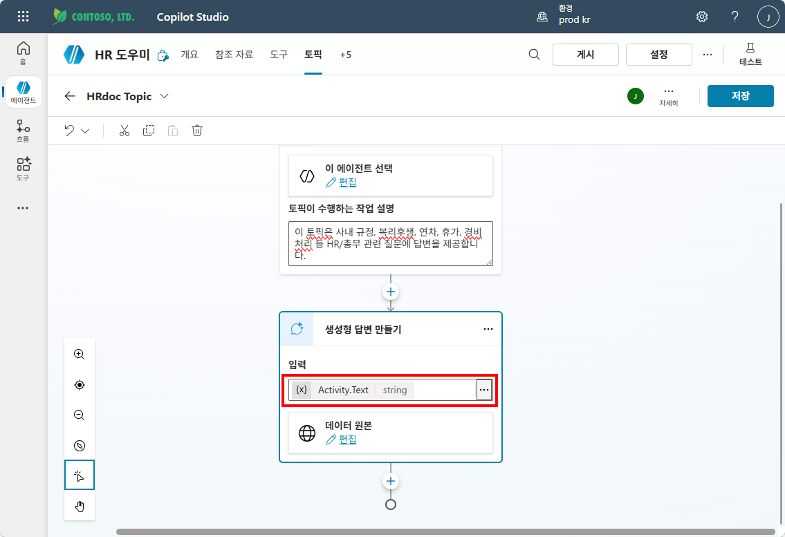

- 검색 대상: **선택한 원본만 검색** → **관련문서들** 체크

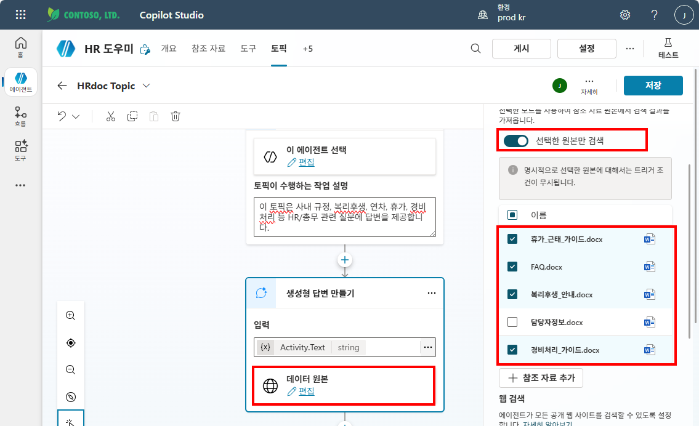

- 고급 설정 펼치기 → **메시지 보내기** 토글 끄기 (중요!)

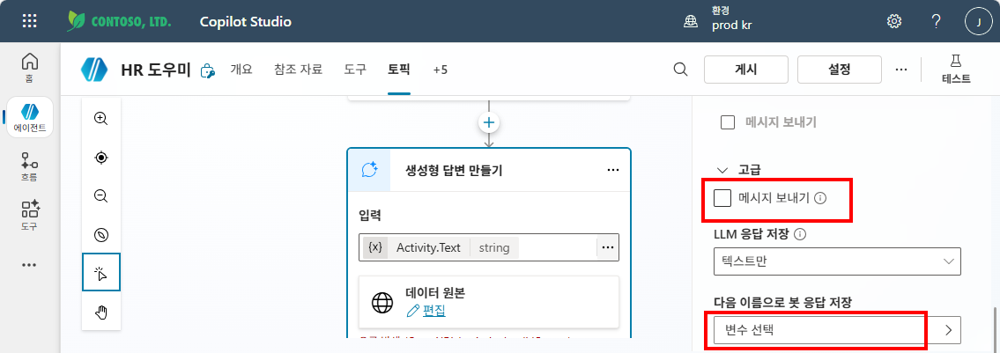

- 출력 저장 변수: **변수 선택 → "새 변수 만들기"**
  - 이름: `HRdoc_result`
  - **"글로벌 변수로 설정"** 체크 → `Global.HRdoc_result`가 됨

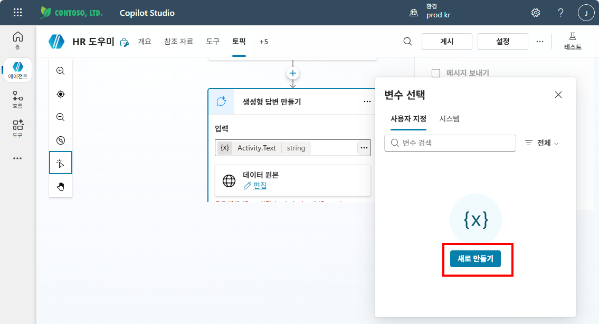

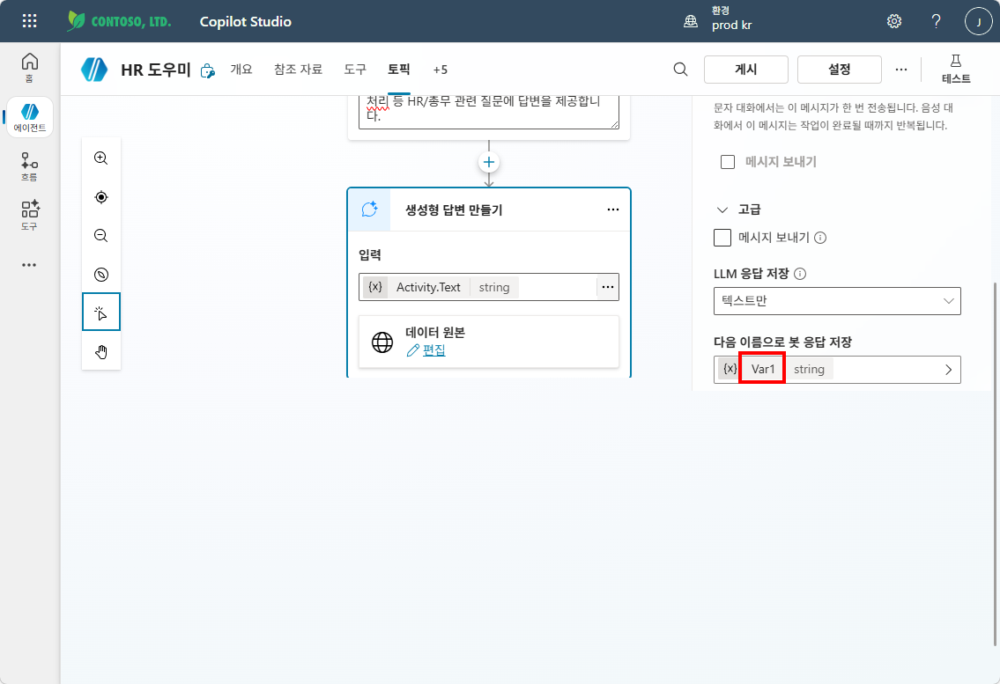

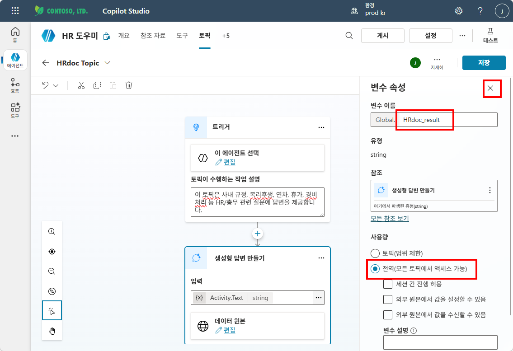

### ⚠️ 메시지 노드는 추가하지 않습니다

지식 검색 결과를 `Global.HRdoc_result`에 저장하면, **오케스트레이터가 지침에 따라 해당 변수를 활용하여 답변을 생성**합니다.  
메시지 노드로 직접 보내면 Topic이 답변 형식을 고정해 버려서, 오케스트레이터가 유연하게 대응할 수 없습니다.

5. 오른쪽 **저장** 클릭

{: .tip }
> 트리거의 **Description**이 핵심입니다. 오케스트레이터가 이 설명을 보고 "HRdoc Topic을 쓸지 말지"를 판단합니다.

---

실습을 완료했으면 [M9 본문으로 돌아가세요](m09-topic-variables).
