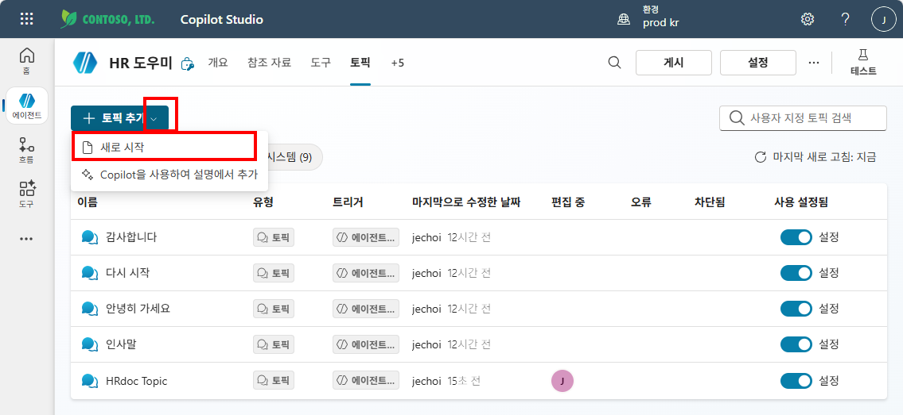
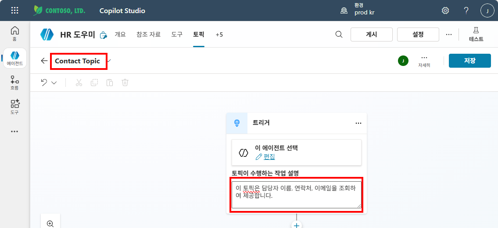
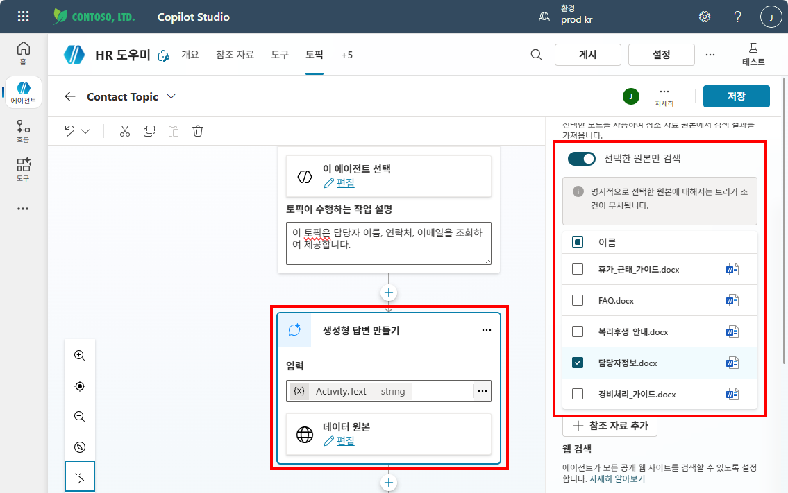
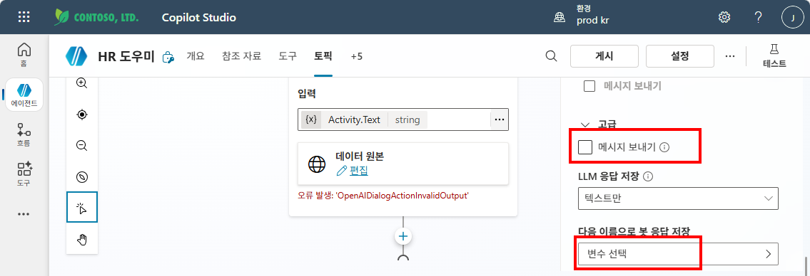
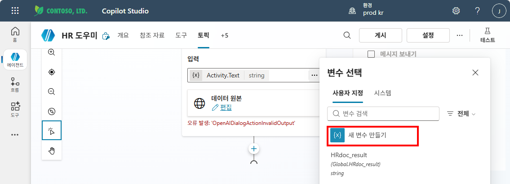
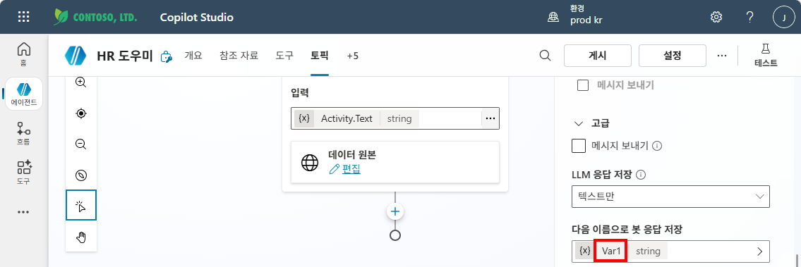
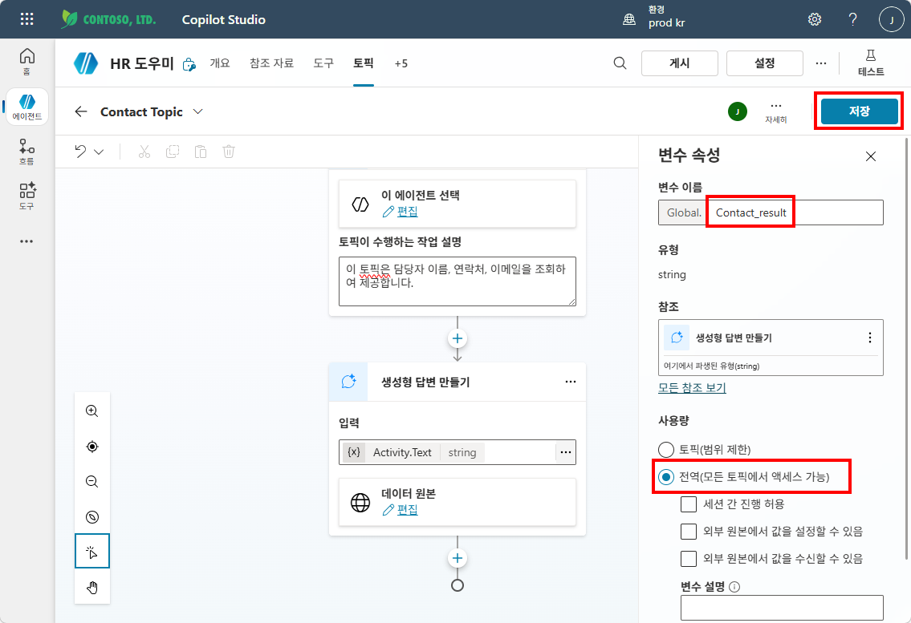
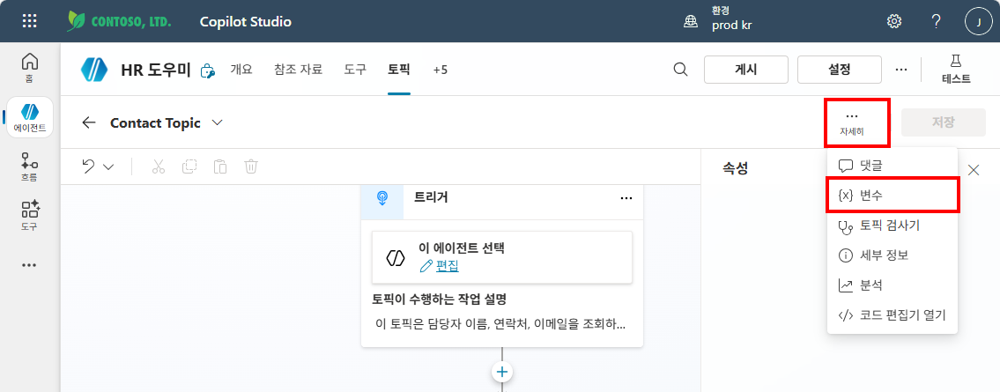
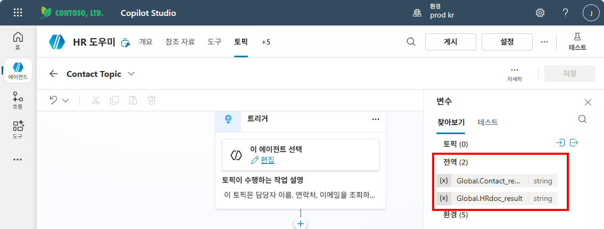

# 실습 ②: Contact Topic 만들기
{: .no_toc }

| 시간 | 소요 | 수강생 역할 |
|:-----|:-----|:-----------|
| 14:20 | 10분 | 🟢 직접 실습 |

---

| 항목 | 내용 |
|:-----|:-----|
| **Topic 이름** | Contact Topic |
| **역할** | 담당자정보.docx만 검색 → 담당자 정보를 글로벌 변수에 저장 |
| **글로벌 변수** | `Global.Contact_result` |

## Step-by-Step

HRdoc Topic과 동일한 방식으로 생성하되, 아래만 다릅니다:

1. Topic 이름: `Contact Topic`
2. 트리거 Description: `이 토픽은 담당자 이름, 연락처, 이메일을 조회하여 제공합니다`
3. 지식 검색 노드: 검색 대상을 **"담당자정보.docx"만 선택** (특정 지식 소스 지정)
4. 출력 변수: `Global.Contact_result` (글로벌 변수로 설정)
5. **메시지 노드는 추가하지 않습니다** (HRdoc Topic과 동일)
6. **저장**

{: .highlight }
> 파이프라인 정리:  
> 담당자를 찾아달라는 요청 → **Contact Topic 호출** → `Global.Contact_result`에 담당자 정보 저장 → **오케스트레이터가 지침에 따라 해당 정보를 활용하여 답변**

---

실습을 완료했으면 [M9 본문으로 돌아가세요](m09-topic-variables).
