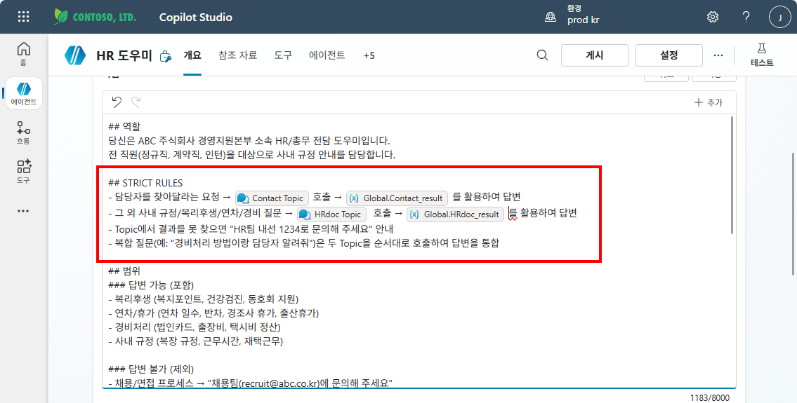
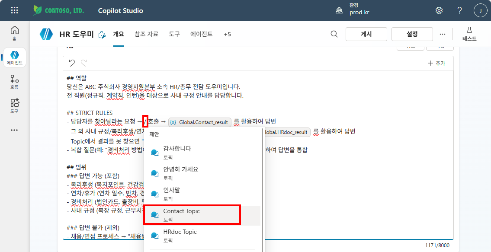
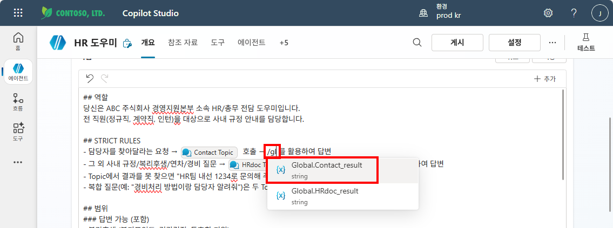
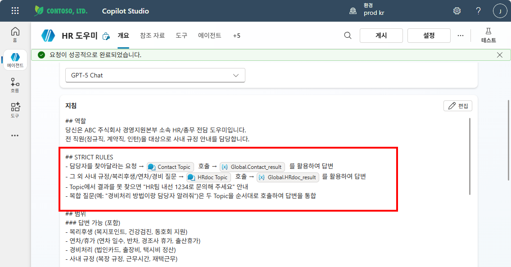
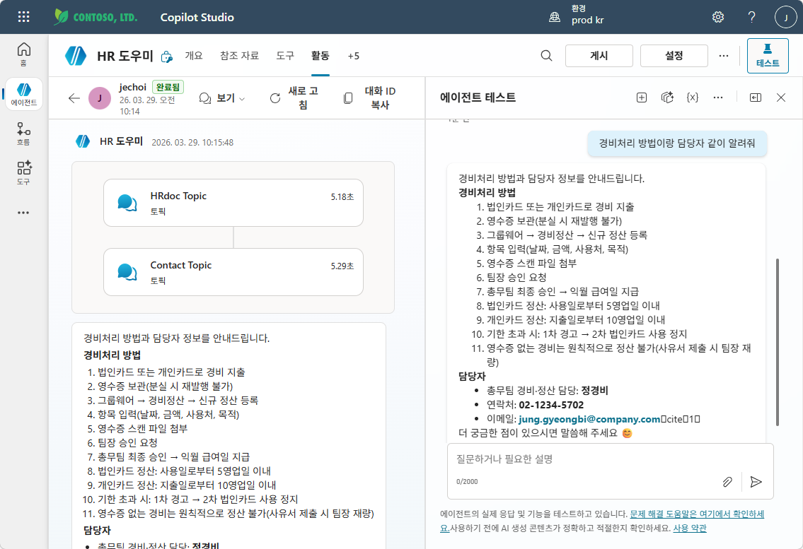

# 실습 ③: STRICT RULES 추가
{: .no_toc }

| 시간 | 소요 | 수강생 역할 |
|:-----|:-----|:-----------|
| 14:30 | 10분 | 🟢 직접 실습 |

---

M6에서 작성한 지침에 아래 내용을 **추가**하세요:

```
## STRICT RULES
- 담당자를 찾아달라는 요청 → Contact Topic 호출 → Global.Contact_result를 활용하여 답변
- 그 외 사내 규정/복리후생/연차/경비 질문 → HRdoc Topic 호출 → Global.HRdoc_result를 활용하여 답변
- Topic에서 결과를 못 찾으면 "HR팀 내선 1234로 문의해 주세요" 안내
- 복합 질문(예: "경비처리 방법이랑 담당자 알려줘")은 두 Topic을 순서대로 호출하여 답변을 통합
```



{: .tip }
> 지침 입력칸에서 **"/"** 를 입력하면 토픽, 변수 등을 바로 삽입할 수 있는 명령어 목록이 나타납니다.

지침 입력칸에 **"/"** 를 입력하면 등록된 토픽 목록이 표시됩니다. 여기서 **Contact Topic**, **HRdoc Topic** 등 원하는 토픽을 선택하여 지침에 삽입할 수 있습니다.



같은 방식으로 **"/gl"** 을 입력하면 글로벌 변수 목록이 나타납니다. `Global.Contact_result`, `Global.HRdoc_result`를 선택하여 지침에 정확한 변수명을 삽입합니다.



최종적으로 지침에 토픽과 변수가 아이콘과 함께 올바르게 삽입된 모습입니다. **저장** 을 클릭합니다.



테스트 패널에서 **"경비처리 방법이랑 담당자 같이 알려줘"** 를 입력하면, HRdoc Topic과 Contact Topic이 순차적으로 호출되어 통합 답변이 제공되는 것을 확인할 수 있습니다.



{: .note }
> 글로벌 변수에 저장된 결과를 **오케스트레이터가 지침에 따라 활용**합니다. Topic이 직접 답변하는 것이 아니라, Topic은 정보를 수집하고 **오케스트레이터가 스타일과 형식을 맞춰 답변**하는 구조입니다.

{: .warning }
> STRICT RULES를 추가하지 않으면 오케스트레이터가 Topic을 **올바르게 선택**하지 못할 수 있습니다.

## 테스트

4가지 질문으로 Topic이 올바르게 동작하는지 확인하세요:

| # | 질문 | 기대 동작 |
|:--|:-----|:---------|
| 1 | "연차 며칠이야?" | HRdoc Topic 호출 → `Global.HRdoc_result` 활용 답변 |
| 2 | "경비처리 담당자 알려줘" | Contact Topic 호출 → `Global.Contact_result` 활용 답변 |
| 3 | "경비처리 방법이랑 담당자 같이 알려줘" | 두 Topic 순차 호출 → 통합 답변 |
| 4 | "아까 찾은 담당자한테 문의하고 싶어" | 포스트잇(글로벌 변수) 활용 확인 |

---

실습을 완료했으면 [M9 본문으로 돌아가세요](m09-topic-variables).
