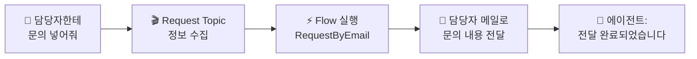

# 손발 달기 — Flow + 메일로 문의 전달
{: .no_toc }

| 시간 | 소요 | 수강생 역할 |
|:-----|:-----|:-----------|
| 15:30 | 50분 | 🟡 복붙 + 결과 확인 |

## 목차
{: .no_toc .text-delta }

1. TOC
{:toc}

---

## 이 모듈에서 배우는 것

- **Power Automate Cloud Flow**를 만들어 에이전트에 연결
- 담당자 메일 주소로 **문의 내용이 자동 전달**되는 것 확인
- **에이전트 → Topic → Flow → 이메일 발송** 전체 연결 구조 이해
- Flow가 연결된 에이전트 = **"대화하는 RPA"**

---

## 말에서 행동으로

지금까지 에이전트는 **"말만"** 했습니다.

| 단계 | Before (M6까지) | After (M9부터) |
|:-----|:----------------|:--------------|
| 사용자 | "연차 며칠이야?" | "담당자한테 문의 넣어줘" |
| 에이전트 | "15일입니다" (말만) | Topic → Flow → **담당자 메일로 자동 전달** (행동!) |

{: .highlight }
> Flow가 연결되면 에이전트는 **대화하는 RPA**가 됩니다.

---

## 전체 연결 구조



---

## 실습 ①: Power Automate Flow 만들기

### Flow 구조 — RequestByEmail

| 항목 | 내용 |
|:-----|:-----|
| **Flow 이름** | RequestByEmail |
| **트리거** | Copilot Studio에서 흐름을 호출할 때 |
| **입력 ①** | `myRequest` (텍스트): 문의 내용 |
| **입력 ②** | `mySender` (텍스트): 문의자 이름 |
| **입력 ③** | `myEmail` (텍스트): 담당자 메일 주소 |
| **동작** | 담당자 메일로 문의 내용 발송 |
| **출력** | `myReturn` (텍스트): 처리 완료 메시지 |

### Step-by-Step

1. [Power Automate](https://make.powerautomate.com) 접속
2. **"만들기"** → **"인스턴트 클라우드 흐름"**
3. **"Copilot Studio에서 흐름을 호출할 때"** 트리거 선택
4. 입력 매개변수 추가: `myRequest` (텍스트), `mySender` (텍스트), `myEmail` (텍스트)
5. **"+ 새 단계"** → **"Office 365 Outlook"** → **"메일 보내기 (V2)"**
6. 받는 사람: 동적 콘텐츠 `myEmail` 선택
7. 제목: `[문의접수] @{triggerBody()?['text_1']}님의 문의`
8. 본문: 아래 HTML 붙여넣기 (아래 참고)
9. **Flow 저장**

### 메일 본문 HTML

아래 HTML을 그대로 복사해서 본문에 붙여넣으세요:

```html
<h2>📧 새로운 문의가 접수되었습니다</h2>
<table>
  <tr><td><b>문의자</b></td><td>@{triggerBody()?['text_1']}</td></tr>
  <tr><td><b>문의내용</b></td><td>@{triggerBody()?['text']}</td></tr>
  <tr><td><b>접수시간</b></td><td>@{utcNow()}</td></tr>
</table>
<p>이 메일은 HR도우미 에이전트가 자동으로 전달한 문의입니다.</p>
```

{: .note }
> HTML을 이해할 필요 없습니다. **복붙이 목표**입니다.

---

## 실습 ②: Request Topic 만들기

1. Copilot Studio → **토픽** → **"+ 토픽 추가"**
2. Topic 이름: `Request Topic`
3. **강사 제공 설정 복붙:**
   - 사용자에게 문의 내용 질문
   - 담당자 메일 주소 확인 (지식 검색 또는 사용자 입력)
   - 변수에 저장
   - RequestByEmail Flow 호출
4. Flow 연결: **"RequestByEmail"** 선택
5. 입력 매핑:
   - `myRequest` ← 사용자 입력 내용
   - `mySender` ← `System.User.DisplayName`
   - `myEmail` ← 담당자 메일 주소 (변수)
6. **저장**

---

## 실습 ③: 지침 업데이트

M5에서 작성한 지침의 STRICT RULES에 추가:

```
- "담당자한테 문의 넣어줘" 등 요청 → Request Topic 호출
- 담당자 메일 주소는 담당자정보 지식에서 검색하고, 없으면 사용자에게 질문
```

---

## 최종 테스트

1. 테스트 패널에 입력: **"담당자한테 문의 넣어줘"**
2. 에이전트가 문의 내용을 물어봄 → **"노트북 교체 요청합니다"** 입력
3. 담당자 메일 주소 확인 → 에이전트가 지식에서 검색하거나 사용자에게 질문
4. **담당자 메일함** 확인 → 문의 메일 도착 확인! 🎉
5. **재게시(Publish)** 버튼 누르기 → Teams에 반영

{: .important }
> Flow를 추가한 후에는 반드시 **재게시**해야 Teams의 에이전트에 반영됩니다.

---

## 핵심 정리

1. **Flow = 에이전트의 손발** — 말에서 행동으로 확장
2. **메일 전달 = 편지봉투** — 문의 내용을 담당자에게 자동 전달
3. **HTML은 복붙** — 코드를 이해할 필요 없음
4. Flow 연결 후 **재게시** 필수
5. **Flow가 연결된 에이전트는 대화하는 RPA**

---

## FAQ

| 질문 | 답변 |
|:-----|:-----|
| Power Automate가 뭔가요? | Microsoft의 자동화 도구입니다. 에이전트의 손발 역할을 합니다. |
| HTML을 알아야 하나요? | 아닙니다. 오늘은 복붙만 합니다. |
| Flow 말고 다른 도구도 연결되나요? | HTTP 요청, 커스텀 커넥터 등 대부분 연결 가능합니다. 오늘은 메일 연동에 집중합니다. |
| 에이전트가 Flow를 잘못 호출하면? | 지침의 STRICT RULES를 더 명확하게 작성하세요. 지침 → 지식 → 엔진 순서로 원인을 찾아보세요. |
| 담당자 메일 주소를 어떻게 알아내나요? | 담당자정보.xlsx 지식 파일에서 검색하거나, 사용자에게 직접 물어보도록 설계합니다. |

---

## 참조 자료

| 자료 | 링크 |
|:-----|:-----|
| Copilot Studio에서 Flow 만들기 | [learn.microsoft.com](https://learn.microsoft.com/microsoft-copilot-studio/advanced-flow-create) |
| Power Automate 시작 | [learn.microsoft.com](https://learn.microsoft.com/power-automate/getting-started) |
| Office 365 Outlook 커넥터 | [learn.microsoft.com](https://learn.microsoft.com/connectors/office365/) |

---

다음 모듈: [M10. 대화기록](m10-conversation-log)
