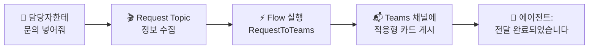

# 손발 달기 — Flow + 편지봉투(적응형 카드)
{: .no_toc }

| 시간 | 소요 | 수강생 역할 |
|:-----|:-----|:-----------|
| 15:30 | 50분 | 🟡 복붙 + 결과 확인 |

## 목차
{: .no_toc .text-delta }

1. TOC
{:toc}

---

## 이 모듈에서 배우는 것

- **Power Automate Cloud Flow**를 만들어 에이전트에 연결
- **적응형 카드(편지봉투)**가 Teams 채널에 게시되는 것 확인
- **에이전트 → Topic → Flow → Teams 채널** 전체 연결 구조 이해
- Flow가 연결된 에이전트 = **"대화하는 RPA"**

---

## 말에서 행동으로

지금까지 에이전트는 **"말만"** 했습니다.

| 단계 | Before (M6까지) | After (M9부터) |
|:-----|:----------------|:--------------|
| 사용자 | "연차 며칠이야?" | "담당자한테 문의 넣어줘" |
| 에이전트 | "15일입니다" (말만) | Topic → Flow → **Teams에 메시지 자동 게시** (행동!) |

{: .highlight }
> Flow가 연결되면 에이전트는 **대화하는 RPA**가 됩니다.

---

## 전체 연결 구조



---

## 사전 준비: Teams 채널 생성

1. Teams → 교육용 팀 선택
2. **"채널 추가"** → 채널 이름: `HR도우미-문의접수`
3. 채널 생성 완료

---

## 실습 ①: Power Automate Flow 만들기

### Flow 구조 — RequestToTeams

| 항목 | 내용 |
|:-----|:-----|
| **Flow 이름** | RequestToTeams |
| **트리거** | Copilot Studio에서 흐름을 호출할 때 |
| **입력 ①** | `myRequest` (텍스트): 문의 내용 |
| **입력 ②** | `mySender` (텍스트): 문의자 이름 |
| **동작** | Teams 채널에 적응형 카드로 메시지 게시 |
| **출력** | `myReturn` (텍스트): 처리 완료 메시지 |

### Step-by-Step

1. [Power Automate](https://make.powerautomate.com) 접속
2. **"만들기"** → **"인스턴트 클라우드 흐름"**
3. **"Copilot Studio에서 흐름을 호출할 때"** 트리거 선택
4. 입력 매개변수 추가: `myRequest` (텍스트), `mySender` (텍스트)
5. **"+ 새 단계"** → **"Microsoft Teams"** → **"채팅 또는 채널에서 메시지 게시"**
6. 팀: [교육용 팀] / 채널: `HR도우미-문의접수`
7. 메시지 형식: **"적응형 카드"** 선택
8. 적응형 카드 JSON 붙여넣기 (아래 참고)
9. **Flow 저장**

### 적응형 카드 JSON

아래 JSON을 그대로 복사해서 붙여넣으세요:

```json
{
  "type": "AdaptiveCard",
  "$schema": "http://adaptivecards.io/schemas/adaptive-card.json",
  "version": "1.5",
  "body": [
    {
      "type": "TextBlock",
      "text": "📬 새로운 문의가 접수되었습니다",
      "weight": "Bolder",
      "size": "Medium"
    },
    {
      "type": "FactSet",
      "facts": [
        { "title": "문의자", "value": "@{triggerBody()?['text_1']}" },
        { "title": "문의내용", "value": "@{triggerBody()?['text']}" },
        { "title": "접수시간", "value": "@{utcNow()}" }
      ]
    }
  ]
}
```

{: .note }
> JSON을 이해할 필요 없습니다. **복붙이 목표**입니다. 디자인을 바꾸고 싶으면 [adaptivecards.io/designer](https://adaptivecards.io/designer/)에서 시각적으로 편집할 수 있습니다.

---

## 실습 ②: Request Topic 만들기

1. Copilot Studio → **토픽** → **"+ 토픽 추가"**
2. Topic 이름: `Request Topic`
3. **강사 제공 설정 복붙:**
   - 사용자에게 문의 내용 질문
   - 변수에 저장
   - RequestToTeams Flow 호출
4. Flow 연결: **"RequestToTeams"** 선택
5. 입력 매핑:
   - `myRequest` ← 사용자 입력 내용
   - `mySender` ← `System.User.DisplayName`
6. **저장**

---

## 실습 ③: 지침 업데이트

M5에서 작성한 지침의 STRICT RULES에 추가:

```
- "담당자한테 문의 넣어줘" 등 요청 → Request Topic 호출
```

---

## 최종 테스트

1. 테스트 패널에 입력: **"담당자한테 문의 넣어줘"**
2. 에이전트가 문의 내용을 물어봄 → **"노트북 교체 요청합니다"** 입력
3. **Teams 채널** `HR도우미-문의접수` 확인 → 적응형 카드 도착 확인! 🎉
4. **재게시(Publish)** 버튼 누르기 → Teams에 반영

{: .important }
> Flow를 추가한 후에는 반드시 **재게시**해야 Teams의 에이전트에 반영됩니다.

---

## 핵심 정리

1. **Flow = 에이전트의 손발** — 말에서 행동으로 확장
2. **적응형 카드 = 편지봉투** — 보기 좋게 포장된 메시지
3. **JSON은 복붙** — 코드를 이해할 필요 없음
4. Flow 연결 후 **재게시** 필수
5. **Flow가 연결된 에이전트는 대화하는 RPA**

---

## FAQ

| 질문 | 답변 |
|:-----|:-----|
| Power Automate가 뭔가요? | Microsoft의 자동화 도구입니다. 에이전트의 손발 역할을 합니다. |
| JSON을 알아야 하나요? | 아닙니다. 오늘은 복붙만 합니다. 디자인 변경은 adaptivecards.io에서 시각 편집 가능합니다. |
| Flow 말고 다른 도구도 연결되나요? | HTTP 요청, 커스텀 커넥터 등 대부분 연결 가능합니다. 오늘은 Teams 연동에 집중합니다. |
| 에이전트가 Flow를 잘못 호출하면? | 지침의 STRICT RULES를 더 명확하게 작성하세요. M5의 3단계 디버깅을 활용하세요. |

---

## 참조 자료

| 자료 | 링크 |
|:-----|:-----|
| Copilot Studio에서 Flow 만들기 | [learn.microsoft.com](https://learn.microsoft.com/microsoft-copilot-studio/advanced-flow-create) |
| Power Automate 시작 | [learn.microsoft.com](https://learn.microsoft.com/power-automate/getting-started) |
| 적응형 카드 디자이너 | [adaptivecards.io](https://adaptivecards.io/designer/) |
| Teams 메시지 게시 액션 | [learn.microsoft.com](https://learn.microsoft.com/connectors/teams/) |

---

다음 모듈: [M10. 대화기록](m10-conversation-log)
