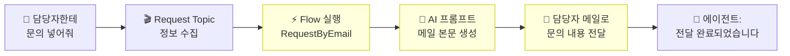

# 손발 달기 — Power Automate Flow 만들기
{: .no_toc }

| 시간 | 소요 | 수강생 역할 |
|:-----|:-----|:-----------|
| 15:35 | 30분 | 🟡 복붙 + 확인 |

## 목차
{: .no_toc .text-delta }

1. TOC
{:toc}

---

## 이 모듈에서 배우는 것

- **Power Automate Cloud Flow**란 무엇인지 이해
- RequestByEmail Flow를 **직접 만들기** (복붙 실습)
- **AI 프롬프트**로 메일 본문을 자동 생성하는 구조 이해
- Flow가 연결된 에이전트 = **"대화하는 RPA"**

---

## 말에서 행동으로

지금까지 에이전트는 **"말만"** 했습니다.

| 단계 | Before (M6까지) | After (M9부터) |
|:-----|:----------------|:--------------|
| 사용자 | "연차 며칠이야?" | "담당자한테 문의 넣어줘" |
| 에이전트 | "15일입니다" (말만) | Topic → Flow → **담당자 메일로 자동 전달** (행동!) |

{: .highlight }
> Flow가 연결되면 에이전트는 **대화하는 RPA**가 됩니다.

---

## 전체 연결 구조

이번 모듈(M9)에서 Flow를 만들고, 다음 모듈(M10)에서 에이전트에 연결합니다.



{: .note }
> 🟡 노란색 부분이 이번 모듈에서 만드는 영역입니다.

---

## 실습: Power Automate Flow 만들기

{: .important }
> 시작 전에 확인하세요: **Power Automate 접속 가능**, **인스턴트 클라우드 흐름 생성 권한**, **AI Builder 프롬프트 사용 가능**, **Office 365 Outlook 커넥터로 메일 발송 가능**. 조직 정책에 따라 관리자 승인이나 라이선스 확인이 필요할 수 있습니다.

### Flow 구조 — RequestByEmail

| 항목 | 내용 |
|:-----|:-----|
| **Flow 이름** | RequestByEmail |
| **트리거** | Copilot Studio에서 흐름을 호출할 때 |
| **입력 ①** | `myRequest` (텍스트): 문의 내용 |
| **입력 ②** | `mySender` (텍스트): 문의자 이름 |
| **입력 ③** | `myEmail` (텍스트): 담당자 메일 주소 |
| **동작 ①** | AI 프롬프트로 메일 본문 생성 |
| **동작 ②** | 담당자 메일로 문의 내용 발송 |
| **출력** | `myReturn` (텍스트): 처리 완료 메시지 |

### Step-by-Step

1. [Power Automate](https://make.powerautomate.com) 접속
2. **"만들기"** → **"인스턴트 클라우드 흐름"**
3. **"Copilot Studio에서 흐름을 호출할 때"** 트리거 선택
4. 입력 매개변수 추가: `myRequest` (텍스트), `mySender` (텍스트), `myEmail` (텍스트)
5. **"+ 새 단계"** → **"AI Builder"** → **"AI 프롬프트를 사용하여 텍스트 만들기"**
6. AI 프롬프트 설정 (아래 참고)
7. **"+ 새 단계"** → **"Office 365 Outlook"** → **"메일 보내기 (V2)"**
8. 받는 사람: 동적 콘텐츠 `myEmail` 선택
9. 제목: `[문의접수] @{triggerBody()?['text_1']}님의 문의`
10. 본문: AI 프롬프트 출력 결과(동적 콘텐츠) 선택
11. **Flow 저장**

### AI 프롬프트 설정

**"+ 새 단계" → "AI Builder" → "AI 프롬프트를 사용하여 텍스트 만들기"**를 선택한 후, **"프롬프트 만들기"**를 클릭하세요.

**프롬프트 이름:** `문의접수 메일 본문 생성`

**프롬프트 내용 (복사해서 붙여넣기):**

<details markdown="1">
<summary><strong>프롬프트 (클릭해서 펼치기)</strong></summary>

```
아래 문의 접수 정보를 바탕으로, 담당자에게 보낼 안내 메일 본문을 HTML 형식으로 작성해 주세요.

문의자: {{mySender}}
문의내용: {{myRequest}}

작성 규칙:
- 정중하고 간결한 한국어 비즈니스 톤
- 문의자 이름, 문의 내용, 접수 시간을 표로 정리
- 마지막에 "이 메일은 HR도우미 에이전트가 자동으로 전달한 문의입니다." 문구 포함
- HTML 태그만 출력 (```html 등 코드 블록 마크업 제외)
```

</details>

**입력 매개변수 매핑:**
- `mySender` ← 동적 콘텐츠 `mySender` (트리거 입력)
- `myRequest` ← 동적 콘텐츠 `myRequest` (트리거 입력)

{: .note }
> AI 프롬프트가 매번 **깔끔한 비즈니스 메일**을 자동 생성합니다. HTML을 직접 쓸 필요가 없습니다!  
> 이것이 M12에서 배울 **"Flow에 AI 심기"**의 실전 적용입니다.

---

## 핵심 정리

1. **Flow = 에이전트의 손발** — 말에서 행동으로 확장
2. **AI 프롬프트 = 메일 작성 AI** — 문의 내용을 깔끔한 비즈니스 메일로 자동 생성
3. Power Automate에서 Flow를 완성했으니, **다음 모듈에서 에이전트에 연결**합니다

---

## FAQ

| 질문 | 답변 |
|:-----|:-----|
| Power Automate가 뭔가요? | Microsoft의 자동화 도구입니다. 에이전트의 손발 역할을 합니다. |
| "인스턴트 클라우드 흐름"이나 AI Builder 메뉴가 안 보여요 | 조직 권한이나 라이선스가 부족할 수 있습니다. 관리자에게 Power Automate/AI Builder 사용 가능 여부를 확인하세요. |
| AI 프롬프트가 매번 다른 메일을 만들지 않나요? | 프롬프트에 규칙을 명확히 지정했기 때문에 형식은 일관되고, 내용만 문의에 맞게 달라집니다. |
| Flow 말고 다른 도구도 연결되나요? | HTTP 요청, 커스텀 커넥터 등 대부분 연결 가능합니다. 오늘은 메일 연동에 집중합니다. |

---

## 참조 자료

| 자료 | 링크 |
|:-----|:-----|
| Copilot Studio에서 Flow 만들기 | [learn.microsoft.com](https://learn.microsoft.com/microsoft-copilot-studio/advanced-flow-create) |
| Power Automate 시작 | [learn.microsoft.com](https://learn.microsoft.com/power-automate/getting-started) |
| AI Builder 프롬프트 개요 | [learn.microsoft.com](https://learn.microsoft.com/ai-builder/prompts-overview) |
| Office 365 Outlook 커넥터 | [learn.microsoft.com](https://learn.microsoft.com/connectors/office365/) |

---

다음 모듈: [M10. 메일 전달 연결](m10-flow-connect)
