# 실습 ①: 게시(Publish) & 채널 추가
{: .no_toc }

| 시간 | 소요 | 수강생 역할 |
|:-----|:-----|:-----------|
| 15:00 | 5분 | 🟢 직접 실습 |

---

## A. 게시(Publish)

1. Copilot Studio → 에이전트 편집 화면

   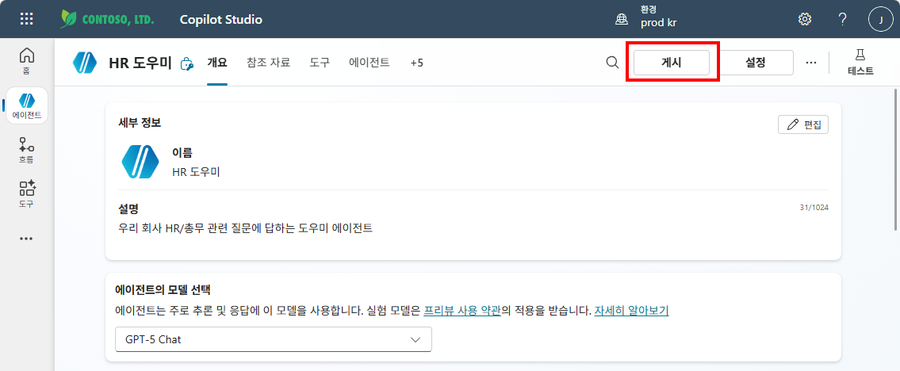

2. 우측 상단 **"게시(Publish)"** 클릭
3. 게시 확인 대화상자 → **"게시"** 클릭

   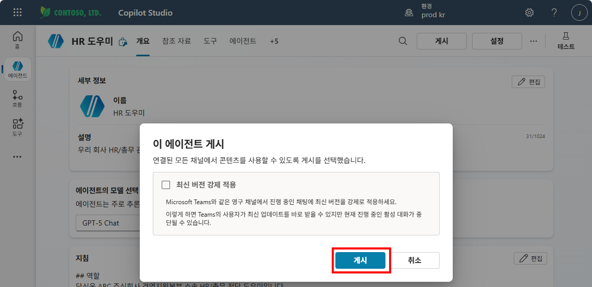

4. 게시 진행 중 화면 → **"닫기"** 클릭 (백그라운드에서 계속 진행됨)

   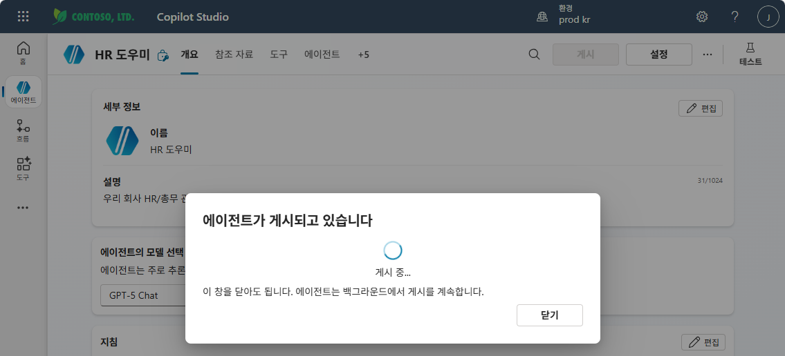

{: .highlight }
> 게시 = 최신 변경사항을 **실사용 버전**에 반영하는 단계입니다. 게시하지 않으면 테스트 패널에서만 확인됩니다.

---

## B. 채널 추가 (Teams & Microsoft 365 Copilot)

게시가 완료되면 에이전트를 **어디서 사용할지** 채널을 연결해야 합니다.

1. 상단 탭에서 **"채널"** 클릭

   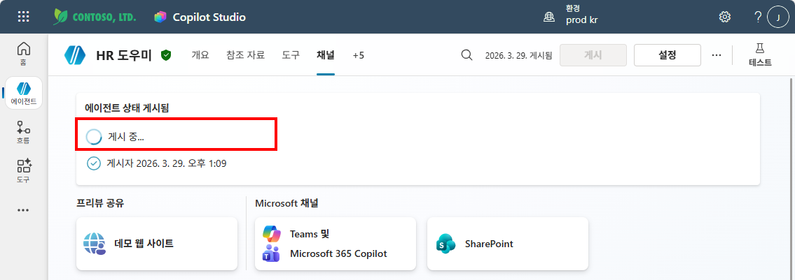

2. 게시 완료 확인 — "에이전트 상태: 게시됨" 표시

   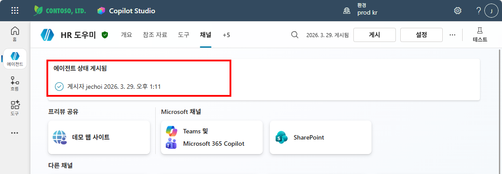

   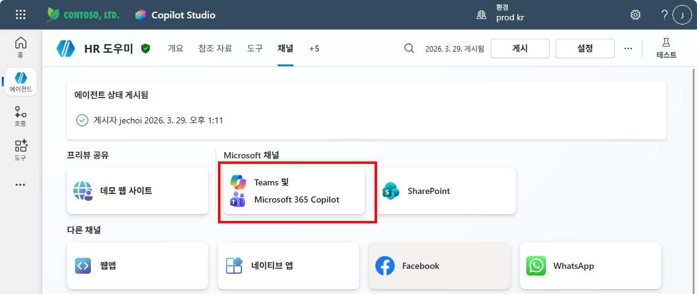

   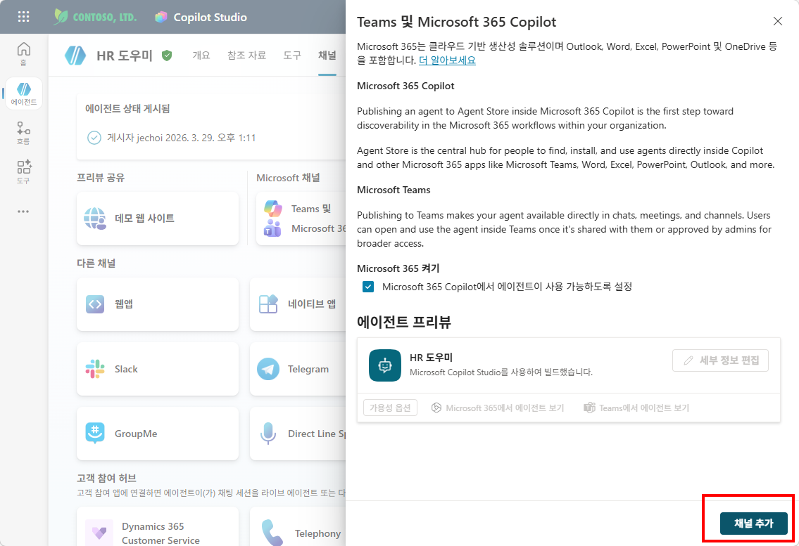

   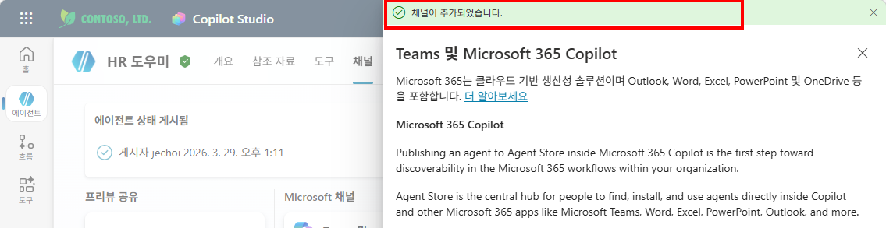

   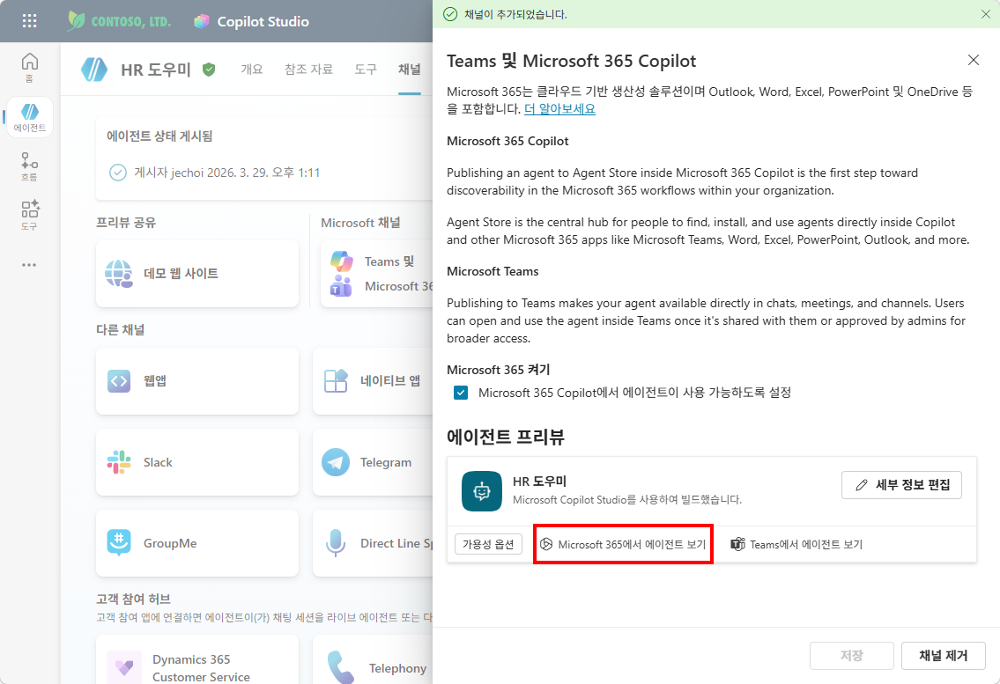

   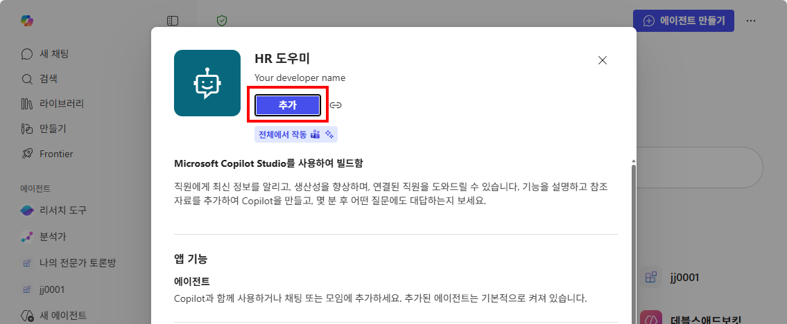

   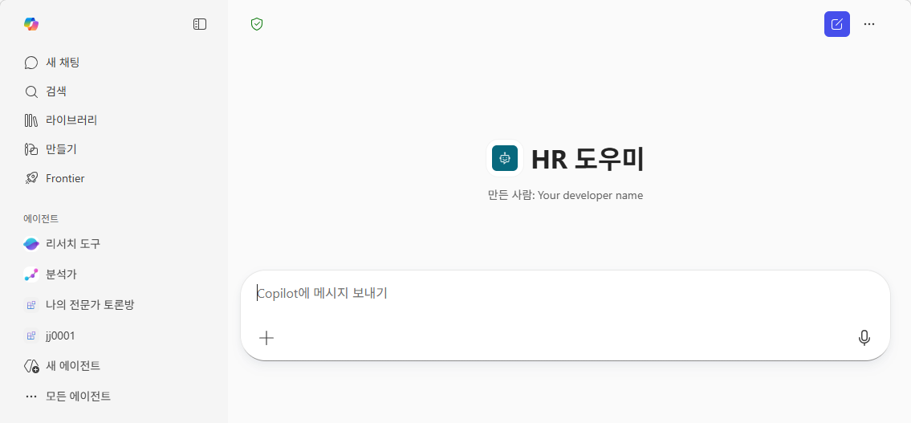

{: .tip }
> **"Teams 및 Microsoft 365 Copilot"** 채널이 연결되어 있어야 실습 ②(몰입형)과 실습 ③(@호출)에서 에이전트를 사용할 수 있습니다.

---

실습을 완료했으면 [M10 본문으로 돌아가세요](m10-publish-share).
