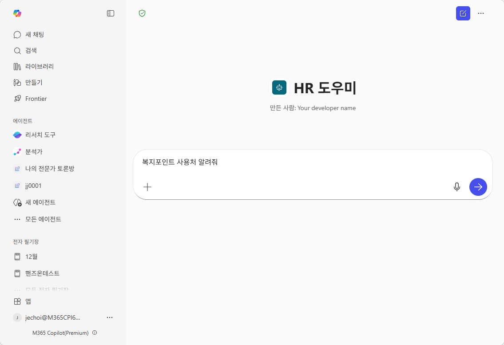
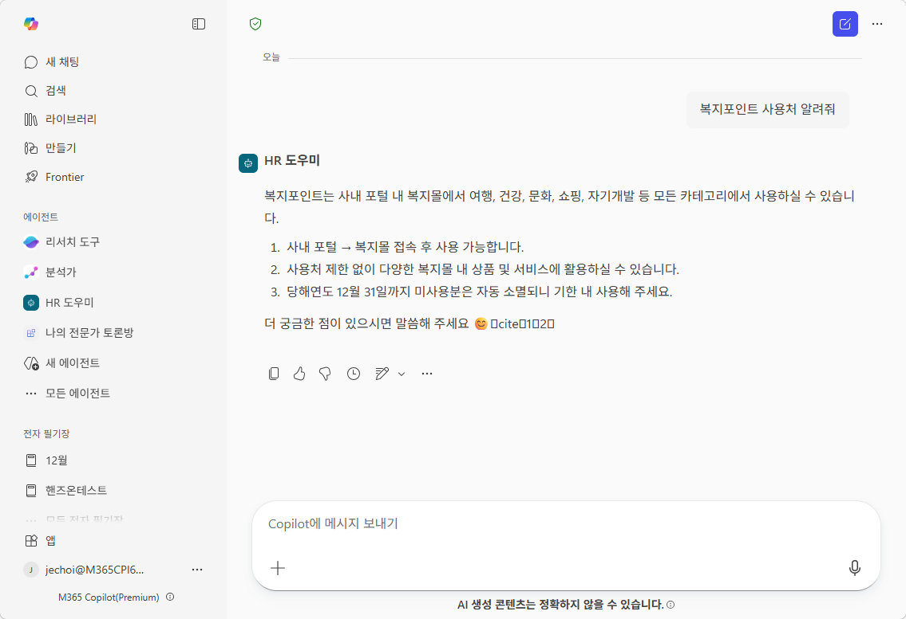

# 실습 ②: Copilot에서 에이전트 사용 (몰입형)
{: .no_toc }

| 시간 | 소요 | 수강생 역할 |
|:-----|:-----|:-----------|
| 15:05 | 5분 | 🟢 직접 실습 |

---

M2에서 배운 **몰입형** 방식입니다. 에이전트 전용 화면에서 1:1로 대화합니다.

## Step-by-Step

1. [M365 Copilot](https://copilot.microsoft.com) 접속 (또는 Teams Copilot)
2. 에이전트 목록에서 **만든 에이전트 이름 클릭**
3. 에이전트 전용 화면이 열림
4. 질문 입력: **"복지포인트 사용처 알려줘"**
5. 에이전트가 답변하는 것 확인! 🎉

{: .tip }
> 몰입형은 에이전트와 **집중 대화**할 때 적합합니다. 여러 질문을 연속으로 하거나 깊이 있는 상담이 필요할 때 사용하세요.

---

실습을 완료했으면 [M10 본문으로 돌아가세요](m10-publish-share).
