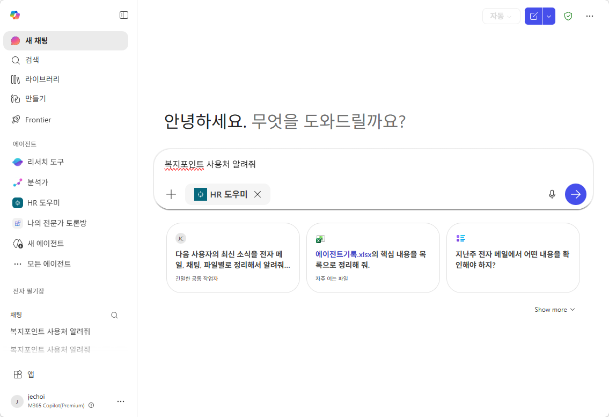
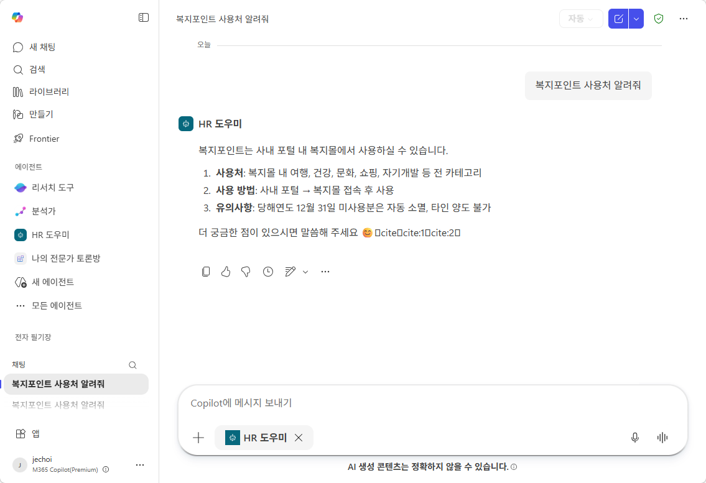

# 실습 ③: @호출 테스트 (인컨텍스트)
{: .no_toc }

| 시간 | 소요 | 수강생 역할 |
|:-----|:-----|:-----------|
| 15:10 | 5분 | 🟢 직접 실습 |

---

M2에서 배운 **인컨텍스트** 방식입니다. 다른 업무 중 빠르게 질문할 때 편합니다.

1. M365 Copilot 채팅 열기 (Teams 또는 브라우저)
2. 입력창에 `@HR 도우미`를 태그하고 **"복지포인트 사용처 알려줘"** 입력 후 전송

   

3. 에이전트가 답변하는 것 확인 — 일반 Copilot 대화 흐름 안에서 에이전트가 응답합니다.

   

---

실습을 완료했으면 [M10 본문으로 돌아가세요](m10-publish-share).
