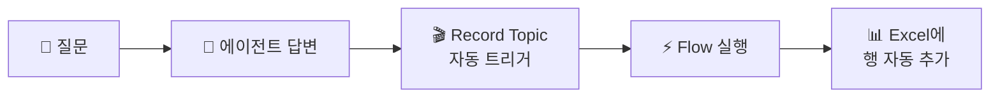

# 신입사원의 일기 — 대화기록 Excel 저장
{: .no_toc }

| 시간 | 소요 | 수강생 역할 |
|:-----|:-----|:-----------|
| 16:35 | 20분 | 👀 강사 데모 |

## 목차
{: .no_toc .text-delta }

1. TOC
{:toc}

---

## 이 모듈에서 배우는 것

- **Record Topic + Flow → Excel** 자동 기록 구조
- 대화기록이 필요한 **3가지 이유** (개선·감사·분석)
- 데이터 기반 에이전트 **개선의 가능성**

---

## 왜 대화를 기록하나요?

에이전트의 모든 대화를 **자동으로 Excel에 기록**하면 3가지 가치가 생깁니다.

| 목적 | 설명 |
|:-----|:-----|
| **에이전트 개선** | 자주 묻는 질문 파악 → 지식 보강 |
| **감사/컴플라이언스** | 누가, 언제, 뭘 물어봤는지 투명한 기록 |
| **업무 분석** | 질문 패턴으로 실제 업무 니즈 발견 |

---

## 대화기록 구조

### Excel 기록 항목

| 컬럼 | 값 | 설명 |
|:-----|:---|:-----|
| 시간 | `utcNow()` | 대화 발생 시각 |
| 사용자 | `System.User.PrincipalName` | 질문한 사람 |
| 질문 | `System.Activity.Text` | 사용자 입력 |
| 답변 | `System.Response.FormattedText` | 에이전트 응답 |

### Record Topic의 특별한 점

일반 Topic은 사용자가 특정 질문을 해야 실행됩니다.  
하지만 Record Topic은 **"AI가 응답을 생성할 때마다"** 자동 실행됩니다.

{: .highlight }
> 사용자는 기록되는 줄도 모릅니다. 에이전트가 **자동으로 일기를 쓰는 것**입니다.

---

## 데이터 활용 시나리오

기록된 데이터로 이런 분석이 가능합니다.

| 시나리오 | 분석 방법 | 기대 효과 |
|:---------|:---------|:---------|
| **자주 묻는 질문 TOP 10** | 질문 컬럼 키워드 분류 | 지식 소스 보강 우선순위 |
| **답변 실패 패턴** | "모르겠습니다" 필터링 | 부족한 교과서 파악 |
| **사용량 추이** | 시간대별/요일별 집계 | 서비스 시간 최적화 |
| **사용자별 현황** | Pivot 분석 | 교육 대상 파악 |

{: .tip }
> Copilot에게 "이 데이터에서 가장 많이 묻는 질문 TOP 5를 알려줘"라고 물으면 **자동으로 분석**해 줍니다.

---

## 핵심 정리

1. **Record Topic** = 모든 대화를 자동으로 감지하는 특수 Topic
2. **Flow → Excel** = 대화 내용을 자동 기록
3. 기록된 데이터로 **에이전트 개선·감사·업무 분석** 가능
4. Copilot을 활용한 **데이터 자동 분석**도 가능

---

## FAQ

| 질문 | 답변 |
|:-----|:-----|
| Excel 말고 다른 곳에 저장할 수 있나요? | Dataverse, SQL, SharePoint 리스트 등 가능합니다. Excel이 가장 간단합니다. |
| Excel에 행 제한이 있나요? | 있습니다. 대량 운영 시 Dataverse나 DB를 권장합니다. |
| 개인정보 보호는 어떻게 하나요? | M1의 보안 정책이 적용됩니다. 사용자명 익명화도 가능합니다. |
| 바로 오늘 팀에서 쓸 수 있나요? | Flow + Excel 연결만 하면 바로 사용 가능합니다. |

---

## 참조 자료

| 자료 | 링크 |
|:-----|:-----|
| Copilot Studio 분석 대시보드 | [learn.microsoft.com](https://learn.microsoft.com/microsoft-copilot-studio/analytics-overview) |
| Power Automate Excel 커넥터 | [learn.microsoft.com](https://learn.microsoft.com/connectors/excelonlinebusiness/) |
| 에이전트 성능 모니터링 | [learn.microsoft.com](https://learn.microsoft.com/microsoft-copilot-studio/analytics-sessions) |

---

다음 모듈: [M11. AI 프롬프트](m11-ai-prompt)
