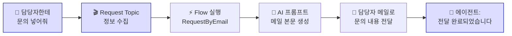

# 메일 전달 연결 — Topic + 테스트 + 재게시
{: .no_toc }

| 시간 | 소요 | 수강생 역할 |
|:-----|:-----|:-----------|
| 16:05 | 20분 | 🟡 복붙 + 결과 확인 |

## 목차
{: .no_toc .text-delta }

1. TOC
{:toc}

---

## 이 모듈에서 배우는 것

- M9에서 만든 Flow를 **에이전트에 연결**
- Request Topic 만들기 + 지침 STRICT RULES 업데이트
- **에이전트 → Topic → Flow → 이메일 발송** 전체 흐름 테스트
- 메일 전달 = **편지봉투** — 문의 내용을 담당자에게 자동 전달

---

## 전체 연결 구조

M9에서 만든 Flow(노란색)를 에이전트(파란색)에 연결합니다.



{: .note }
> 🔵 파란색 부분이 이번 모듈에서 만드는 영역입니다.

---

## 실습 ①: Request Topic 만들기

1. Copilot Studio → **토픽** → **"+ 토픽 추가"**
2. Topic 이름: `Request Topic`
3. Topic 안에 아래 순서로 노드를 배치합니다:
   - 질문 노드: 사용자에게 문의 내용을 물어보고 변수에 저장
   - 확인 노드: 담당자 메일 주소를 지식에서 찾거나, 없으면 사용자에게 직접 질문
   - 작업 노드: **RequestByEmail** Flow 호출
   - 메시지 노드: 전달 완료 메시지 출력
4. Flow 연결: **"RequestByEmail"** 선택
5. 입력 매핑:
   - `myRequest` ← 사용자 입력 내용
   - `mySender` ← `System.User.DisplayName`
   - `myEmail` ← 담당자 메일 주소 (변수)
6. 출력 매핑:
   - `myReturn` ← Flow가 돌려준 완료 메시지
7. **저장**

{: .tip }
> 강사가 제공한 샘플 Topic을 붙여넣더라도, 위 4개 노드가 어떤 순서로 연결되는지는 직접 확인해 두세요. 나중에 혼자 수정할 때 가장 먼저 보는 구조입니다.

---

## 실습 ②: 지침 업데이트

M5에서 작성한 지침의 STRICT RULES에 추가:

<details markdown="1">
<summary><strong>추가 규칙 (클릭해서 펼치기)</strong></summary>

```
- "담당자한테 문의 넣어줘" 등 요청 → Request Topic 호출
- 담당자 메일 주소는 담당자정보 지식에서 검색하고, 없으면 사용자에게 질문
```

</details>

---

## 최종 테스트

1. 테스트 패널에 입력: **"담당자한테 문의 넣어줘"**
2. 에이전트가 문의 내용을 물어봄 → **"노트북 교체 요청합니다"** 입력
3. 담당자 메일 주소 확인 → 에이전트가 지식에서 검색하거나 사용자에게 질문
4. **담당자 메일함** 확인 → 문의 메일 도착 확인! 🎉
5. **재게시(Publish)** 버튼 누르기 → Copilot/Teams 사용 채널에 반영

{: .important }
> Flow를 추가한 후에는 반드시 **재게시**해야 Teams의 에이전트에 반영됩니다.

---

## 핵심 정리

1. **Request Topic** = 사용자의 문의 요청을 감지하고 정보를 수집하는 대본
2. **Flow 연결** = Topic에서 Flow를 호출하여 실제 행동 실행
3. **메일 전달 = 편지봉투** — 문의 내용을 담당자에게 자동 전달
4. Flow 연결 후 **재게시** 필수
5. **Flow가 연결된 에이전트는 대화하는 RPA**

---

## FAQ

| 질문 | 답변 |
|:-----|:-----|
| 에이전트가 Flow를 잘못 호출하면? | 지침만 보지 말고 **STRICT RULES → Topic 조건 → 입력 매핑** 순서로 확인하세요. 어느 단계에서 잘못 연결됐는지 더 빨리 찾을 수 있습니다. |
| 담당자 메일 주소를 어떻게 알아내나요? | 담당자정보.docx 지식 파일에서 검색하거나, 사용자에게 직접 물어보도록 설계합니다. |
| 재게시 안 하면 어떻게 되나요? | 테스트 패널에서는 동작하지만, Teams/Copilot에서는 이전 버전이 유지됩니다. |

---

## 참조 자료

| 자료 | 링크 |
|:-----|:-----|
| Copilot Studio에서 Flow 만들기 | [learn.microsoft.com](https://learn.microsoft.com/microsoft-copilot-studio/advanced-flow-create) |
| Power Automate 시작 | [learn.microsoft.com](https://learn.microsoft.com/power-automate/getting-started) |
| Office 365 Outlook 커넥터 | [learn.microsoft.com](https://learn.microsoft.com/connectors/office365/) |

---

다음 모듈: [M11. 대화기록](m11-conversation-log)
