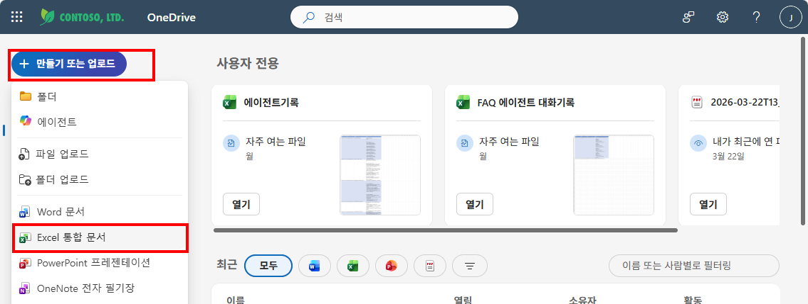
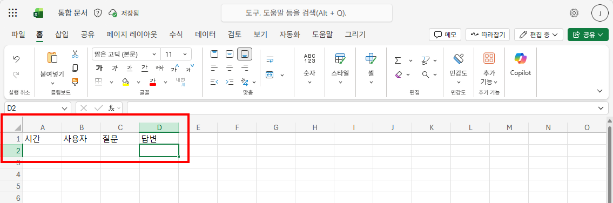
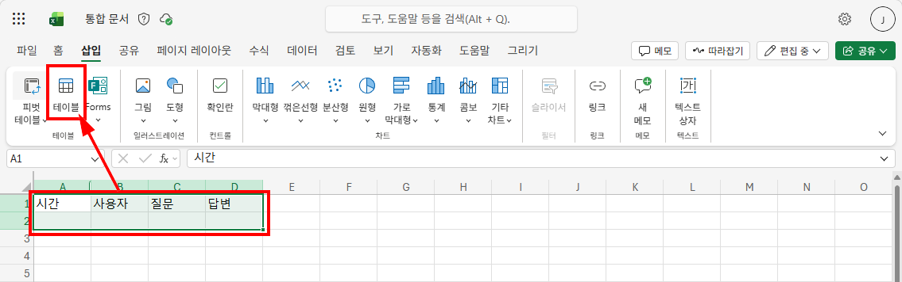
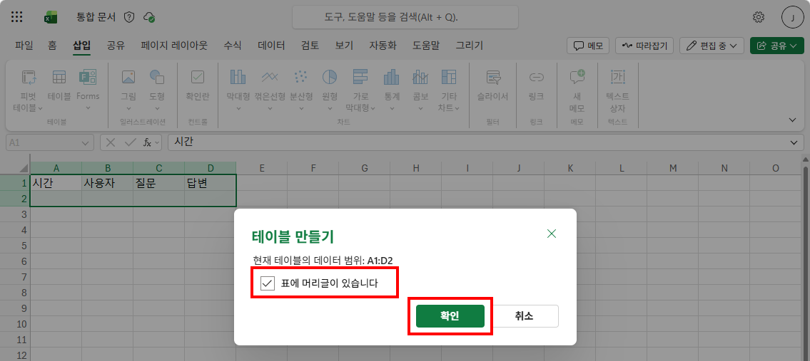
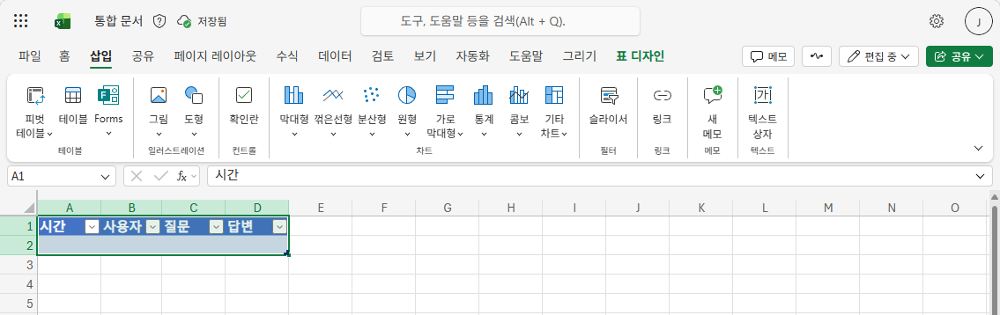

# 실습 ①: Excel 파일 준비
{: .no_toc }

| 시간 | 소요 | 수강생 역할 |
|:-----|:-----|:-----------|
| 15:20 | 5분 | 🟢 직접 실습 |

---

{: .important }
> **OneDrive for Business**와 **Excel Online (Business)** 접근 권한이 있어야 합니다. 조직 정책상 OneDrive 사용이 제한되어 있으면 같은 구조로 **SharePoint 문서 라이브러리**를 사용해도 됩니다.

### 1. OneDrive에서 새 Excel 파일 생성

**OneDrive** 접속 → **"+ 만들기 또는 업로드"** → **"Excel 통합 문서"** 클릭

### 2. 헤더 행 입력

Sheet1의 **A1:D1** 셀에 아래 4개 열 이름을 입력합니다.

| 시간 | 사용자 | 질문 | 답변 |
|:-----|:------|:-----|:-----|

### 3. 표(Table)로 변환 — 범위 선택 & 삽입

**A1:D2** 영역을 드래그하여 선택한 뒤, 상단 **"삽입"** 탭 → **"테이블"** 클릭

### 4. 테이블 만들기 확인

**"테이블 만들기"** 대화상자에서:
- 데이터 범위: `A1:D2`
- **"표에 머리글이 있습니다"** 체크 확인
- **"확인"** 클릭

### 5. 테이블 생성 완료 & 파일 이름 변경

테이블이 생성되면 헤더에 필터 드롭다운이 표시되고, **"표 디자인"** 탭이 나타납니다.  
파일 이름을 **"대화기록"** 으로 변경하고 저장합니다.

{: .tip }
> 반드시 **표(Table)**로 만들어야 Copilot Studio의 Excel 커넥터에서 행을 추가할 수 있습니다.

---

실습을 완료했으면 [M11 본문으로 돌아가세요](m11-connector).
