# 실습 ②: Record Topic에서 Excel 커넥터 연결하기
{: .no_toc }

| 시간 | 소요 | 수강생 역할 |
|:-----|:-----|:-----------|
| 15:25 | 20분 | 🟢 직접 실습 |

---

## Step 1 — Topic 생성 + 트리거 설정

1. Copilot Studio → **토픽** → **"+ 토픽 추가"** → **"새로 시작"**
2. Topic 이름: `Record Topic`
3. 트리거 노드 클릭 → **"트리거 변경"** 선택
4. 트리거 유형 목록에서 **"응답 후(After response)"** 선택
   - 이것이 "AI가 응답을 생성할 때마다 자동 실행"의 의미입니다

토픽 목록에서 **"+ 토픽 추가"** → **"새로 시작"**을 클릭합니다.

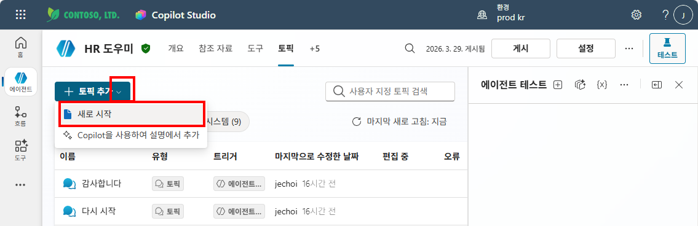

Topic 이름을 `Record Topic`으로 입력하고, 트리거 노드의 **"트리거 변경"** 아이콘을 클릭합니다. 트리거 유형 목록에서 **"AI가 생성한 응답이 곧 전송됩니다"**를 선택합니다.

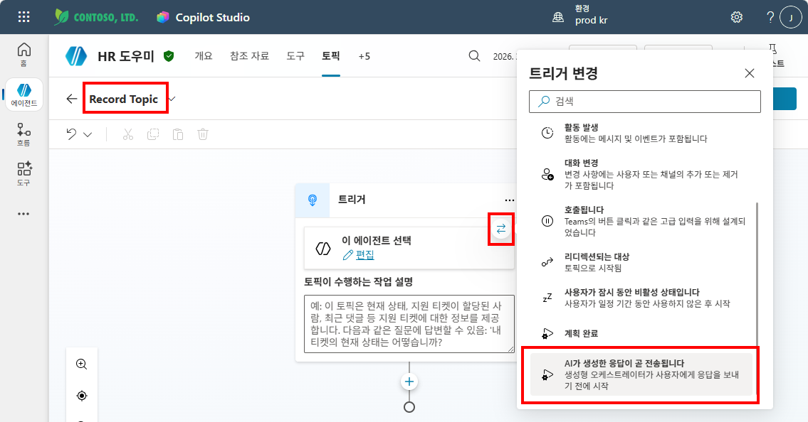

트리거가 **"생성된 AI 응답"**으로 변경된 것을 확인합니다.

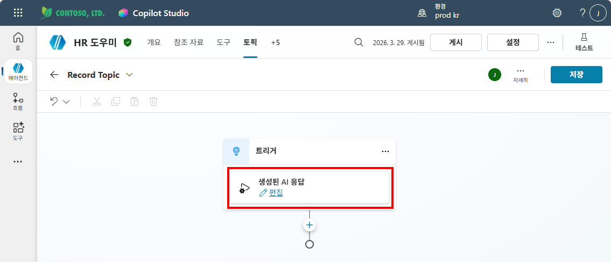

{: .highlight }
> 일반 Topic의 트리거는 **"문구(Phrases)"**입니다. Record Topic은 **"응답 후"** 트리거를 사용하기 때문에, 사용자가 특정 말을 하지 않아도 **매번 자동으로 실행**됩니다.

## Step 2 — Excel 커넥터 추가

5. 트리거 아래 **"+"** 클릭 → **"작업 호출"** 선택
6. 커넥터 검색창에서 **"Excel"** 검색 → **"Excel Online (Business)"** 선택
7. 동작 목록에서 **"표에 행 추가"** 선택
8. 연결 승인 팝업이 나타나면 **"승인"** 클릭 (Microsoft 365 계정으로 로그인)

트리거 아래 **"+"** 클릭 → **"도구 추가"**를 선택합니다.

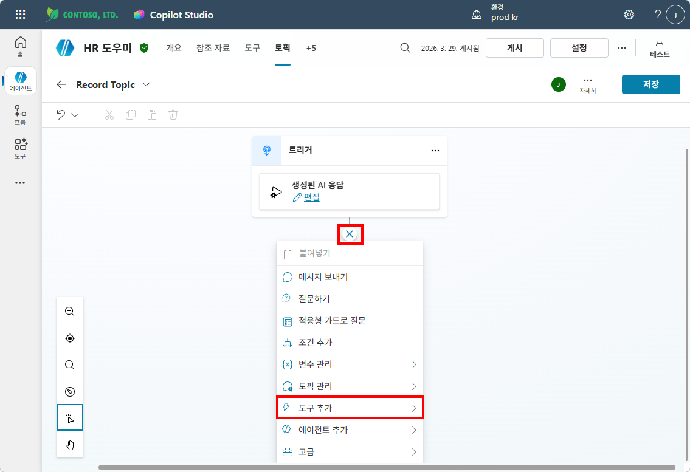

도구 추가 패널의 **커넥터** 탭에서 "테이블에 행"을 검색하고, **"테이블에 행 추가 — Excel Online (Business)"**를 선택합니다.

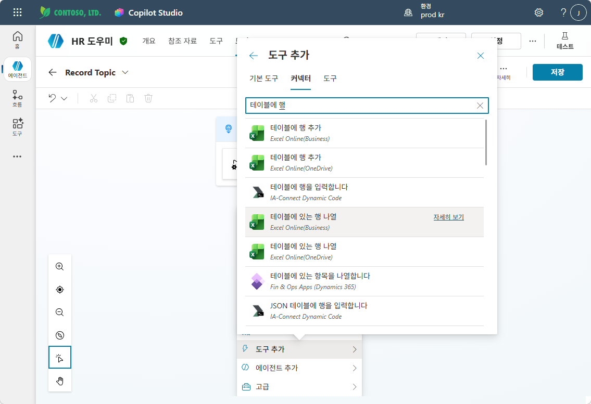

연결 만들기 화면에서 Excel Online(Business) 연결이 ✅ 확인되면 **"제출"**을 클릭합니다.

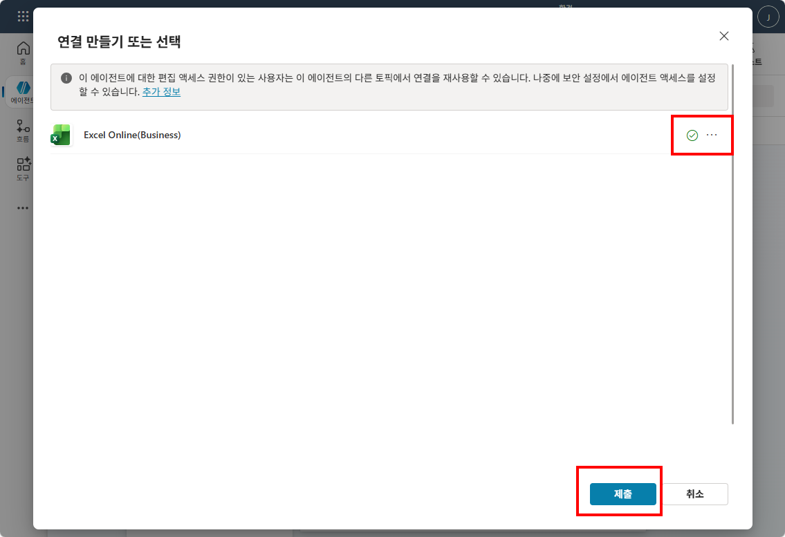

커넥터가 추가되면 "Add a row into a table" 노드가 생성됩니다.

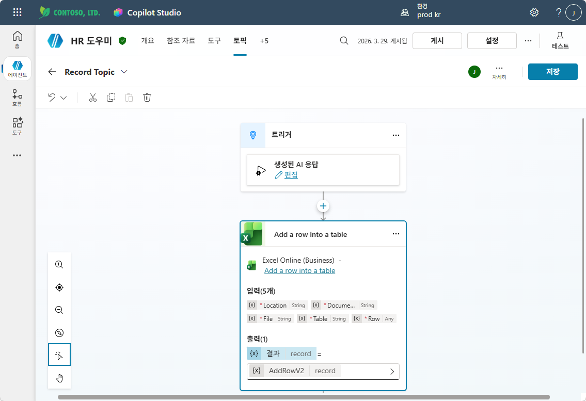

## Step 3 — Excel 파일 연결 + 매핑

9. 설정 항목을 아래와 같이 지정합니다:

| 항목 | 값 |
|:-----|:---|
| 위치 | **OneDrive for Business** |
| 문서 라이브러리 | (기본값) |
| 파일 | `대화기록.xlsx` 선택 |
| 표 | `표1` 선택 |

   노드를 클릭하면 우측에 입력 패널이 열립니다.

   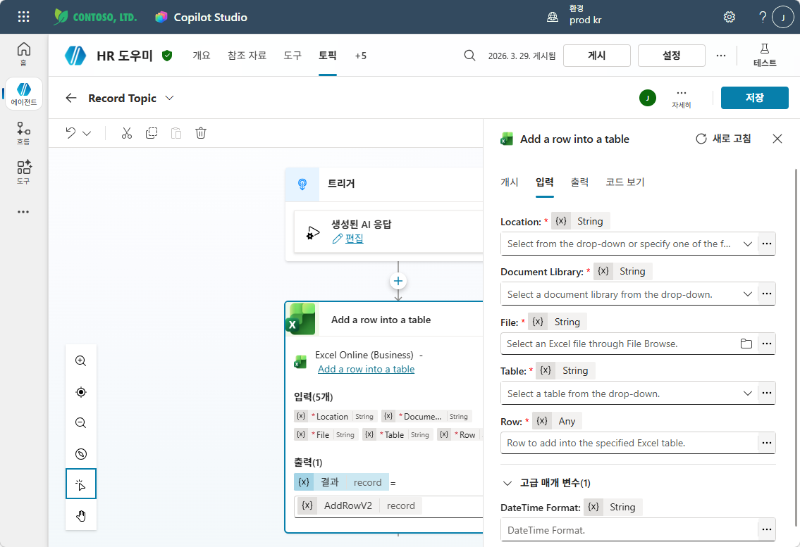

   각 항목을 아래와 같이 설정합니다.

   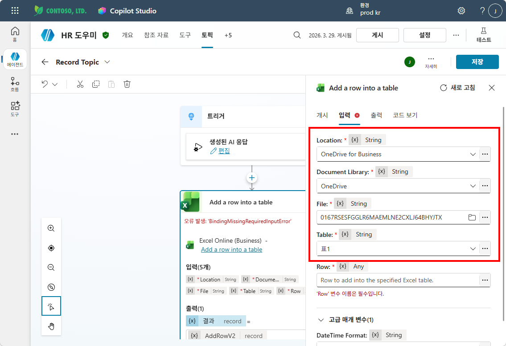

10. 컬럼 매핑 (각 컬럼 오른쪽 입력란 클릭 → 변수 삽입):

| Excel 컬럼 | 매핑 값 | 설명 |
|:-----------|:---------|:-----|
| 시간 | `utcNow()` (수식 입력) | 현재 시각 |
| 사용자 | `System.User.PrincipalName` | 질문한 사람 |
| 질문 | `System.Activity.Text` | 사용자 입력 |
| 답변 | `System.Response.FormattedText` | 에이전트 응답 |

   Row의 "..." 버튼을 클릭하고 **수식** 탭에서 컬럼 매핑 수식을 입력한 후 **"삽입"**을 클릭합니다.

   ```
{
    시간: Now(),
    사용자: System.User.PrincipalName,
    질문: System.Activity.Text,
    답변: System.Response.FormattedText
}
   ```

   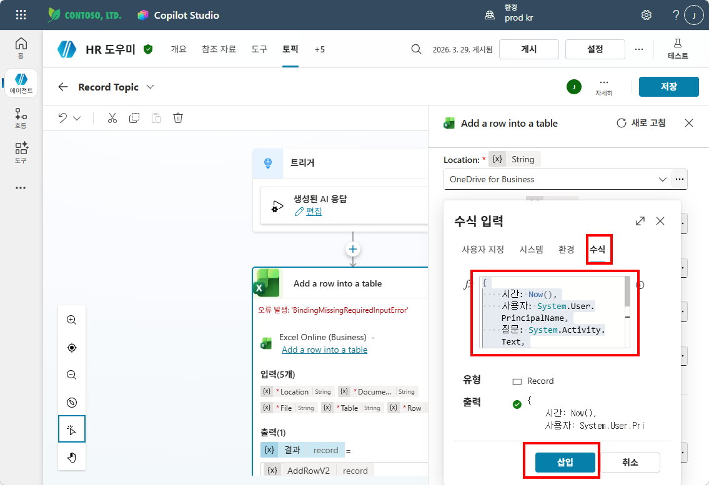

   Row에 수식이 설정된 것을 확인합니다.

   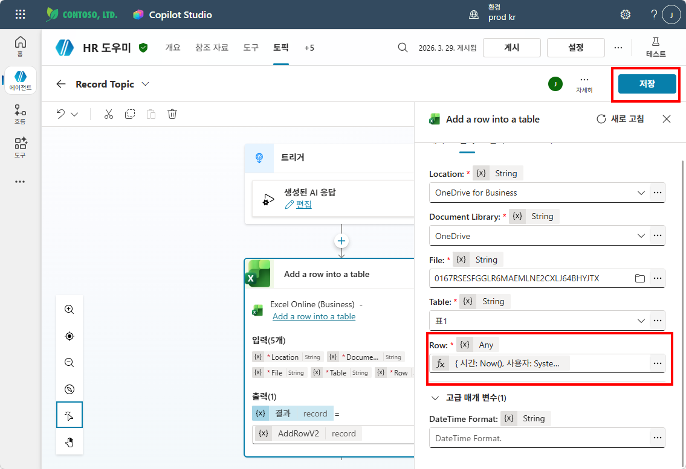

11. **속성** 클릭

   노드의 **"..."** 메뉴를 클릭하고 **"속성"**을 선택합니다.

   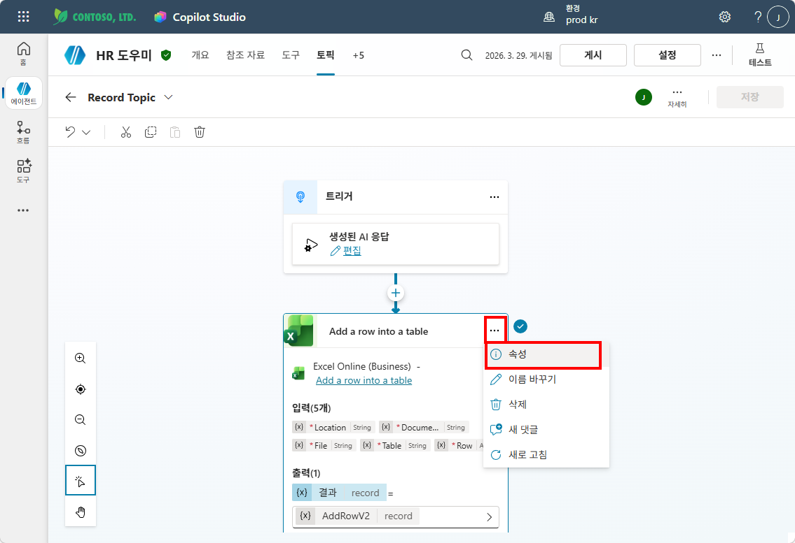

   **개시** 탭에서 최종 사용자 인증을 **"제작자 제공 자격 증명"**으로 설정하고 **저장**합니다.

   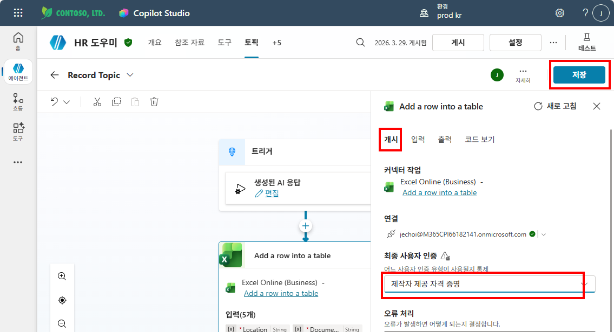

12. **저장**

{: .tip }
> 이 Topic은 사용자가 직접 호출하지 않습니다. "응답이 생성될 때마다 실행"되는 자동 Topic이고, 안에서 **Excel 커넥터를 바로 호출**합니다.

---

## 테스트

1. 테스트 패널에서 아무 질문 입력: **"연차 며칠이야?"**
2. 에이전트가 답변
3. **OneDrive → 대화기록.xlsx** 열기 → 새 행이 추가되어 있는지 확인! 🎉

{: .important }
> Excel에 시간·사용자·질문·답변이 쌓이는 걸 확인하면 성공입니다.

   테스트 패널에서 "연차 며칠이야?" 질문을 입력하면 에이전트가 답변하고, Record Topic이 자동으로 실행됩니다.

   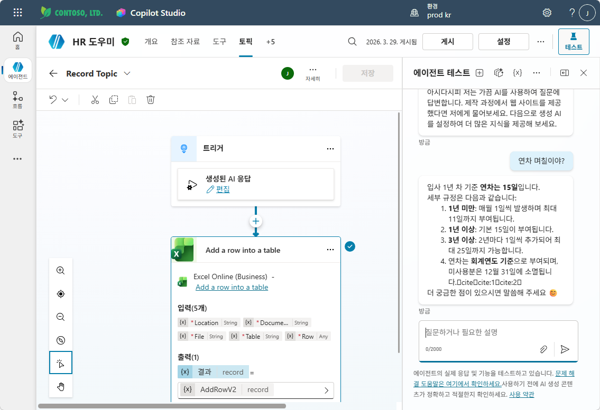

   OneDrive에서 대화기록.xlsx를 열면 시간·사용자·질문·답변이 기록되어 있습니다!

   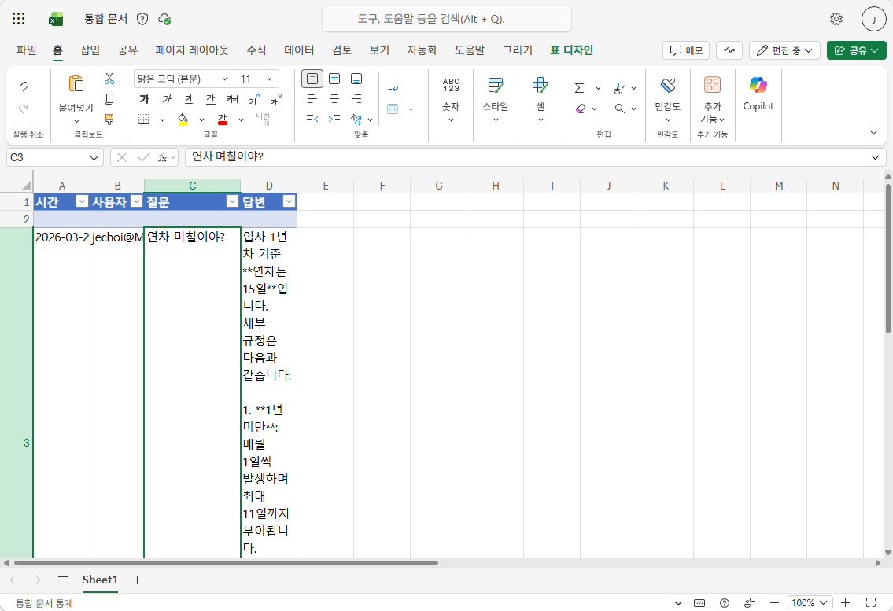

---

실습을 완료했으면 [M11 본문으로 돌아가세요](m11-connector).
