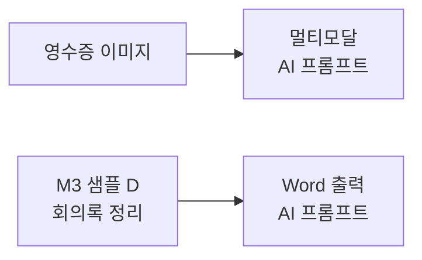

# AI 프롬프트 — Flow에 AI 심기
{: .no_toc }

| 시간 | 소요 | 수강생 역할 |
|:-----|:-----|:-----------|
| 16:55 | 20분 | 👀 강사 데모 |

## 목차
{: .no_toc .text-delta }

1. TOC
{:toc}

---

## 이 모듈에서 배우는 것

- **AI 프롬프트** = Flow 안에 AI를 심는 기능
- **4가지 유형** 구분 (텍스트·멀티모달·코드 인터프리터·Word 출력)
- M3 샘플의 **내부 동작 원리** 이해
- 실무 적용 아이디어

---

## Flow에 AI를 심는다

M9에서 만든 Flow는 **규칙 기계**였습니다.  
"이 입력을 받으면 이걸 실행해라" — 정해진 대로만 동작합니다.

AI 프롬프트를 추가하면 Flow가 **판단하는 AI**로 바뀝니다.

| 상태 | Flow의 성격 |
|:-----|:-----------|
| **Before (M9)** | 규칙 기계 — 정해진 대로 실행 |
| **After (M11)** | 판단하는 AI — 프롬프트로 AI가 분석·생성·분류 |

{: .highlight }
> **AI 프롬프트 하나로 Flow는 규칙 기계에서 판단하는 AI로 바뀝니다.**

---

## 4가지 AI 프롬프트 유형

| 유형 | 하는 일 | 예시 | M3 샘플 연결 |
|:-----|:--------|:-----|:------------|
| **텍스트** | 생성·분류·요약·추출 | 고객 문의 → 카테고리 자동 분류 | — |
| **멀티모달** | 이미지·문서 인식 | 영수증 사진 → 금액·날짜 추출 | 샘플 E (영수증) |
| **코드 인터프리터** | AI가 코드를 만들어 실행 | PDF 10장 → Excel 경비 보고서 | 샘플 E (경비보고서) |
| **Word 출력** | 텍스트 → 문서 자동 생성 | 회의록 → Word 보고서 | 샘플 D (회의록) |

---

## 유형 ① — 텍스트: 자동 분류

고객 문의가 들어오면 AI가 자동으로 카테고리를 분류합니다.

**Flow 구조:**
1. 입력: 고객 문의 텍스트
2. AI 프롬프트: "이 문의를 '기술지원', '청구', '일반문의' 중 하나로 분류해줘"
3. 출력: 분류 결과

**예시:**

| 입력 | AI 분류 결과 |
|:-----|:-----------|
| "인터넷이 안 돼요" | **기술지원** |
| "청구서가 이상해요" | **청구** |
| "주차장 위치가 어디에요?" | **일반문의** |

{: .tip }
> 프롬프트 텍스트만 바꾸면 분류 기준도 바뀝니다. 코드 한 줄 필요 없습니다.

**🔗 실전 활용:** 이 텍스트 유형은 **답변 초안 자동 생성**에도 쓸 수 있습니다.  
예: Forms로 접수된 문의 → AI가 사내 FAQ 기반으로 답변 초안 생성 → 관리자에게 메일 전달  
(M12 "실전 시나리오"에서 전체 흐름을 살펴봅니다)

---

## 유형 ② — 멀티모달: 영수증 인식

영수증 사진을 넣으면 AI가 금액, 일자, 가맹점을 자동으로 추출합니다.

| 입력 | AI 추출 결과 |
|:-----|:-----------|
| 📷 영수증 이미지 | 금액: 45,000원 |
| | 일자: 2026-03-20 |
| | 가맹점: ○○커피 |

{: .note }
> 영수증 이미지를 AI가 읽어서 금액·일자·가맹점을 추출하는 것 — 이것이 멀티모달 AI 프롬프트의 힘입니다.

---

## 유형 ③ — 코드 인터프리터

영수증 PDF 10장을 넣으면 → AI가 코드를 자동 생성·실행 → **Excel 경비 보고서**를 만듭니다.

- 개발자가 필요 없습니다
- AI가 알아서 코드를 만들고 실행합니다
- 결과: 날짜, 금액, 항목이 정리된 표

---

## 유형 ④ — Word 출력

회의록 텍스트를 넣으면 → AI가 **Word 보고서**를 자동으로 생성합니다.

자동으로 정리되는 항목:
- 참석자
- 논의사항
- 결정사항
- 후속조치

{: .note }
> M3의 **"회의록 정리(샘플 D)"**의 프로급 버전입니다.

---

## M3 샘플과의 연결

M3에서 에이전트 빌더로 체험했던 것들의 **내부 엔진**이 바로 AI 프롬프트입니다.

---

## 핵심 정리

1. **AI 프롬프트** = Flow 안에 AI를 심는 기능
2. **4가지 유형:** 텍스트, 멀티모달, 코드 인터프리터, Word 출력
3. M3 샘플의 내부 엔진이 바로 **AI 프롬프트**
4. 코드 없이, **프롬프트 텍스트 하나**로 Flow에 AI 추가

---

## FAQ

| 질문 | 답변 |
|:-----|:-----|
| AI 프롬프트는 추가 비용이 있나요? | Copilot Studio 라이선스에 포함된 AI 크레딧이 있습니다. 대량 사용 시 크레딧 소비량을 확인하세요. |
| 한국어 문서도 잘 인식하나요? | 네, 최신 모델은 한국어 문서·이미지 인식 성능이 매우 좋습니다. |
| 우리 회사 양식에 맞춰 Word를 만들 수 있나요? | 프롬프트에 양식을 지정하면 됩니다. Word 템플릿과 결합하면 더 정교해집니다. |
| 에이전트 없이 AI 프롬프트만 쓸 수 있나요? | 네! Power Automate Flow에서 단독으로도 사용 가능합니다. |

---

## 참조 자료

| 자료 | 링크 |
|:-----|:-----|
| AI 프롬프트 개요 | [learn.microsoft.com](https://learn.microsoft.com/ai-builder/prompts-overview) |
| Power Automate + AI Builder | [learn.microsoft.com](https://learn.microsoft.com/ai-builder/use-in-flow-overview) |
| 멀티모달 프롬프트 | [learn.microsoft.com](https://learn.microsoft.com/ai-builder/azure-openai-model-pautate) |
| 코드 인터프리터 | [learn.microsoft.com](https://learn.microsoft.com/ai-builder/prebuilt-prompts) |

---

다음 모듈: [M12. 미래 비전](m12-future-vision)
