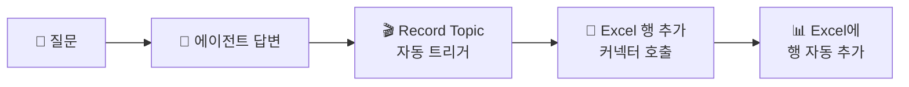

# 도구 — 커넥터
{: .no_toc }

| 시간 | 소요 | 수강생 역할 |
|:-----|:-----|:-----------|
| 15:20 | 30분 | 🟢 직접 실습 |

## 목차
{: .no_toc .text-delta }

1. TOC
{:toc}

---

## 이 모듈에서 배우는 것

- **커넥터(Connector)**란 무엇인지 — Microsoft 365 앱을 에이전트에 직접 연결하는 원리
- 커넥터와 에이전트 흐름의 **차이점**
- Excel **행 추가 커넥터**를 활용한 **대화기록 자동 저장** 실습
- Record Topic에서 **Excel 커넥터를 직접 호출**해 대화가 Excel에 자동으로 쌓이는 것 확인

---

## 커넥터란?

**커넥터**는 Microsoft 365 앱(예: Excel, Outlook, Teams, SharePoint)에 에이전트를 하나의 동작으로 **직접 연결**하는 가장 간단한 도구입니다.

| 커넥터 | 에이전트 흐름(M12) |
|:--------|:----------------|
| 단일 앱 직접 연결 | 여러 단계 자동화 |
| 단순한 동작 | 복잡한 로직 담당 |
| 빠른 적용 | 높은 유연성 |

{: .highlight }
> 커넥터는 M365 앱 범위 내에서 단순한 작업에 적합하고, 에이전트 흐름은 **여러 단계를 엮어 복잡한 자동화**에 적합합니다.

이 모듈에서는 Excel **행 추가 커넥터**를 예시로 사용합니다. Topic 안에서 커넥터를 바로 호출해, 에이전트와 대화한 내용이 Excel에 자동으로 기록되게 만듭니다.

---

## 왜 대화를 정리합니까?

에이전트의 모든 대화를 **자동으로 Excel에 기록**하면 3가지 가치가 생깁니다.

| 목적 | 설명 |
|:-----|:-----|
| **에이전트 개선** | 자주 묻는 질문 파악 → 지식 보강 |
| **감사/컴플라이언스** | 누가, 언제, 뭘 물어봤는지 투명한 기록 |
| **업무 분석** | 질문 패턴으로 실제 업무 니즈 발견 |

---

## 대화기록 구조

### Excel 기록 항목

| 컬럼 | 값 | 설명 |
|:-----|:---|:-----|
| 시간 | `utcNow()` | 대화 발생 시각 |
| 사용자 | `System.User.PrincipalName` | 질문한 사람 |
| 질문 | `System.Activity.Text` | 사용자 입력 |
| 답변 | `System.Response.FormattedText` | 에이전트 응답 |

### Record Topic의 특별한 점

일반 Topic은 사용자가 특정 질문을 해야 실행됩니다.  
하지만 Record Topic은 **"AI가 응답을 생성할 때마다"** 자동 실행됩니다.

{: .highlight }
> 사용자는 기록되는 줄도 모릅니다. 에이전트가 **자동으로 일기를 쓰는 것**입니다.

---

## 실습 ①: Excel 파일 준비

{: .important }
> **OneDrive for Business**와 **Excel Online (Business)** 접근 권한이 있어야 합니다. 조직 정책상 OneDrive 사용이 제한되어 있으면 같은 구조로 **SharePoint 문서 라이브러리**를 사용해도 됩니다.

1. **OneDrive** 접속 → 새 Excel 파일 생성: `대화기록.xlsx`
2. **Sheet1**에 테이블 만들기:

| 시간 | 사용자 | 질문 | 답변 |
|:-----|:------|:-----|:-----|
| (비워두기) | | | |

3. 표 전체 선택 → **"삽입" → "표"** → 확인
4. **저장**

{: .tip }
> 반드시 **표(Table)**로 만들어야 Copilot Studio의 Excel 커넥터에서 행을 추가할 수 있습니다.

---

## 실습 ②: Record Topic에서 Excel 커넥터 연결하기

### Step 1 — Topic 생성 + 트리거 설정

1. Copilot Studio → **토픽** → **"+ 토픽 추가"** → **"새로 만들기"**
2. Topic 이름: `Record Topic`
3. 트리거 노드 클릭 → **"트리거 변경"** 선택
4. 트리거 유형 목록에서 **"응답 후(After response)"** 선택
   - 이것이 "AI가 응답을 생성할 때마다 자동 실행"의 의미입니다

{: .highlight }
> 일반 Topic의 트리거는 **"문구(Phrases)"**입니다. Record Topic은 **"응답 후"** 트리거를 사용하기 때문에, 사용자가 특정 말을 하지 않아도 **매번 자동으로 실행**됩니다.

### Step 2 — Excel 커넥터 추가

5. 트리거 아래 **"+"** 클릭 → **"작업 호출"** 선택
6. 커넥터 검색창에서 **"Excel"** 검색 → **"Excel Online (Business)"** 선택
7. 동작 목록에서 **"표에 행 추가"** 선택
8. 연결 승인 팝업이 나타나면 **"승인"** 클릭 (Microsoft 365 계정으로 로그인)

### Step 3 — Excel 파일 연결 + 매핑

9. 설정 항목을 아래와 같이 지정합니다:

| 항목 | 값 |
|:-----|:---|
| 위치 | **OneDrive for Business** |
| 문서 라이브러리 | (기본값) |
| 파일 | `대화기록.xlsx` 선택 |
| 표 | `표1` 선택 |

10. 컸럼 매핑 (각 컸럼 오른쪽 입력란 클릭 → 변수 삽입):

| Excel 컸럼 | 매핑 값 | 설명 |
|:-----------|:---------|:-----|
| 시간 | `utcNow()` (수식 입력) | 현재 시각 |
| 사용자 | `System.User.PrincipalName` | 질문한 사람 |
| 질문 | `System.Activity.Text` | 사용자 입력 |
| 답변 | `System.Response.FormattedText` | 에이전트 응답 |

11. **저장**

{: .tip }
> 이 Topic은 사용자가 직접 호출하지 않습니다. "응답이 생성될 때마다 실행"되는 자동 Topic이고, 안에서 **Excel 커넥터를 바로 호출**합니다.

---

## 테스트

1. 테스트 패널에서 아무 질문 입력: **"연차 며칠이야?"**
2. 에이전트가 답변
3. **OneDrive → 대화기록.xlsx** 열기 → 새 행이 추가되어 있는지 확인! 🎉

{: .important }
> Excel에 시간·사용자·질문·답변이 쌓이는 걸 확인하면 성공입니다.

---

## 데이터 활용 시나리오

기록된 데이터로 이런 분석이 가능합니다.

| 시나리오 | 분석 방법 | 기대 효과 |
|:---------|:---------|:---------|
| **자주 묻는 질문 TOP 10** | 질문 컬럼 키워드 분류 | 지식 소스 보강 우선순위 |
| **답변 실패 패턴** | "모르겠습니다" 필터링 | 부족한 교과서 파악 |
| **사용량 추이** | 시간대별/요일별 집계 | 서비스 시간 최적화 |
| **사용자별 현황** | Pivot 분석 | 교육 대상 파악 |

{: .tip }
> Copilot에게 "이 데이터에서 가장 많이 묻는 질문 TOP 5를 알려줘"라고 물으면 **자동으로 분석**해 줍니다.

---

## M12로 넘어가기

강사는 아래처럼 연결하면 자연스럽습니다.

> 방금 한 것은 Power Automate 흐름을 만든 것이 아니라, **Topic 안에서 Excel 커넥터를 바로 호출해 한 줄을 저장한 것**입니다. 즉, 앱 하나에 단일 동작을 바로 붙여본 것입니다. 다음 M12에서는 여기서 한 단계 더 나아가, 정보를 수집하고 AI로 문안을 만들고 메일까지 보내는 **여러 단계 자동화 흐름**으로 확장하겠습니다.

---

## 핵심 정리

1. **Record Topic** = 모든 대화를 자동으로 감지하는 특수 Topic
2. **Excel 행 추가 커넥터** = Topic 안에서 바로 호출해 대화 내용을 자동 기록
3. 기록된 데이터로 **에이전트 개선·감사·업무 분석** 가능
4. M12에서는 이 단일 동작을 넘어, **여러 단계를 묶는 Agent Flow**로 확장합니다

---

## FAQ

| 질문 | 답변 |
|:-----|:-----|
| Excel 말고 다른 곳에 저장할 수 있나요? | Dataverse, SQL, SharePoint 리스트 등 가능합니다. Excel이 가장 간단합니다. |
| Excel에 행 제한이 있나요? | 있습니다. 대량 운영 시 Dataverse나 DB를 권장합니다. |
| 개인정보 보호는 어떻게 하나요? | M1의 보안 정책이 적용됩니다. 사용자명 익명화도 가능합니다. |
| OneDrive가 막혀 있으면 어떻게 하나요? | SharePoint 문서 라이브러리나 Dataverse 같은 대체 저장소로 같은 구조를 구현할 수 있습니다. |
| 바로 오늘 팀에서 쓸 수 있나요? | 커넥터 연결과 저장소 권한이 모두 준비돼 있으면 바로 사용 가능합니다. |

---

## 참조 자료

| 자료 | 링크 |
|:-----|:-----|
| Copilot Studio 분석 대시보드 | [learn.microsoft.com](https://learn.microsoft.com/microsoft-copilot-studio/analytics-overview) |
| Power Automate Excel 커넥터 | [learn.microsoft.com](https://learn.microsoft.com/connectors/excelonlinebusiness/) |
| 에이전트 성능 모니터링 | [learn.microsoft.com](https://learn.microsoft.com/microsoft-copilot-studio/analytics-sessions) |

---

다음 모듈: [M12. 도구 — 에이전트 흐름](m12-agent-flow)
