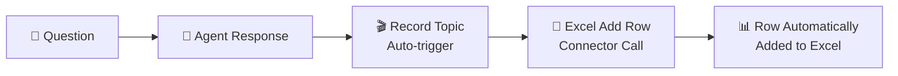

# Tools — Connectors
{: .no_toc }

| Time | Duration | Participant Role |
|:-----|:---------|:-----------------|
| 15:20 | 30 min | 🟢 Hands-on Lab |

## Table of Contents
{: .no_toc .text-delta }

1. TOC
{:toc}

---

## What You'll Learn in This Module

- What a **Connector** is — the principle of directly connecting Microsoft 365 apps to your agent
- The **differences** between connectors and Agent Flows
- Hands-on lab using the Excel **Add a Row** connector for **automatic conversation logging**
- Calling the **Excel connector directly from a Record Topic** to verify conversations are automatically saved to Excel

---

## What Is a Connector?

A **connector** is the simplest tool for **directly connecting** your agent to a Microsoft 365 app (e.g., Excel, Outlook, Teams, SharePoint) with a single action.

| Connector | Agent Flow (M12) |
|:----------|:-----------------|
| Direct connection to a single app | Multi-step automation |
| Simple actions | Handles complex logic |
| Quick to set up | Highly flexible |

{: .highlight }
> Connectors are ideal for simple tasks within the M365 app ecosystem, while Agent Flows are better suited for **complex automation that chains multiple steps together**.

In this module, we'll use the Excel **Add a Row** connector as our example. We'll call the connector directly from within a Topic so that conversations with the agent are automatically recorded in Excel.

---

## Why Log Conversations?

**Automatically recording** all agent conversations to Excel creates three types of value.

| Purpose | Description |
|:--------|:------------|
| **Agent Improvement** | Identify frequently asked questions → reinforce knowledge sources |
| **Audit / Compliance** | Transparent record of who asked what and when |
| **Business Analysis** | Discover real business needs from question patterns |

---

## Conversation Logging Architecture

```mermaid
flowchart LR
    A[👤 Question] --> B[🤖 Agent Response]
    B --> C[🎬 Record Topic<br>Auto-trigger]
   C --> D[🔌 Excel Add Row<br>Connector Call]
   D --> E[📊 Row Automatically<br>Added to Excel]
```

### Excel Record Fields

| Column | Value | Description |
|:-------|:------|:------------|
| Time | `utcNow()` | Timestamp of the conversation |
| User | `System.User.PrincipalName` | Person who asked the question |
| Question | `System.Activity.Text` | User input |
| Answer | `System.Response.FormattedText` | Agent response |

### What Makes Record Topic Special

A regular Topic only runs when the user asks a specific question.  
But a Record Topic **runs automatically every time the AI generates a response**.

{: .highlight }
> The user doesn't even know they're being logged. It's like the agent is **automatically keeping a journal**.

---

## Lab ①: Prepare the Excel File

{: .important }
> 📌 This lab is on a separate page.  
> Complete [Lab ①: Prepare the Excel File](m11-1-excel-prep) and then come back here.

---

## Lab ②: Connect the Excel Connector in the Record Topic

{: .important }
> 📌 This lab is on a separate page.  
> Complete [Lab ②: Record Topic + Excel Connector](m11-2-record-topic) and then come back here.

---

## Data Utilization Scenarios

Here's what you can analyze with the recorded data.

| Scenario | Analysis Method | Expected Outcome |
|:---------|:---------------|:-----------------|
| **Top 10 Frequently Asked Questions** | Keyword classification of the Question column | Prioritize knowledge source improvements |
| **Failed Answer Patterns** | Filter for "I don't know" responses | Identify gaps in knowledge (textbooks) |
| **Usage Trends** | Aggregate by time of day / day of week | Optimize service hours |
| **Per-User Breakdown** | Pivot analysis | Identify training needs |

{: .tip }
> Ask Copilot "Show me the top 5 most frequently asked questions from this data" and it will **analyze it automatically**.

---

## Transitioning to M12

Here's a natural way for instructors to bridge to the next module:

> What we just did was NOT creating a Power Automate flow — we **called an Excel connector directly from within a Topic to save a single row**. In other words, we attached a single action directly to one app. In M12, we'll take it a step further and expand into a **multi-step automation flow** that collects information, drafts content with AI, and even sends emails.

---

## Key Takeaways

1. **Record Topic** = a special Topic that automatically captures every conversation
2. **Excel Add a Row connector** = called directly from a Topic to automatically log conversation content
3. Recorded data enables **agent improvement, auditing, and business analysis**
4. In M12, we'll go beyond this single action and expand into **multi-step Agent Flows**

---

## FAQ

| Question | Answer |
|:---------|:-------|
| Can I save to something other than Excel? | Yes — Dataverse, SQL, SharePoint lists, and more. Excel is simply the easiest option. |
| Is there a row limit in Excel? | Yes. For large-scale operations, Dataverse or a database is recommended. |
| How is personal data protected? | The security policies from M1 apply. User names can also be anonymized. |
| What if OneDrive is blocked? | You can implement the same structure using a SharePoint document library or Dataverse as an alternative storage location. |
| Can my team start using this today? | Yes, as long as the connector connection and storage permissions are all set up. |

---

## Reference Materials

| Resource | Link |
|:---------|:-----|
| Copilot Studio Analytics Dashboard | [learn.microsoft.com](https://learn.microsoft.com/microsoft-copilot-studio/analytics-overview) |
| Power Automate Excel Connector | [learn.microsoft.com](https://learn.microsoft.com/connectors/excelonlinebusiness/) |
| Agent Performance Monitoring | [learn.microsoft.com](https://learn.microsoft.com/microsoft-copilot-studio/analytics-sessions) |

---

Next module: [M12. Tools — Agent Flows](m12-agent-flow)
