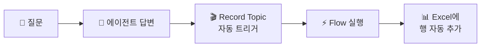

# 신입사원의 일기 — 대화기록 Excel 저장
{: .no_toc }

| 시간 | 소요 | 수강생 역할 |
|:-----|:-----|:-----------|
| 16:40 | 25분 | 🟢 직접 실습 |

## 목차
{: .no_toc .text-delta }

1. TOC
{:toc}

---

## 이 모듈에서 배우는 것

- **Record Topic + Flow → Excel** 자동 기록 구조 이해
- 대화기록이 필요한 **3가지 이유** (개선·감사·분석)
- RecordLog Flow + Record Topic을 **직접 만들기**
- Excel에 대화가 **자동으로 쌓이는 것** 확인

---

## 왜 대화를 기록하나요?

에이전트의 모든 대화를 **자동으로 Excel에 기록**하면 3가지 가치가 생깁니다.

| 목적 | 설명 |
|:-----|:-----|
| **에이전트 개선** | 자주 묻는 질문 파악 → 지식 보강 |
| **감사/컴플라이언스** | 누가, 언제, 뭘 물어봤는지 투명한 기록 |
| **업무 분석** | 질문 패턴으로 실제 업무 니즈 발견 |

---

## 대화기록 구조

### Excel 기록 항목

| 컬럼 | 값 | 설명 |
|:-----|:---|:-----|
| 시간 | `utcNow()` | 대화 발생 시각 |
| 사용자 | `System.User.PrincipalName` | 질문한 사람 |
| 질문 | `System.Activity.Text` | 사용자 입력 |
| 답변 | `System.Response.FormattedText` | 에이전트 응답 |

### Record Topic의 특별한 점

일반 Topic은 사용자가 특정 질문을 해야 실행됩니다.  
하지만 Record Topic은 **"AI가 응답을 생성할 때마다"** 자동 실행됩니다.

{: .highlight }
> 사용자는 기록되는 줄도 모릅니다. 에이전트가 **자동으로 일기를 쓰는 것**입니다.

---

## 실습 ①: Excel 파일 준비

{: .important }
> **OneDrive for Business**와 **Excel Online (Business)** 접근 권한이 있어야 합니다. 조직 정책상 OneDrive 사용이 제한되어 있으면 같은 구조로 **SharePoint 문서 라이브러리**를 사용해도 됩니다.

1. **OneDrive** 접속 → 새 Excel 파일 생성: `대화기록.xlsx`
2. **Sheet1**에 테이블 만들기:

| 시간 | 사용자 | 질문 | 답변 |
|:-----|:------|:-----|:-----|
| (비워두기) | | | |

3. 표 전체 선택 → **"삽입" → "표"** → 확인
4. **저장**

{: .tip }
> 반드시 **표(Table)**로 만들어야 Power Automate에서 행을 추가할 수 있습니다.

---

## 실습 ②: RecordLog Flow 만들기

1. [Power Automate](https://make.powerautomate.com) 접속
2. **"만들기"** → **"인스턴트 클라우드 흐름"**
3. **"Copilot Studio에서 흐름을 호출할 때"** 트리거 선택
4. 입력 매개변수 추가:
   - `logUser` (텍스트): 사용자 이름
   - `logQuestion` (텍스트): 질문 내용
   - `logAnswer` (텍스트): 답변 내용
5. **"+ 새 단계"** → **"Excel Online (Business)"** → **"표에 행 추가"**
6. 설정:
   - 위치: OneDrive for Business
   - 문서 라이브러리: OneDrive
   - 파일: `대화기록.xlsx`
   - 테이블: 표1 (Sheet1의 표)
   - 시간: `utcNow()` (식으로 입력)
   - 사용자: 동적 콘텐츠 `logUser`
   - 질문: 동적 콘텐츠 `logQuestion`
   - 답변: 동적 콘텐츠 `logAnswer`
7. **Flow 저장**

---

## 실습 ③: Record Topic 만들기

1. Copilot Studio → **토픽** → **"+ 토픽 추가"**
2. Topic 이름: `Record Topic`
3. Topic 안에 아래 구조를 만듭니다:
   - 트리거: **AI 응답 생성 시 자동 실행**
   - 작업 노드: **RecordLog** Flow 호출
   - 입력 매핑: `logUser` ← `System.User.PrincipalName`, `logQuestion` ← `System.Activity.Text`, `logAnswer` ← `System.Response.FormattedText`
4. **저장**

{: .tip }
> 이 Topic은 사용자가 직접 호출하지 않습니다. "응답이 생성될 때마다 실행"되는 자동 Topic이라는 점을 꼭 기억해 두세요.

---

## 테스트

1. 테스트 패널에서 아무 질문 입력: **"연차 며칠이야?"**
2. 에이전트가 답변
3. **OneDrive → 대화기록.xlsx** 열기 → 새 행이 추가되어 있는지 확인! 🎉

{: .important }
> Excel에 시간·사용자·질문·답변이 쌓이는 걸 확인하면 성공입니다.

---

## 데이터 활용 시나리오

기록된 데이터로 이런 분석이 가능합니다.

| 시나리오 | 분석 방법 | 기대 효과 |
|:---------|:---------|:---------|
| **자주 묻는 질문 TOP 10** | 질문 컬럼 키워드 분류 | 지식 소스 보강 우선순위 |
| **답변 실패 패턴** | "모르겠습니다" 필터링 | 부족한 교과서 파악 |
| **사용량 추이** | 시간대별/요일별 집계 | 서비스 시간 최적화 |
| **사용자별 현황** | Pivot 분석 | 교육 대상 파악 |

{: .tip }
> Copilot에게 "이 데이터에서 가장 많이 묻는 질문 TOP 5를 알려줘"라고 물으면 **자동으로 분석**해 줍니다.

---

## 핵심 정리

1. **Record Topic** = 모든 대화를 자동으로 감지하는 특수 Topic
2. **Flow → Excel** = 대화 내용을 자동 기록
3. 기록된 데이터로 **에이전트 개선·감사·업무 분석** 가능
4. M9에서 배운 Flow 만들기를 **그대로 활용** — 더 쉬운 버전!

---

## FAQ

| 질문 | 답변 |
|:-----|:-----|
| Excel 말고 다른 곳에 저장할 수 있나요? | Dataverse, SQL, SharePoint 리스트 등 가능합니다. Excel이 가장 간단합니다. |
| Excel에 행 제한이 있나요? | 있습니다. 대량 운영 시 Dataverse나 DB를 권장합니다. |
| 개인정보 보호는 어떻게 하나요? | M1의 보안 정책이 적용됩니다. 사용자명 익명화도 가능합니다. |
| OneDrive가 막혀 있으면 어떻게 하나요? | SharePoint 문서 라이브러리나 Dataverse 같은 대체 저장소로 같은 구조를 구현할 수 있습니다. |
| 바로 오늘 팀에서 쓸 수 있나요? | Flow + 저장소 권한이 모두 준비돼 있으면 바로 사용 가능합니다. |

---

## 참조 자료

| 자료 | 링크 |
|:-----|:-----|
| Copilot Studio 분석 대시보드 | [learn.microsoft.com](https://learn.microsoft.com/microsoft-copilot-studio/analytics-overview) |
| Power Automate Excel 커넥터 | [learn.microsoft.com](https://learn.microsoft.com/connectors/excelonlinebusiness/) |
| 에이전트 성능 모니터링 | [learn.microsoft.com](https://learn.microsoft.com/microsoft-copilot-studio/analytics-sessions) |

---

다음 모듈: [M12. AI 프롬프트](m12-ai-prompt)
