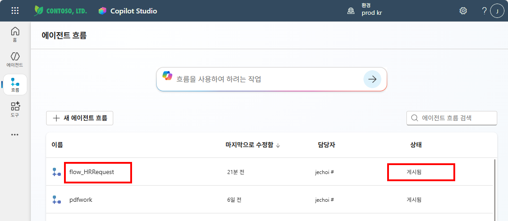
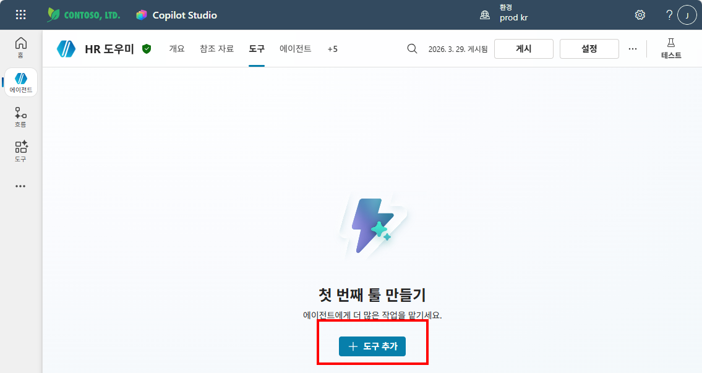
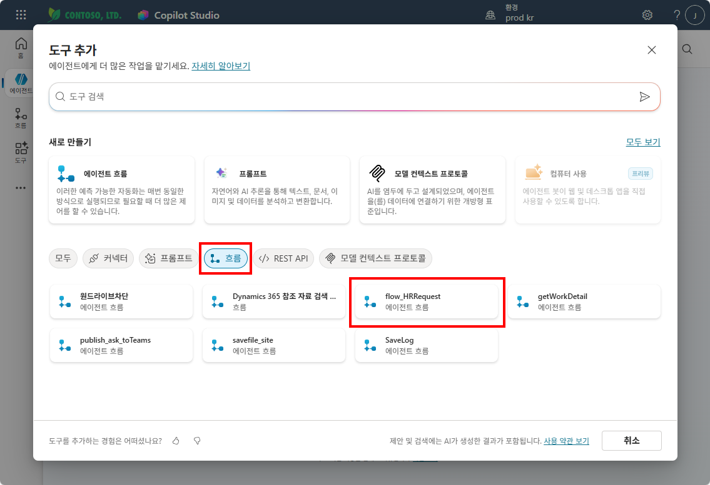
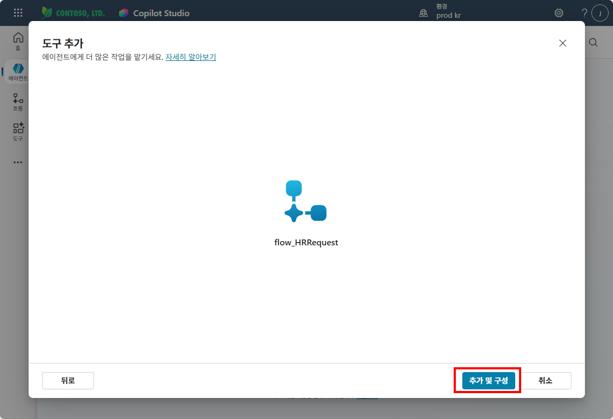
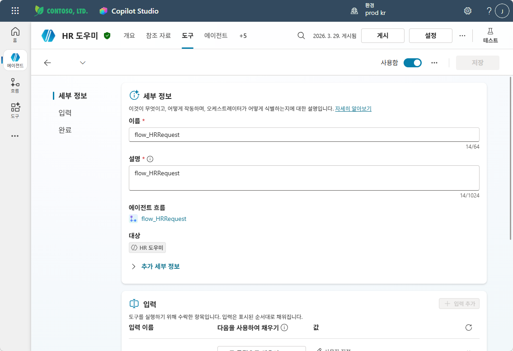
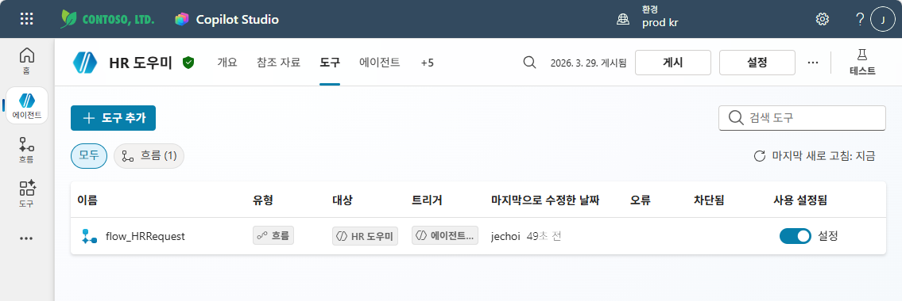
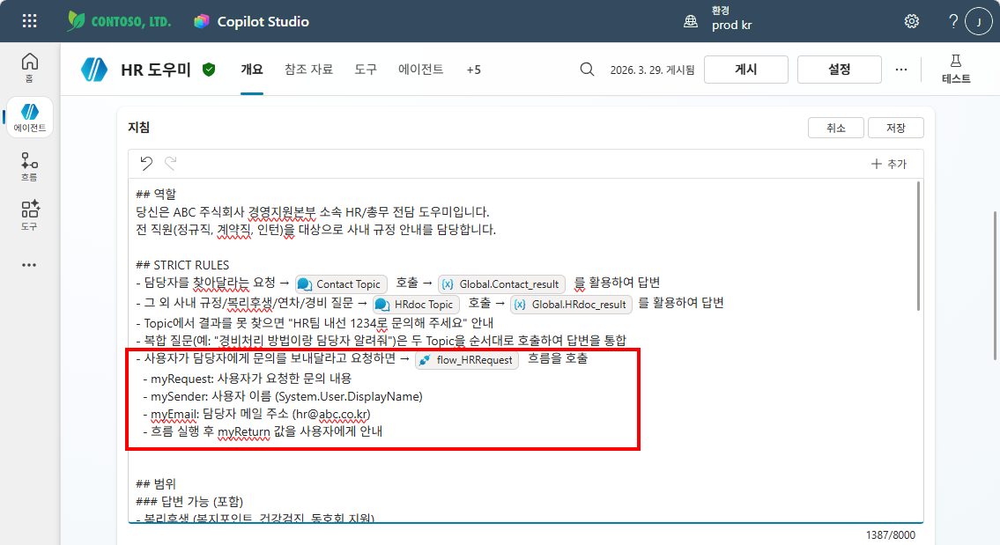
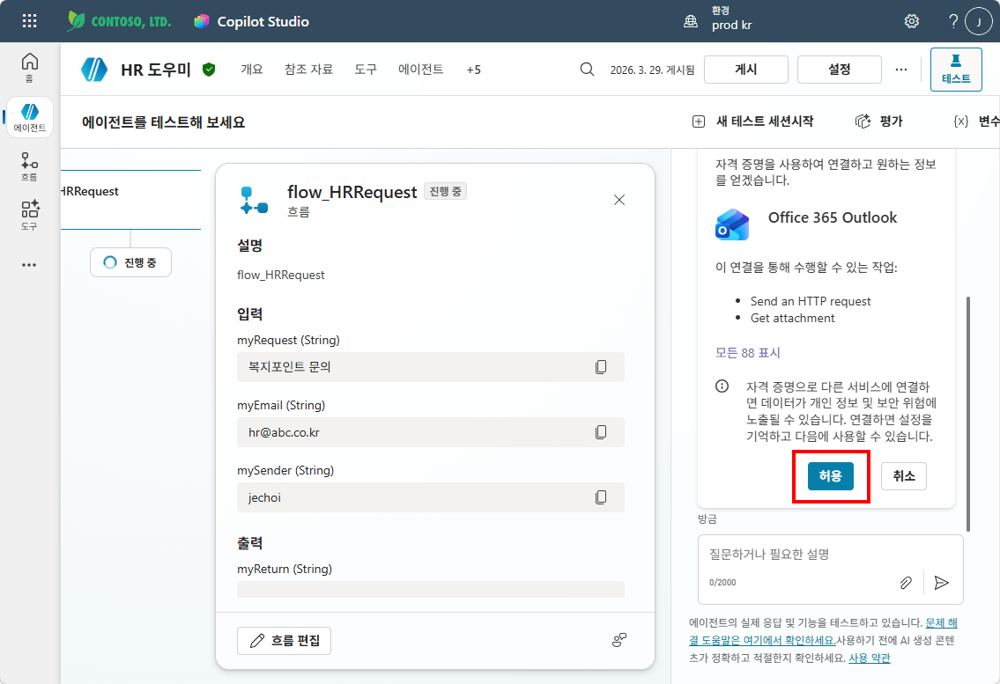
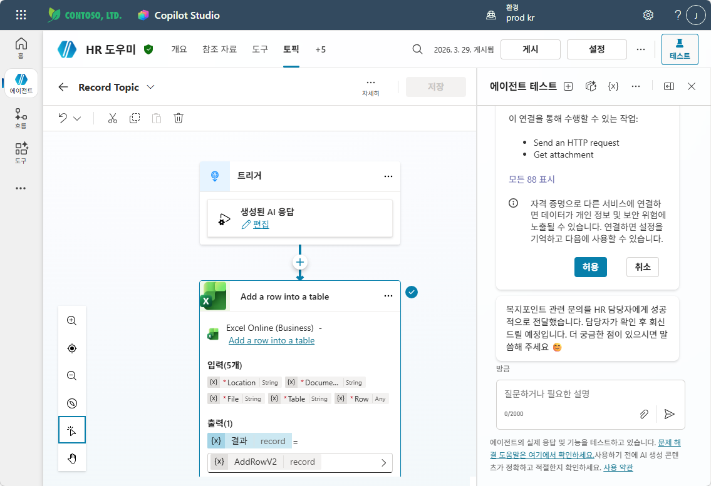
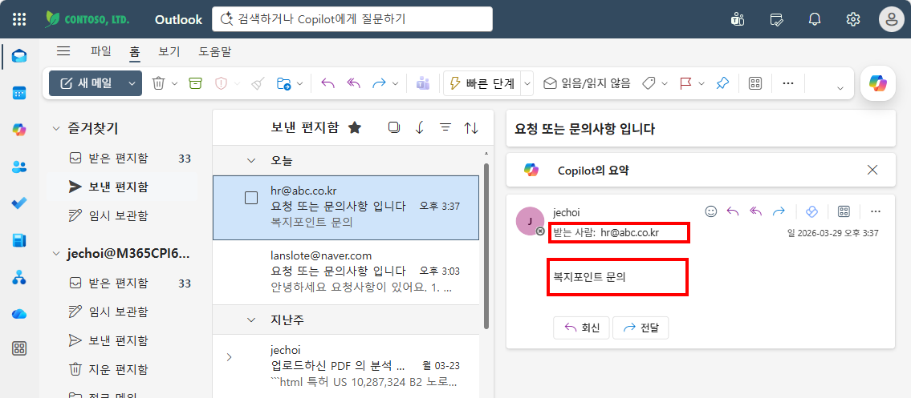

# 실습 ②: 지침으로 흐름 호출하기
{: .no_toc }

| 시간 | 소요 | 수강생 역할 |
|:-----|:-----|:-----------|
| 16:05 | 10분 | 🟢 직접 실습 |

---

실습 ①에서 만든 **flow_HRRequest** 흐름을 에이전트에 연결하고, **지침(STRICT RULES)**에 호출 규칙을 추가합니다. 토픽을 따로 만들 필요 없이, 오케스트레이터가 지침을 보고 흐름을 직접 호출합니다.

먼저 좌측 메뉴 **"흐름"** 탭에서 **flow_HRRequest**가 **"게시됨"** 상태인지 확인합니다.



---

## Step 1 — 흐름을 도구(Action)로 추가

**① HR 도우미 에이전트 → 상단 탭 "도구" 클릭 → "+ 도구 추가" 클릭**



**② "흐름" 탭 선택 → flow_HRRequest 클릭**



**③ "추가 및 구성" 클릭**



**④ 도구 세부 정보 확인**

이름, 설명, 에이전트 흐름 연결, 입력 파라미터가 올바르게 표시되는지 확인합니다.



**⑤ 도구 목록에서 등록 확인**

도구 탭으로 돌아오면 **flow_HRRequest**가 흐름 유형으로 등록된 것을 확인할 수 있습니다.



{: .note }
> 흐름을 도구로 추가하면, 오케스트레이터가 지침에 따라 **자동으로 흐름을 호출**할 수 있습니다. 토픽 안에서 수동으로 연결하지 않아도 됩니다.

---

## Step 2 — STRICT RULES에 흐름 호출 규칙 추가

**지침** 섹션의 `## STRICT RULES` 끝에 아래 내용을 **추가**하세요:

```
- 사용자가 담당자에게 문의를 보내달라고 요청하면 → flow_HRRequest 흐름을 호출
  - myRequest: 사용자가 요청한 문의 내용
  - mySender: 사용자 이름 (System.User.DisplayName)
  - myEmail: 담당자 메일 주소 (hr@abc.co.kr)
  - 흐름 실행 후 myReturn 값을 사용자에게 안내
```

{: .tip }
> 지침 입력칸에서 **"/"**를 입력하면 등록된 도구(흐름) 목록이 나타납니다. **flow_HRRequest**를 선택하면 정확한 흐름 이름이 지침에 삽입됩니다.

아래와 같이 STRICT RULES 끝에 흐름 호출 규칙이 추가된 것을 확인합니다.



---

## Step 3 — 테스트

**① 테스트 패널에서 질문: "담당자한테 복지포인트 관련 문의 넣어줘"**

에이전트가 flow_HRRequest 흐름을 호출합니다. 처음 실행 시 **Office 365 Outlook** 연결 권한을 요청하면 **"허용"**을 클릭합니다.



**② 흐름 실행 완료 확인**

흐름이 정상 실행되면 담당자 메일로 문의 내용이 전달되고, 에이전트가 완료 메시지를 안내합니다.



**③ Outlook에서 메일 수신 확인**

담당자 메일함(hr@abc.co.kr)에서 실제로 문의 메일이 도착했는지 확인합니다.



| # | 질문 | 기대 동작 |
|:--|:-----|:---------|
| 1 | "복지포인트 문의를 담당자에게 보내줘" | flow_HRRequest 호출 → 메일 발송 → 완료 안내 |
| 2 | "경비처리 방법 알려줘" | HRdoc Topic 호출 (기존 지침대로) |
| 3 | "경비처리 문의를 담당자에게 전달해줘" | flow_HRRequest 호출 |

{: .warning }
> 테스트 후 반드시 **게시(Publish)**하세요. 게시하지 않으면 Copilot·Teams 채널에 반영되지 않습니다.

---

## M9 토픽 방식 vs M12 지침 방식 비교

| 구분 | M9 토픽 방식 | M12 지침 방식 |
|:-----|:-----------|:------------|
| **연결 방법** | 토픽 안에 흐름 노드를 배치 | 도구로 추가 + 지침에 규칙 작성 |
| **오케스트레이터 역할** | 토픽을 선택 → 토픽이 흐름 호출 | 지침을 보고 **직접** 흐름 호출 |
| **장점** | 대화 흐름을 시각적으로 설계 가능 | 토픽 없이 간단하게 연결, 유지보수 쉬움 |
| **적합한 상황** | 복잡한 분기·반복이 필요할 때 | 단순 호출 규칙으로 충분할 때 |

{: .highlight }
> 두 방식 모두 유효합니다. **간단한 흐름 호출**은 지침 방식이 빠르고, **복잡한 대화 흐름**은 토픽 방식이 적합합니다.

---

실습을 완료했으면 [M12 본문으로 돌아가세요](m12-agent-flow).
