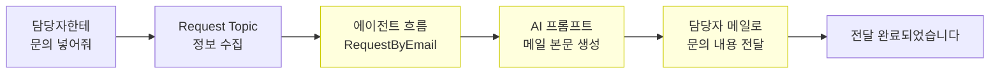

# 도구  에이전트 흐름
{: .no_toc }

| 시간 | 소요 | 수강생 역할 |
|:-----|:-----|:-----------|
| 15:50 | 30분 |  직접 실습 |

## 목차
{: .no_toc .text-delta }

1. TOC
{:toc}

---

## 이 모듈에서 배우는 것

- **에이전트 흐름(Agent Flow)**이 커넥터와 무엇이 다른지
- Power Automate로 **담당자에게 문의 메일 보내기** 흐름 만들기
- 에이전트에서 흐름을 **도구로 연결**하고 호출하는 방법
- 간단한 **AI 프롬프트**를 흐름 안에 한 단계로 넣어보는 방법

{: .highlight }
> M11에서는 Topic 안에서 Excel 커넥터를 **바로 호출해 한 줄을 저장**했습니다. 에이전트 흐름은 그보다 한 단계 더 나아가, **여러 단계를 묶어서 자동화**하는 방식입니다. 사용자가 문의를 넣으면 에이전트가 담당자에게 자동으로 메일을 보냅니다.

---

## 커넥터 vs 에이전트 흐름

| 구분 | 커넥터 | 에이전트 흐름 |
|:-----|:-------|:------------|
| 방식 | 단일 앱 직접 연결 | 여러 단계 자동화 |
| 복잡도 | 낮음 | 중간~높음 |
| 유연성 | 제한적 | 높음 |
| 예시 | Excel 행 추가 | 정보 수집  AI 작성  메일 발송 |

{: .note }
> 구분 기준은 간단합니다. **한 앱에 한 동작을 바로 붙이면 커넥터**, **여러 단계를 묶어 처리하면 에이전트 흐름**입니다.

---

## 전체 흐름 구조

---

## 실습 : Power Automate 흐름 만들기

### 흐름 구조  RequestByEmail

| 항목 | 내용 |
|:-----|:-----|
| **흐름 이름** | RequestByEmail |
| **트리거** | Copilot Studio에서 흐름을 호출할 때 |
| **입력 ** | `myRequest` (텍스트): 문의 내용 |
| **입력 ** | `mySender` (텍스트): 문의자 이름 |
| **입력 ** | `myEmail` (텍스트): 담당자 메일 주소 |
| **동작 ** | AI 프롬프트로 메일 본문 생성 |
| **동작 ** | Office 365 Outlook으로 메일 발송 |
| **출력** | `myReturn`: 완료 메시지 |

### 실습 순서

1. [Power Automate](https://make.powerautomate.com) 접속
2. **만들기  즉시 클라우드 흐름** 선택
3. 트리거: **Copilot Studio에서 흐름을 호출할 때** 선택
4. 입력 변수 3개 추가 (`myRequest`, `mySender`, `myEmail`)
5. **AI Builder  AI 프롬프트** 동작 추가  메일 본문 생성 프롬프트 입력
6. **Office 365 Outlook  메일 보내기** 동작 추가
7. 출력 변수 `myReturn` 추가
8. **저장  게시**

{: .important }
> AI Builder 프롬프트는 AI Builder 크레딧이 필요합니다. 조직 정책에 따라 사용 불가일 수 있습니다. 이 경우 AI 프롬프트 단계를 건너뛰고 직접 메일 본문을 작성합니다.

{: .note }
> 이 모듈의 목표는 **텍스트 AI 프롬프트를 한 번 넣어 보는 것**입니다. AI 프롬프트의 종류와 확장 시나리오는 다음 M13에서 따로 정리합니다.

---

## 실습 : 에이전트에 흐름 연결하기

### Request Topic 만들기

1. Copilot Studio  **토픽  + 토픽 추가**
2. 이름: `Request Topic`
3. 질문 노드: 문의 내용 수집  변수 저장
4. 작업 노드: **RequestByEmail** 흐름 호출
5. 입력 매핑:
   - `myRequest`  문의 내용 변수
   - `mySender`  `System.User.DisplayName`
   - `myEmail`  담당자 메일 주소
6. 메시지 노드: 전달 완료 메시지 출력
7. **저장  게시**

{: .tip }
> 지침의 STRICT RULES에 "담당자 문의가 필요할 때는 반드시 Request Topic을 실행하라"고 추가하면 오케스트레이터가 이 토픽을 더 잘 채택합니다.

---

## 핵심 정리

1. 에이전트 흐름 = 여러 단계를 묶어 자동화하는 Power Automate 흐름
2. 에이전트에서 흐름을 **도구(Action)**로 연결하면 대화로 자동화 실행 가능
3. AI 프롬프트를 흐름 안에 넣으면 메일 본문도 AI가 자동 작성

---

다음 모듈: [M13. 도구 — AI 프롬프트](m13-ai-prompt)
