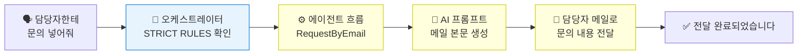

# 도구  에이전트 흐름
{: .no_toc }

| 시간 | 소요 | 수강생 역할 |
|:-----|:-----|:-----------|
| 15:50 | 30분 |  직접 실습 |

## 목차
{: .no_toc .text-delta }

1. TOC
{:toc}

---

## 이 모듈에서 배우는 것

- **에이전트 흐름(Agent Flow)**이 커넥터와 무엇이 다른지
- Power Automate로 **담당자에게 문의 메일 보내기** 흐름 만들기
- 에이전트에서 흐름을 **도구로 추가**하고, **지침(STRICT RULES)**으로 호출하는 방법
- 간단한 **AI 프롬프트**를 흐름 안에 한 단계로 넣어보는 방법

{: .highlight }
> M11에서는 Topic 안에서 Excel 커넥터를 **바로 호출해 한 줄을 저장**했습니다. 에이전트 흐름은 그보다 한 단계 더 나아가, **여러 단계를 묶어서 자동화**하는 방식입니다. 사용자가 문의를 넣으면 에이전트가 담당자에게 자동으로 메일을 보냅니다.

---

## 커넥터 vs 에이전트 흐름

| 구분 | 커넥터 | 에이전트 흐름 |
|:-----|:-------|:------------|
| 방식 | 단일 앱 직접 연결 | 여러 단계 자동화 |
| 복잡도 | 낮음 | 중간~높음 |
| 유연성 | 제한적 | 높음 |
| 예시 | Excel 행 추가 | 정보 수집  AI 작성  메일 발송 |

{: .note }
> 구분 기준은 간단합니다. **한 앱에 한 동작을 바로 붙이면 커넥터**, **여러 단계를 묶어 처리하면 에이전트 흐름**입니다.

---

## 전체 흐름 구조

---

## 실습 ①: Power Automate 흐름 만들기

{: .important }
> 📌 이 실습은 별도 페이지에서 진행합니다.  
> [실습 ①: 흐름 만들기](m12-1-create-flow)를 완료하고 돌아오세요.

---

## 실습 ②: 지침으로 흐름 호출하기

{: .important }
> 📌 이 실습은 별도 페이지에서 진행합니다.  
> [실습 ②: 지침으로 흐름 호출](m12-2-connect-flow)을 완료하고 돌아오세요.

---

## 핵심 정리

1. 에이전트 흐름 = 여러 단계를 묶어 자동화하는 Power Automate 흐름
2. 흐름을 **도구로 추가** + **지침(STRICT RULES)**에 호출 규칙 작성 → 토픽 없이도 호출 가능
3. AI 프롬프트를 흐름 안에 넣으면 메일 본문도 AI가 자동 작성

---

다음 모듈: [M13. 도구 — AI 프롬프트](m13-ai-prompt)
