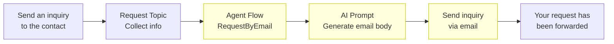

# Tools — Agent Flow
{: .no_toc }

| Time | Duration | Participant Role |
|:-----|:---------|:-----------------|
| 15:50 | 30 min | 🟢 Hands-on Lab |

## Table of Contents
{: .no_toc .text-delta }

1. TOC
{:toc}

---

## What You Will Learn

- How **Agent Flow** differs from a connector
- Building a **"Send inquiry email to a contact person"** flow with Power Automate
- How to **connect and invoke a flow as a tool** from your agent
- How to add a simple **AI Prompt** as a step inside the flow

{: .highlight }
> In M11, we called an Excel connector **directly inside a Topic to save a single row**. Agent Flow takes it one step further — it **chains multiple steps together into an automated workflow**. When a user submits an inquiry, the agent automatically sends an email to the contact person.

---

## Connector vs Agent Flow

| Aspect | Connector | Agent Flow |
|:-------|:----------|:-----------|
| Approach | Direct single-app connection | Multi-step automation |
| Complexity | Low | Medium to High |
| Flexibility | Limited | High |
| Example | Add an Excel row | Collect info → AI drafts message → Send email |

{: .note }
> The rule of thumb is simple: **if you connect one action to one app, it's a connector**; **if you chain multiple steps together, it's an Agent Flow**.

---

## End-to-End Flow Structure

```mermaid
flowchart LR
    A[Send an inquiry\nto the contact] --> B[Request Topic\nCollect info]
    B --> C[Agent Flow\nRequestByEmail]
    C --> C1[AI Prompt\nGenerate email body]
    C1 --> D[Send inquiry\nvia email]
    D --> E[Your request has\nbeen forwarded]

    style C fill:#ffd,stroke:#cc0
    style C1 fill:#ffd,stroke:#cc0
    style D fill:#ffd,stroke:#cc0
```

---

## Lab ①: Create a Power Automate Flow

{: .important }
> 📌 This lab is on a separate page.  
> Complete [Lab ①: Create a Flow](m12-1-create-flow) and come back here.

---

## Lab ②: Connect the Flow to Your Agent

{: .important }
> 📌 This lab is on a separate page.  
> Complete [Lab ②: Connect the Flow to Your Agent](m12-2-connect-flow) and come back here.

---

## Key Takeaways

1. Agent Flow = a Power Automate flow that chains multiple steps into an automation
2. When you connect a flow as a **tool (Action)** in your agent, you can trigger automation through conversation
3. Adding an AI Prompt inside the flow lets AI automatically draft the email body

---

Next module: [M13. Tools — AI Prompt](m13-ai-prompt)
