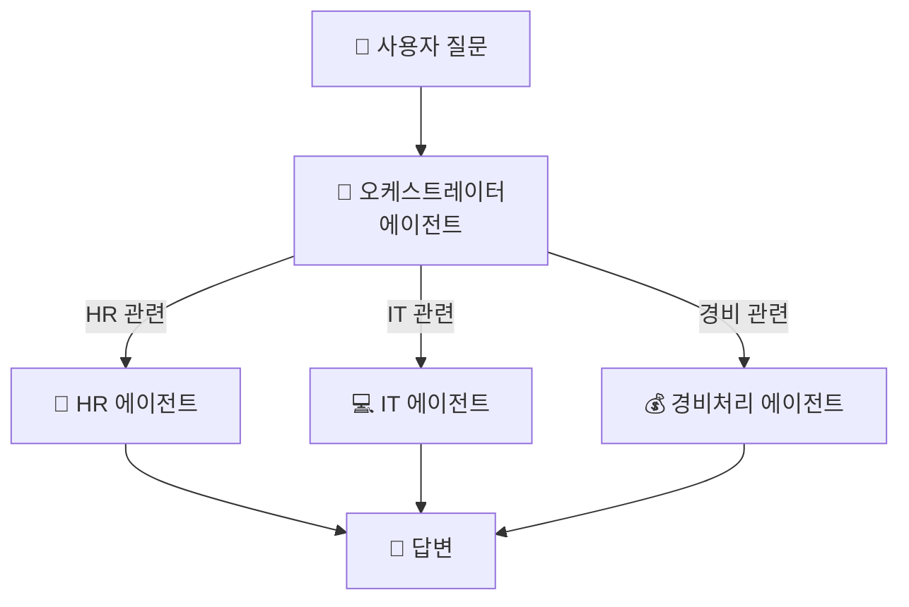
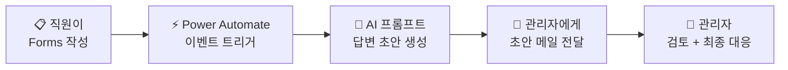

# 미래 비전 — 멀티에이전트 + 자율 트리거
{: .no_toc }

| 시간 | 소요 | 수강생 역할 |
|:-----|:-----|:-----------|
| 17:15 | 15분 | 👀 강사 데모 |

## 목차
{: .no_toc .text-delta }

1. TOC
{:toc}

---

## 이 모듈에서 배우는 것

- **멀티에이전트** 패턴 (오케스트레이터 + 전문 에이전트)
- **트리거 3종**이 에이전트를 자율적으로 움직이게 하는 원리
- 오늘 만든 에이전트의 **확장 경로**

---

## 에이전트 하나에서 팀으로

한 에이전트가 HR도, IT도, 경비도 모두 담당하기는 어렵습니다.  
사람도 한 명이 모든 부서 업무를 하기 어렵듯이요.

해결책은 **에이전트 팀**을 만드는 것입니다.

---

## 멀티에이전트 패턴

### 패턴 1: 오케스트레이터 + 전문 에이전트



사용자는 **하나의 에이전트**와 대화하지만, 뒤에서는 **전문가 팀**이 움직입니다.

| 패턴 | 구조 | 비유 |
|:-----|:-----|:-----|
| **오케스트레이터 + 전문** | 팀장이 요청 파악 → 전문가에게 위임 → 결과 취합 | 팀장이 적재적소에 배분 |
| **순차 파이프라인** | 에이전트 A → B → C 순서대로 처리 | [분류] → [답변] → [품질 검토] |

### 확장 상상

에이전트를 하나씩 추가로 만들어서 오케스트레이터에 연결하면,  
회사 전체를 커버하는 **에이전트 조직**이 됩니다.

{: .highlight }
> 각 에이전트를 만드는 방법은 **오늘 배운 것과 동일**합니다.

---

## 트리거 — 자율 에이전트

지금까지 에이전트는 사용자가 **말을 걸어야** 답했습니다.  
트리거를 붙이면 에이전트가 **스스로 움직입니다.**

| 종류 | 설명 | 비유 | 예시 |
|:-----|:-----|:-----|:-----|
| **일정 기반** | 정해진 시간에 자동 실행 | 매일 아침 출근하는 직원 | 매일 오전 9시 뉴스 브리핑 |
| **이벤트 기반** | 특정 사건 발생 시 실행 | 전화 오면 받는 안내원 | 새 메일 도착 시 자동 분류 |
| **에이전트 간** | 다른 에이전트가 호출 | 부서 간 업무 요청 | 멀티에이전트 연계 |

### 일정 트리거 예시

```
매일 오전 9시 자동 실행
    ↓
에이전트가 뉴스 브리핑 생성
    ↓
Teams에 자동 게시
    ↓
여러분이 출근하기 전에 이미 정보 수집 완료
```

{: .tip }
> 트리거가 연결되면 에이전트는 **스스로 일을 시작**합니다. 여러분이 출근도 하기 전에요.

---

## 실전 시나리오: Forms 문의 → AI 답변 초안 → 관리자 검토

실제 고객사에서 요청이 들어온 시나리오입니다.  
오늘 배운 기술이 어떻게 연결되는지 살펴봅시다.

### 시나리오

> "회사 내부에 문의 폼을 만들어 게시하고, 직원이 문의를 접수하면 AI가 **답변 초안**을 만들어서 관리자에게 보내주세요.  
> 관리자는 초안을 검토한 후 **직접 최종 대응**합니다."

### 전체 흐름



### 어떤 기술이 필요한가?

| 단계 | 기술 | 오늘 배운 모듈 |
|:-----|:-----|:-------------|
| ① Forms 접수 시 자동 시작 | 이벤트 트리거 (Forms 응답) | 이 모듈 (M12 트리거) |
| ② 문의 내용으로 답변 초안 생성 | AI 프롬프트 — 텍스트 유형 | M11 |
| ③ 관리자에게 초안 메일 전달 | Flow + Office 365 메일 발송 | M9 |
| ④ 관리자가 검토 후 최종 대응 | **Human-in-the-Loop** 패턴 | 설계 원칙 |

### Human-in-the-Loop — AI 시대의 핵심 설계 원칙

AI가 아무리 잘해도, **최종 결정은 사람**이 합니다.

| 패턴 | 설명 | 위험도 |
|:-----|:-----|:------|
| **완전 자동** | AI 답변 → 직원에게 곧바로 전송 | ⚠️ 오답 시 신뢰 하락 |
| **Human-in-the-Loop** ✅ | AI 초안 → 관리자 검토 → 승인 후 전송 | ✅ 품질 보장 |

{: .important }
> AI는 **초안을 만드는** 역할, 사람은 **검토하고 최종 결정**하는 역할.  
> 이것이 가장 안전하고 효과적인 AI 협업 패턴입니다.

### 이 시나리오를 만들려면?

1. **Microsoft Forms** — 문의 양식 만들기 (제목, 카테고리, 상세 내용)
2. **Power Automate** — Forms 응답 도착 시 자동 트리거
3. **AI 프롬프트 (텍스트)** — 문의 내용 + 사내 FAQ 기반으로 답변 초안 생성
4. **메일 발송** — 관리자에게 원문 + 답변 초안을 함께 메일 전달
5. **관리자** — 초안을 검토·수정 후 직접 답변

오늘 배운 **M9(Flow + 메일) + M11(AI 프롬프트) + M12(트리거)**를 조합하면  
**내일 당장 만들 수 있는** 시나리오입니다.

---

## 당장 멀티에이전트를 만들어야 하나요?

{: .note }
> **아닙니다!** 오늘 만든 에이전트 하나를 잘 운영하는 게 우선입니다. 필요할 때 확장하면 됩니다.

---

## 핵심 정리

1. **멀티에이전트** = 오케스트레이터 + 전문 에이전트 팀
2. **트리거 3종** = 에이전트가 스스로 움직이는 방법 (일정/이벤트/에이전트 간)
3. **Human-in-the-Loop** = AI 초안 + 사람 검토 — 가장 안전한 AI 협업 패턴
4. 오늘 배운 기술로 **이 모든 게 가능**
5. 먼저 에이전트 하나를 잘 운영하고, **필요할 때 확장**

{: .highlight }
> "에이전트 하나의 완성에서 에이전트 팀으로 — 트리거가 연결되면 스스로 움직이는 디지털 동료가 됩니다."

---

## FAQ

| 질문 | 답변 |
|:-----|:-----|
| 멀티에이전트 설정이 어렵나요? | 오케스트레이터에서 전문 에이전트를 연결하는 건 클릭 몇 번입니다. |
| 트리거가 오작동하면? | Power Automate 실행 기록에서 확인하고 조건을 세밀하게 설정할 수 있습니다. |
| 멀티에이전트는 추가 비용이 있나요? | 에이전트 수에 따라 라이선스가 달라질 수 있습니다. 관리자와 확인하세요. |
| 에이전트끼리 서로 충돌하지 않나요? | 오케스트레이터가 교통정리를 합니다. 각 에이전트의 역할을 명확히 쓰면 충돌 없이 협업합니다. |

---

## 참조 자료

| 자료 | 링크 |
|:-----|:-----|
| 멀티에이전트 개요 | [learn.microsoft.com](https://learn.microsoft.com/microsoft-copilot-studio/multi-agent-overview) |
| 자율 에이전트 트리거 | [learn.microsoft.com](https://learn.microsoft.com/microsoft-copilot-studio/advanced-triggers) |
| Copilot Studio 로드맵 | [learn.microsoft.com](https://learn.microsoft.com/microsoft-copilot-studio/whats-new) |

---

다음 모듈: [M13. 설계서 완성](m13-design-complete)
