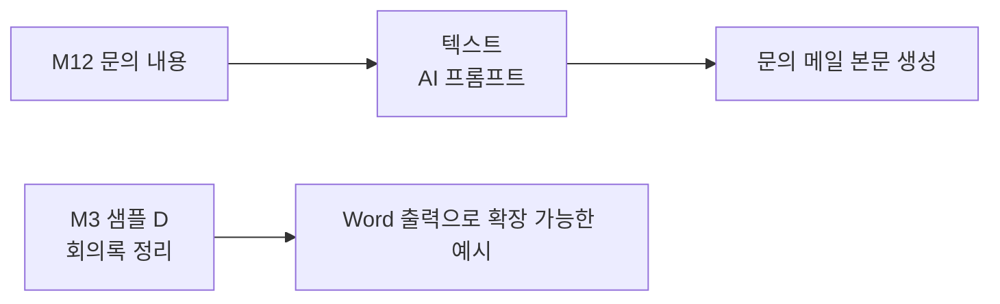

# 고급도구 — AI 프롬프트
{: .no_toc }

| 시간 | 소요 | 수강생 역할 |
|:-----|:-----|:-----------|
| 16:20 | 10분 | 👀 강사 데모 |

## 목차
{: .no_toc .text-delta }

1. TOC
{:toc}

---

## 이 모듈에서 배우는 것

- **AI 프롬프트** = Flow 안에 AI를 심는 기능
- **4가지 유형** 구분 (텍스트·멀티모달·코드 인터프리터·Word 출력)
- M3 샘플의 **내부 동작 원리** 이해
- 실무 적용 아이디어

{: .highlight }
> M12에서 문의 메일을 보내는 흐름에 **텍스트 AI 프롬프트를 한 단계 넣어** 메일 본문을 생성해 봤습니다. 이 모듈에서는 방금 사용한 기능을 분해해서, **AI 프롬프트가 무엇이고 어디까지 확장할 수 있는지**를 정리합니다.

---

## Flow에 AI를 심는다

Power Automate 흐름의 기본 뼈대는 **규칙 기반 자동화**입니다.  
"이 입력을 받으면 이걸 실행해라" — 정해진 순서대로 동작합니다.

여기에 AI 프롬프트를 추가하면, 흐름 안에 **생성·분류·요약 같은 AI 단계**가 들어갑니다.

| 상태 | Flow의 성격 |
|:-----|:-----------|
| **AI 프롬프트 전** | 규칙 기반 자동화 — 정해진 대로 실행 |
| **AI 프롬프트 후** | 판단하는 자동화 — 프롬프트로 AI가 분석·생성·분류 |

{: .highlight }
> **AI 프롬프트 하나가 추가되면, 규칙 기반 흐름 안에 AI 판단 단계가 들어옵니다.**

---

## 4가지 AI 프롬프트 유형

| 유형 | 하는 일 | 예시 | 오늘 과정과 연결 |
|:-----|:--------|:-----|:----------------|
| **텍스트** | 생성·분류·요약·추출 | 고객 문의 → 카테고리 자동 분류 | **M12** 문의 내용을 메일 본문으로 생성 |
| **멀티모달** | 이미지·문서 인식 | 영수증 사진 → 금액·날짜 추출 | 오늘은 소개만, 이후 확장 예시 |
| **코드 인터프리터** | AI가 코드를 만들어 실행 | PDF 10장 → Excel 경비 보고서 | 오늘은 소개만, 이후 확장 예시 |
| **Word 출력** | 텍스트 → 문서 자동 생성 | 회의록 → Word 보고서 | **M3 샘플 D**를 문서 자동화로 확장하는 방향 |

---

## 유형 ① — 텍스트: 자동 분류

고객 문의가 들어오면 AI가 자동으로 카테고리를 분류합니다.

**예시:**

| 입력 | AI 분류 결과 |
|:-----|:-----------|
| "인터넷이 안 돼요" | **기술지원** |
| "청구서가 이상해요" | **청구** |
| "주차장 위치가 어디에요?" | **일반문의** |

{: .tip }
> 프롬프트 텍스트만 바꾸면 분류 기준도 바뀝니다. 코드 한 줄 필요 없습니다.

**🔗 실전 활용:** 이 텍스트 유형은 **답변 초안 자동 생성**에도 쓸 수 있습니다.  
예: Forms로 접수된 문의 → AI가 사내 FAQ 기반으로 답변 초안 생성 → 관리자에게 메일 전달  
(M13 "실전 시나리오"에서 전체 흐름을 살펴봅니다)

---

## 유형 ② — 멀티모달: 영수증 인식

영수증 사진을 넣으면 AI가 금액, 일자, 가맹점을 자동으로 추출합니다.

| 입력 | AI 추출 결과 |
|:-----|:-----------|
| 📷 영수증 이미지 | 금액: 45,000원 |
| | 일자: 2026-03-20 |
| | 가맹점: ○○커피 |

---

## 유형 ③ — 코드 인터프리터 / 유형 ④ — Word 출력

| 유형 | 입력 | 출력 | 연결 |
|:-----|:-----|:-----|:-----|
| **코드 인터프리터** | 영수증 PDF 10장 | Excel 경비 보고서 | 대량 파일 처리 확장 예시 |
| **Word 출력** | 회의록 텍스트 | Word 보고서 (참석자·결정사항·후속조치) | M3 샘플 D |

---

## 오늘 과정과의 연결

오늘 실습에서 가장 직접적으로 사용한 것은 **텍스트 AI 프롬프트**입니다.  
M12에서 문의 내용을 받아 **비즈니스 메일 본문을 자동 생성**한 것이 바로 그 예시입니다.

M3의 회의록 정리 샘플은 지금 당장 Word 파일을 만들지는 않지만, 나중에 **Word 출력 프롬프트**로 확장할 수 있는 대표 사례입니다.

M3의 이메일 초안 작성기는 코드 인터프리터보다는 **텍스트 생성 프롬프트**와 더 가깝습니다. 코드 인터프리터는 여러 파일을 계산·변환·분석해 결과물을 만드는 시나리오에서 더 적합합니다.

---

## 핵심 정리

1. **AI 프롬프트** = Flow 안에 AI를 심는 기능
2. **4가지 유형:** 텍스트, 멀티모달, 코드 인터프리터, Word 출력
3. M3 샘플의 내부 엔진이 바로 **AI 프롬프트**
4. 코드 없이, **프롬프트 텍스트 하나**로 Flow에 AI 추가

---

## FAQ

| 질문 | 답변 |
|:-----|:-----|
| AI 프롬프트는 추가 비용이 있나요? | Copilot Studio 라이선스에 포함된 AI 크레딧이 있습니다. 대량 사용 시 크레딧 소비량을 확인하세요. |
| 한국어 문서도 잘 인식하나요? | 네, 최신 모델은 한국어 문서·이미지 인식 성능이 매우 좋습니다. |
| 에이전트 없이 AI 프롬프트만 쓸 수 있나요? | 네! Power Automate Flow에서 단독으로도 사용 가능합니다. |

---

## 참조 자료

| 자료 | 링크 |
|:-----|:-----|
| AI 프롬프트 개요 | [learn.microsoft.com](https://learn.microsoft.com/ai-builder/prompts-overview) |
| Power Automate + AI Builder | [learn.microsoft.com](https://learn.microsoft.com/ai-builder/use-in-flow-overview) |
| 멀티모달 프롬프트 | [learn.microsoft.com](https://learn.microsoft.com/ai-builder/azure-openai-model-pautate) |
| 코드 인터프리터 | [learn.microsoft.com](https://learn.microsoft.com/ai-builder/prebuilt-prompts) |

---

다음 모듈: [M14. 멀티에이전트](m14-multi-agent)
