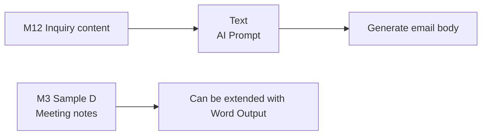

# Advanced Tools — AI Prompt
{: .no_toc }

| Time | Duration | Participant Role |
|:-----|:---------|:-----------------|
| 16:20 | 10 min | 👀 Instructor Demo |

## Table of Contents
{: .no_toc .text-delta }

1. TOC
{:toc}

---

## What You Will Learn

- **AI Prompt** = a feature that embeds AI inside a Flow
- Distinguishing the **4 prompt types** (Text · Multimodal · Code Interpreter · Word Output)
- Understanding the **inner workings** of the M3 samples
- Ideas for real-world applications

{: .highlight }
> In M12, we added **a text-based AI Prompt step** to the inquiry email flow to generate the email body. In this module, we break down the feature we just used and explore **what AI Prompt is and how far it can be extended**.

---

## Embedding AI in a Flow

The basic backbone of a Power Automate flow is **rule-based automation**.  
"When this input is received, execute this action" — it runs in a predetermined sequence.

When you add an AI Prompt, the flow gains **AI-powered steps such as generation, classification, and summarization**.

| State | Nature of the Flow |
|:------|:-------------------|
| **Before AI Prompt** | Rule-based automation — runs as prescribed |
| **After AI Prompt** | Intelligent automation — AI analyzes, generates, and classifies via prompt |

{: .highlight }
> **Adding a single AI Prompt introduces an AI decision-making step into a rule-based flow.**

---

## The 4 Types of AI Prompt

| Type | What It Does | Example | Connection to Today's Course |
|:-----|:-------------|:--------|:----------------------------|
| **Text** | Generate · Classify · Summarize · Extract | Customer inquiry → Automatic category classification | **M12** Generated email body from inquiry content |
| **Multimodal** | Image & document recognition | Receipt photo → Extract amount & date | Introduction only today; expansion examples later |
| **Code Interpreter** | AI writes and runs code | 10 receipt PDFs → Excel expense report | Introduction only today; expansion examples later |
| **Word Output** | Text → Automatic document generation | Meeting notes → Word report | Extending **M3 Sample D** toward document automation |

---

## Type ① — Text: Automatic Classification

When a customer inquiry comes in, AI automatically classifies it into a category.

**Example:**

| Input | AI Classification Result |
|:------|:------------------------|
| "My internet isn't working" | **Technical Support** |
| "My invoice looks wrong" | **Billing** |
| "Where is the parking lot?" | **General Inquiry** |

{: .tip }
> Just change the prompt text and the classification criteria change too. No code required.

**🔗 Real-world use:** This text type can also be used to **auto-generate draft responses**.  
Example: Inquiry submitted via Forms → AI drafts a response based on internal FAQ → Email forwarded to an admin  
(We walk through the full flow in the M13 "Real-World Scenarios" section)

---

## Type ② — Multimodal: Receipt Recognition

Upload a receipt photo and AI automatically extracts the amount, date, and merchant.

| Input | AI Extraction Result |
|:------|:--------------------|
| 📷 Receipt image | Amount: ₩45,000 |
| | Date: 2026-03-20 |
| | Merchant: ○○ Coffee |

---

## Type ③ — Code Interpreter / Type ④ — Word Output

| Type | Input | Output | Connection |
|:-----|:------|:-------|:-----------|
| **Code Interpreter** | 10 receipt PDFs | Excel expense report | Bulk file processing expansion example |
| **Word Output** | Meeting notes text | Word report (attendees · decisions · follow-ups) | M3 Sample D |

---

## Connection to Today's Course

The most directly used feature in today's labs was the **text-based AI Prompt**.  
In M12, we took inquiry content and **automatically generated a professional email body** — that was a prime example.

The meeting notes summarizer in M3 doesn't produce a Word file right now, but it is a representative use case that can later be extended with a **Word Output Prompt**.

The email draft generator in M3 is closer to a **text generation prompt** than to Code Interpreter. Code Interpreter is better suited for scenarios involving calculations, transformations, and analysis across multiple files.

```mermaid
graph LR
    A[M12 Inquiry content] --> B[Text<br>AI Prompt]
    B --> C[Generate email body]
    D[M3 Sample D<br>Meeting notes] --> E[Can be extended with Word Output]
```

---

## Key Takeaways

1. **AI Prompt** = a feature that embeds AI inside a Flow
2. **4 types:** Text, Multimodal, Code Interpreter, Word Output
3. The engine behind the M3 samples is the **AI Prompt**
4. Add AI to a Flow with **just a single prompt text** — no code needed

---

## FAQ

| Question | Answer |
|:---------|:-------|
| Does AI Prompt cost extra? | AI credits are included with your Copilot Studio license. Check credit consumption for high-volume usage. |
| Does it recognize non-English documents well? | Yes, the latest models have excellent multilingual document and image recognition. |
| Can I use AI Prompt without an agent? | Yes! It can be used standalone in a Power Automate Flow. |

---

## References

| Resource | Link |
|:---------|:-----|
| AI Prompt Overview | [learn.microsoft.com](https://learn.microsoft.com/ai-builder/prompts-overview) |
| Power Automate + AI Builder | [learn.microsoft.com](https://learn.microsoft.com/ai-builder/use-in-flow-overview) |
| Multimodal Prompt | [learn.microsoft.com](https://learn.microsoft.com/ai-builder/azure-openai-model-pautate) |
| Code Interpreter | [learn.microsoft.com](https://learn.microsoft.com/ai-builder/prebuilt-prompts) |

---

Next module: [M14. Tools — Multi-Agent](m14-multi-agent)
