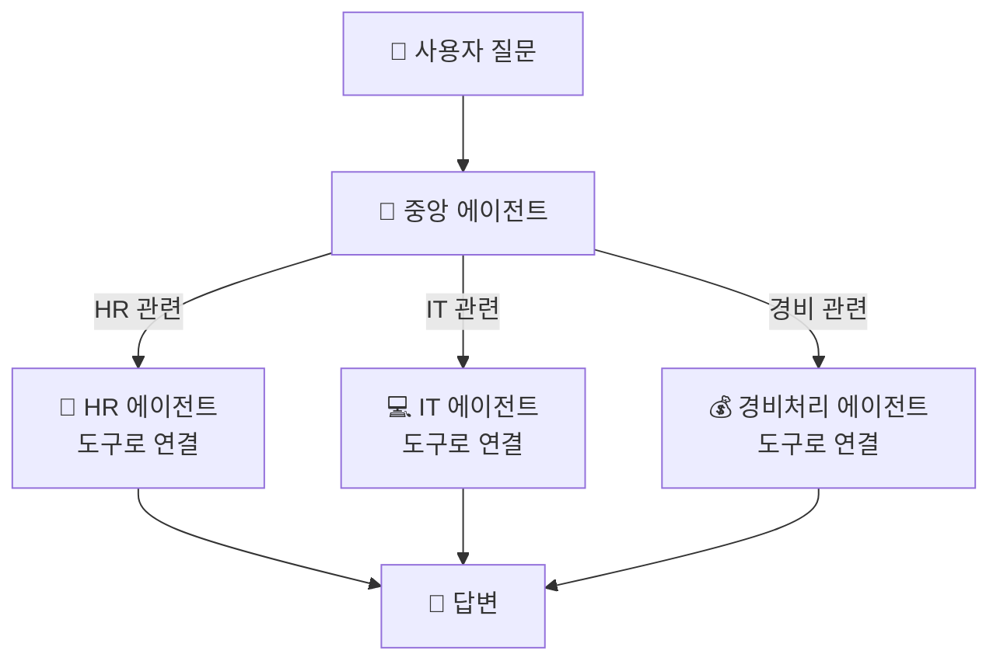

# 미래 비전 — 멀티에이전트 + MCP + 자율 트리거
{: .no_toc }

| 시간 | 소요 | 수강생 역할 |
|:-----|:-----|:-----------|
| 17:20 | 10분 | 👀 강사 데모 |

## 목차
{: .no_toc .text-delta }

1. TOC
{:toc}

---

## 이 모듈에서 배우는 것

- Copilot Studio의 **멀티에이전트 오케스트레이션** 이해
- **MCP(Model Context Protocol)** — 에이전트의 USB 포트
- **트리거 3종**이 에이전트를 자율적으로 움직이게 하는 원리
- 오늘 만든 에이전트의 **확장 경로**

---

## 에이전트 하나에서 팀으로

한 에이전트가 HR도, IT도, 경비도 모두 담당하기는 어렵습니다.  
해결책은 **에이전트 팀**을 만드는 것입니다.

### 멀티에이전트 오케스트레이션

Copilot Studio "도구" 메뉴에서 다른 에이전트를 추가하면 연결됩니다.

{: .highlight }
> 각 전문 에이전트를 만드는 방법은 **오늘 배운 것과 동일**합니다.

---

## 트리거 — 자율 에이전트

| 종류 | 설명 | 비유 | 예시 |
|:-----|:-----|:-----|:-----|
| **일정 기반** | 정해진 시간에 자동 실행 | 매일 아침 출근하는 직원 | 매일 오전 9시 뉴스 브리핑 |
| **이벤트 기반** | 특정 사건 발생 시 실행 | 전화 오면 받는 안내원 | 새 메일 도착 시 자동 분류 |
| **에이전트 간** | 다른 에이전트가 호출 | 부서 간 업무 요청 | 멀티에이전트 연계 |

{: .tip }
> 트리거가 연결되면 에이전트는 **스스로 일을 시작**합니다.

---

## MCP — 에이전트의 USB 포트

**MCP(Model Context Protocol)**는 에이전트가 외부 도구·데이터에 연결하는 **표준 규격**입니다.

{: .warning }
> 오늘은 **개념만 소개**합니다. 실제 MCP 연동은 서버 준비, 인증, 보안 검토가 함께 필요한 **고급 작업**입니다.

| 지금까지 배운 방식 | MCP를 검토하는 시점 |
|:-------------------|:---------------------|
| 파일 업로드, 기본 커넥터, Flow로 빠르게 시작 | 여러 시스템을 표준 방식으로 연결해야 할 때 |
| 입문자에게 가장 단순하고 실습 친화적 | 서버, 인증, 보안 설계가 추가로 필요 |
| 소규모 업무 자동화에 적합 | 운영 범위가 커질 때 장점이 커짐 |

{: .highlight }
> MCP는 에이전트 세계의 USB에 가깝습니다. 다만 **항상 더 쉬운 선택은 아니고**, 규모가 커질 때 표준 연결의 장점이 커집니다.

### 언제 MCP를 고민하나요?

- 파일 업로드나 기본 커넥터만으로는 연결 대상이 너무 많을 때
- 여러 에이전트가 같은 도구를 공통 방식으로 써야 할 때
- 운영팀이 인증·보안·버전 관리를 별도로 다루려 할 때

{: .note }
> 입문 단계에서는 오늘 배운 **파일 업로드 + Topic + Flow**만으로도 충분합니다. MCP는 그 다음 단계의 선택지로 이해하면 됩니다.

---

## 실전 시나리오: Forms 문의 → AI 답변 초안 → 관리자 검토

| 단계 | 기술 | 오늘 배운 모듈 |
|:-----|:-----|:-------------|
| ① Forms 접수 시 자동 시작 | 이벤트 트리거 | 이 모듈 (M13) |
| ② 답변 초안 생성 | AI 프롬프트 — 텍스트 유형 | M12 |
| ③ 관리자에게 메일 전달 | Flow + Office 365 메일 발송 | M9~M10 |
| ④ 관리자 검토 후 최종 대응 | **Human-in-the-Loop** 패턴 | 설계 원칙 |

### Human-in-the-Loop — 가장 안전한 AI 협업 패턴

| 패턴 | 설명 | 위험도 |
|:-----|:-----|:------|
| **완전 자동** | AI 답변 → 직원에게 곧바로 전송 | ⚠️ 오답 시 신뢰 하락 |
| **Human-in-the-Loop** ✅ | AI 초안 → 관리자 검토 → 승인 후 전송 | ✅ 품질 보장 |

{: .important }
> AI는 **초안을 만드는** 역할, 사람은 **검토하고 최종 결정**하는 역할.

---

## 핵심 정리

1. **멀티에이전트** = 전문 에이전트를 도구로 연결하여 팀으로 운영
2. **MCP** = 표준 연결 방식. 다만 서버 준비와 보안 검토가 필요한 고급 확장
3. **트리거 3종** = 에이전트가 스스로 움직이는 방법 (일정/이벤트/에이전트 간)
4. **Human-in-the-Loop** = AI 초안 + 사람 검토 — 가장 안전한 AI 협업 패턴
5. 먼저 에이전트 하나를 잘 운영하고, **필요할 때 확장**

---

## 참조 자료

| 자료 | 링크 |
|:-----|:-----|
| 멀티에이전트 개요 | [learn.microsoft.com](https://learn.microsoft.com/microsoft-copilot-studio/multi-agent-overview) |
| 자율 에이전트 트리거 | [learn.microsoft.com](https://learn.microsoft.com/microsoft-copilot-studio/advanced-triggers) |
| Copilot Studio 로드맵 | [learn.microsoft.com](https://learn.microsoft.com/microsoft-copilot-studio/whats-new) |

---

다음 모듈: [M14. 설계서 완성](m14-design-complete)
